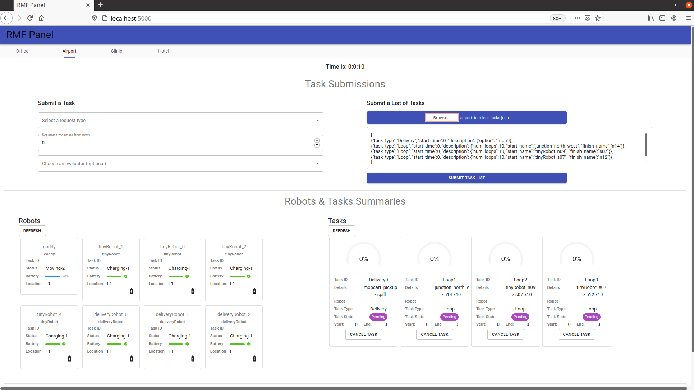

## Demos

In this chapter, we will briefly demonstrate the capability of RMF with `rmf_demos`. 
This will give users a brief understanding of the core features of RMF.

> For the most updated rmf_demos run instruction, please refer to [here](https://github.com/open-rmf/rmf_demos).

First make sure, you have have installed the provided RMF demos from their Debian package:

```bash
# Demos example with gazebo simulator, use ros-foxy-rmf-demos-ign for ignition
sudo apt-get install ros-foxy-rmf-demos-gz
```
Run your desired demo. In this case we will run the `airport terminal`:

Before running the demo, we can ensure all required models are downloaded locally by:
```bash
ros2 run rmf_building_map_tools model_downloader rmf_demos_maps -s airport_terminal
```

```bash
ros2 launch rmf_demos_gz airport_terminal.launch.xml
# or with ignition
ros2 launch rmf_demos_ign airport_terminal.launch.xml
```

Now you should be able to see the airport terminal with the robots in Gazebo:


The RMF Schedule Visualizer should have loaded in an rviz window. This canvas will display all integrated robots or infrastructure which are available to RMF.


During a task request, instead of requiring the user to specify the robot name to complete a task, RMF will assign the task to the best robot. 

RMF currently suports 3 types of task, namely: `loop`, `delivery` or `clean` . User can submit a task via  CLI:

**Loop Task**
```
ros2 run rmf_demos_tasks dispatch_loop -s s07 -f n12 -n 3 --use_sim_time
```

**Delivery Task**
```
ros2 run rmf_demos_tasks dispatch_delivery -p mopcart_pickup -pd mopcart_dispenser -d spill -di mopcart_collector --use_sim_time
```

**Clean Task**
```
ros2 run rmf_demos_tasks dispatch_clean -cs zone_3 --use_sim_time
```

Now you can observe robots roaming around the airport space!

**rmf_panel**
Another way to observe and interact with RMF is via a web `rmf_panel`. Open the webpage: `firefox https://open-rmf.github.io/rmf-panel-js/` or click [here](https://open-rmf.github.io/rmf-panel-js/)


You can view the status of all the robots under RMF. To request a list of tasks, first select the `Airport` tab. User can choose to submit a (1) Adhoc task or (2) Task List.

Copy paste this to the Task List Box. (or open a file)
```json
[{"task_type":"Delivery", "start_time":0, "description": {"option": "mop"}},
 {"task_type":"Loop", "start_time":0, "description": {"num_loops":10, "start_name":"junction_north_west", "finish_name":"n14"}},
 {"task_type":"Loop", "start_time":0, "description": {"num_loops":10, "start_name":"tinyRobot_n09", "finish_name":"s07"}},
 {"task_type":"Clean", "start_time":0, "priority":0, "description":{"cleaning_zone":"zone_2"}}
]
```

Then Click Submit to submit the list of tasks:


Now, sit back and enjoy.

## Jump in, the water is fine!

So now you have an idea of what RMF is all about, it's time to jump in. We would suggest if you have not already that you take the time to review the [RMF Demos](https://github.com/open-rmf/rmf_demos) repository and if you want a really quick overview of RMF then take a look at this [Mock Airport Terminal video demo](https://vimeo.com/405803151) (Short film Oscar nominations most welcome). We hope you find RMF to be a useful tool to help you scale your robot deployments and operations and we look forward to the many improvements and contributions to come!
