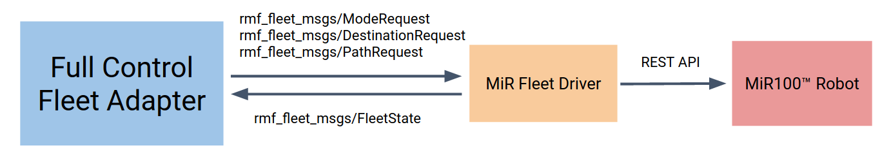
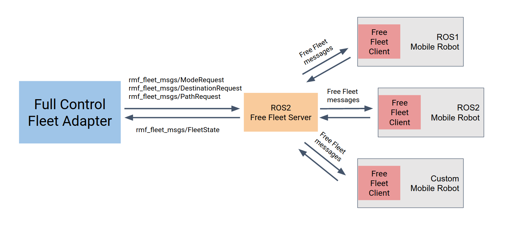
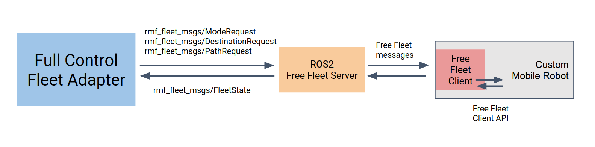

<!-- # Requirements -->

<!-- robot, door, lift, workcell, etc. integration with RMF

    I have a door door
    I have an elevator / I have a lift arrow_up_down
    I have a workcell robot mechanical_arm
    I have a loose mobile robot and would like to use FreeFleet (F5)
        robot runs ROS 1
        robot runs ROS 2
        robot runs something that I wrote
        robot runs something somebody else wrote and I can't change
    I have some mobile robots with their own fleet manager(s)
        it has a REST API or some other formal API (XMLRPC)
        it has some other communication mechanism (SQL database, etc.) -->

# Hardware

In this chapter, we will describe the integration requirements and basic steps to have hardware working with RMF. These include [mobile robots](#mobile-robots), [doors](#doors), [elevators](#elevators) and [workcells](#workcells). In each section, we will go through how to build the necessary ROS 2 packages and interfaces that are used by `rmf_core`, as well as possible scenarios where such interactions occur.

In general, all the interactions can be summed up with this system architecture diagram,


RMF uses ROS 2 messages and topic interfaces. Hence, in most cases we use components called Adapters to bridge between the hardware interfaces and RMF with some exception for robot fleets which also have fleet drivers in the process. Robot fleets will be further elaborated in the next few sections.

## Mobile Robots

We have identified a number of different scenarios where mobile robots are integrated with RMF, though preliminary focus and use cases have involved delivery service mobile robots. In this section, we will be addressing each scenario or configuration and how users can go about working with them.

Before all that, let us revisit the diagram and description in the [hardware introduction section](#hardware). Fleet adapters serve as a bridge between the mobile robot fleet and RMF. However, an additional level of complexity also exists to address traffic monitoring, scheduling and conflict resolution between the multitude of robots and robot fleets throughout the environment. Fleet drivers are then necessary to interact with the mobile robots/fleets in order to update the adapters and relay commands via simple ROS 2 message and topic interfaces. More information about how fleet adapters work can be found in Chapter 5, rmf-core.

### Map data requirements for integration with RMF

#### Motivation
RMF uses robot route maps to predict the navigation paths of robots working in the environment. RMF generates path predictions for all active robots in the environment which can be used to proactively avoid conflicts between the various robot path plans. This is often referred to as "traffic monitoring" in RMF. Along with the traffic monitoring, RMF can help enable multi-fleet visualization to building/robot operations staff, improve scheduling of resources (such as lifts and corridors), reduce robot deadlock and more.

Robot route maps in large buildings are complex and may evolve over time in response to customer requests and building renovations. As a result, RoMi-H works best when scripts can automatically import robot route maps, and re-import them in the future after changes are made.

#### Minimum Map Information Required
- list of waypoints or nodes
  - name of waypoint
  - level name (B1, L1, L2, etc.)
  - (x, y) location in meters within the level
  - any special properties or flags, such as:
    - is this a dropoff/pickup parking point?
    - is this a charger?
    - is this a safe parking spot during an emergency alarm?
- list of edges or "travel lanes" between nodes
  - (start, end) waypoint names
  - two-way or one-way traffic?
    - if one-way, identify direction of travel
  - any other information, such as speed limit along this segment

#### Format requirements
We can write import scripts to handle virtually any "open" file format that contains the required information. This includes, in order of preference:
  - YAML
  - XML
  - plain text (space or comma-separated ASCII, etc.)
  - DXF
  - DWG
  - SVG

## Comments
If the map data is provided in textual form, screenshots are helpful for "sanity-checking" the coordinate system and alignment with building features.

### Mobile Robot Fleets

Mobile robots in industrial settings are often controlled and monitored as a fleet, with a central fleet management system keeping things in check. For this configuration, we will focus on how we can integrate with RMF using a Fleet Adapter to control and communicate with the mobile robots via the fleet manager.

We have identified 4 different levels of control when working with fleets of mobile robots, namely,

* **Paths** - RMF is provided with status and full control over the paths that each individual mobile robot uses when navigating through the environment. This control level provides the highest compliance with RMF, which allows it to reduces stoppages and deal with unexpected scenarios gracefully.

* **Traffic Light** - RMF is given the status as well as pauce/resume control over each mobile robot, which is useful for deconflicting traffic schedules especially when sharing resources like corridors, lifts and doors.

* **Read Only** - RMF is not given any control over the mobile robots, however is provided with regular status updates. This will allow other mobile robot fleets with higher control levels to avoid conflicts with this fleet.

* **No Control** - This will prevent other fleets to coordinate with it through RMF, and will likely cause deadlocks when sharing the same navigatable envirnoment or resource.

In short, the more control a fleet provides RMF to utilize, the higher the level of compliance and a better chance that conflicts between robots will be resolved automatically. Note that there can only ever be 1 operating Read Only fleet for an environment, as any 2 or more of such fleets will make avoiding each other impossible.

After identifying the level of control the fleet can provide, users can select to use the basic fleet adapters labelled by their control level, that have been implemented within the `rmf_core` repository. These fleet adapters are designed to work seamlessly with RMF, with the users only required to set up a list of parameters during launch. Below is an example of the parameters requried for launching a Full Control fleet adapter

```xml
<include file="$(find-pkg-share rmf_fleet_adapter)/fleet_adapter.launch.xml">

  <!-- The name and control type of the fleet -->
  <arg name="fleet_name" value="$(var fleet_name)"/>
  <arg name="control_type" value="full_control"/>

  <!-- The graph that this fleet should use for navigation -->
  <arg name="nav_graph_file" value="$(var nav_graph_file)" />

  <!-- The nominal linear and angular velocity of this fleet's vehicles -->
  <arg name="linear_velocity" value="0.5"/>
  <arg name="angular_velocity" value="0.4"/>

  <!-- The nominal linear and angular acceleration of this fleet's vehicles -->
  <arg name="linear_acceleration" value="0.3"/>
  <arg name="angular_acceleration" value="1.0"/>

  <!-- The radius of the circular footprint of this fleet's vehicles -->
  <arg name="footprint_radius" value="0.6"/>
  <!-- Other robots are not allowed within this radius --> 
  <arg name="vicinity_radius" value="2.0"/>

  <!-- Whether to use sim time -->
  <arg name="use_sim_time" value="$(var use_sim_time)"/>

  <!-- How long it can be delayed before we give up and start over -->
  <arg name="delay_threshold" value="15.0"/>

  <!-- Don't make the mir wait long to retry -->
  <arg name="retry_wait" value="10.0"/>

  <!-- Give everything time to discover -->
  <arg name="discovery_timeout" value="60.0"/>

  <!-- Whether it can perform deliveries -->
  <arg name="perform_deliveries" value="true"/>

</include>
```

This exact launch file can be found in our `rmf_demos` repository, while the variable `nav_graph_file` describes the path to a navigation graph file that was either generated by `building_map_tools` or in a similar format. The graph describes the various traversable waypoints and lanes for this mobile robot fleet. All the other parameters listed are used by RMF to make estimations and predictions of the movements of each mobile robot under this fleet, in order to foresee possible conflicts between mobile robots to resolve them before they occur.

The final piece of the puzzle is the Fleet Driver, which interacts with the Fleet Adapter over ROS2 messages, while at the same time uses the fleet manager's API to directly obtain status updates, and relay commands to each mobile robot. Fleet Drivers for diffirent fleets are expected to be implemented different due to the differences in API, some of which could be based on `REST`, `XMLRPC`, `SQL` databases, etc. Users implementing their own Fleet Drivers will need to communicate with the Fleet Adapters using these standardized ROS2 messages and topics listed in the table below,

| Message Types                     | ROS2 Topic            | Description                                                                                                                                 |
|-----------------------------------|-----------------------|---------------------------------------------------------------------------------------------------------------------------------------------|
| `rmf_fleet_msgs/ModeRequest`        | `/robot_mode_requests`  | Allows RMF to give pause/resume and emergency commands.                                                                                     |
| `rmf_fleet_msgs/PathRequest`        | `/robot_path_requests`  | Allows full control over the path which mobile robots use during navigation, provided in the form of a list of waypoints.                          |
| `rmf_fleet_msgs/DestinationRequest` | `/destination_requests` | Gives mobile robots a one-way command to a certain location/waypoint.                                                                              |
| `rmf_fleet_msgs/FleetState`         | `/fleet_states`         | Provides RMF with fleet and mobile robot status updates, including the their locations, as well as their current path and task information. |

(** These messages and topics are referenced from the code-base, it might not be the most up-to-date)

The block diagram below shows an example implementation using a fleet of MiR100™ mobile robot, with a Full Control Fleet Adapter. On one end the Fleet Driver uses the ROS2 message and topic interfaces to interact with the Fleet Adapter, while on the other end it uses the REST API that comes with the MiR100™ robots to communicate and control each mobile robot.



If however the user wishes to add more complexity to his or her fleet's behavior, the Fleet Adapter and Fleet Drivers can be implemented from scratch using the API provided in the `rmf_core` repository. In this scenario, the user can opt for implementing both the adapter and driver into a single module, without the need to use ROS2 topic and messages between them.

### Standalone Mobile Robot

In the event that the user wishes to integrate a standalone mobile robot which doesn't come with its own fleet management system, the open source fleet management system `free_fleet` could be used. 

`free_fleet` can be split into a client and a server. The client is to be run on each of these standalone mobile robots alongside their navigational software, and is intended to have direct control over the mobile robot, while at the same time is able to monitor its status to be reported back to the server. The client's base implementation is designed to allow interaction with different configurations of mobile robots, while at the same time all report to the same server. This way, users are able to use `free_fleet` to manage a heterogenrous fleet of robots, each using different distributions of ROS, versions of ROS, navigation software, or onboard communication protocols.

The server is run on a central computer, consolidates the incoming status updates from each client to be either visualized using the developer UI, or relayed upstream to RMF. The server also relays commands from the user via the UI or RMF, down to the clients to be executed. Each server can work with multiple clients at a time, hence it serves the role as a fleet management system. The server can be implemented and used as its own fleet management system, or work with larger systems like RMF, bridging the gap between each mobile robot's API and RMF's API and interface.

The communication between the server and clients is implemented using `CycloneDDS`, therefore we are not concerned if the mobile robot or central computer is running different versions of ROS.

In this section, we will address 4 different configurations of using `free_fleet` to integrate with RMF, specifically the navigation stack used by the robot. Each configuration maintains a similar systems architecture, which is illustrated in the simple block diagram below.



#### ROS1 Navigation Stack

An implementation of a `free_fleet` client that works with a ROS1 navigation stack can be found in the [repository](https://github.com/osrf/free_fleet). The implementation expects the transforms of the mobile robot to be fully defined, the mobile robot to accept navigation commands via the `move_base` action library, as well as publishing its battery status using the `sensor_msgs/BatteryState` message.

After following the build instructions on the README on the mobile robot, the user can launch the client as part of his launch script, while at the same time define all the necessary parameters using `rosparam`. Below is a small snippet example of how a client can be launched, with its paramters defined,

```xml
<node name="free_fleet_client_node" 
    pkg="free_fleet_client_ros1"
    type="free_fleet_client_ros1" output="screen">

  <!-- These parameters will be used to identify the mobile robots -->
  <param name="fleet_name" type="string" value="example_fleet"/>
  <param name="robot_name" type="string" value="example_bot"/>
  <param name="robot_model" type="string" value="Turtlebot3"/>

  <!-- These are the topics required to get battery and level information -->
  <param name="battery_state_topic" type="string" value="example_bot/battery_state"/>
  <param name="level_name_topic" type="string" value="example_bot/level_name"/>

  <!-- These frames will be used to update the mobile robot's location -->
  <param name="map_frame" type="string" value="example_bot/map"/>
  <param name="robot_frame" type="string" value="example_bot/base_footprint"/>

  <!-- The name of the move_base server for actions -->
  <param name="move_base_server_name" type="string" value="example_bot/move_base"/>

  <!-- These are DDS configurations used between Free Fleet clients and servers -->
  <param name="dds_domain" type="int" value="42"/>
  <param name="dds_state_topic" type="string" value="robot_state"/>
  <param name="dds_mode_request_topic" type="string" value="mode_request"/>
  <param name="dds_path_request_topic" type="string" value="path_request"/>
  <param name="dds_destination_request_topic" type="string" value="destination_request"/>
  
  <!-- This decides how long the client should wait for a valid transform and action server before failing -->
  <param name="wait_timeout" type="double" value="10"/>
  
  <!-- These define the frequency at which the client checks for commands and 
  publishes the robot state to the server -->
  <param name="update_frequency" type="double" value="10.0"/>
  <param name="publish_frequency" type="double" value="1.0"/>

  <!-- The client will only pass on navigation commands if the destination or first waypoint 
  of the path is within this distance away, otherwise it will ignore the command -->
  <param name="max_dist_to_first_waypoint" type="double" value="10.0"/>

</node>
```

The running `free_fleet` client will communicate with the nodes running on the robot via ROS1, while publishing its state and subscribing to requests over DDS with the `free_fleet` Server.

The current implementation of the `free_fleet` server is implemented with ROS2 and communicates with RMF using the aforementioned ROS2 message and topic interfaces of an RMF fleet adapter. The ROS2 build instructions can also be found on the same repository. Similar to the client, a simple ROS2 wrapper has been implemented, and it can be started using a `.launch.xml` file like so,

```xml
<node pkg="free_fleet_server_ros2"
    exec="free_fleet_server_ros2"
    name="free_fleet_server_node"
    node-name="free_fleet_server_node"
    output="both">

  <!-- Fleet name will be used to identify robots -->
  <param name="fleet_name" value="example_fleet"/>

  <!-- These are the ROS2 topic names that will be used to communicate with RMF -->
  <param name="fleet_state_topic" value="fleet_states"/>
  <param name="mode_request_topic" value="robot_mode_requests"/>
  <param name="path_request_topic" value="robot_path_requests"/>
  <param name="destination_request_topic" value="robot_destination_requests"/>

  <!-- These are the DDS specific configurations used to communicate with the clients -->
  <param name="dds_domain" value="42"/>
  <param name="dds_robot_state_topic" value="robot_state"/>
  <param name="dds_mode_request_topic" value="mode_request"/>
  <param name="dds_path_request_topic" value="path_request"/>
  <param name="dds_destination_request_topic" value="destination_request"/>

  <!-- This determines the frequency it checks for incoming state and request messages,
  as well as how often it publishes its fleet state to RMF -->
  <param name="update_state_frequency" value="20.0"/>
  <param name="publish_state_frequency" value="2.0"/>

  <!-- These transformations are required when the frame of the robot fleet is
  different from that of RMF globally. In order to transform a pose from the RMF
  frame to the free fleet robot frame, it is first scaled, rotated, then 
  translated using these parameters -->
  <param name="scale" value="0.928"/>
  <param name="rotation" value="-0.013"/>
  <param name="translation_x" value="-4.117"/>
  <param name="translation_y" value="27.26"/>

</node>
```

Furthermore, an example of this configuration can be found in the repository as well, under the packages `ff_examples_ros1` and `ff_exmaples_ros2`. This example launches the example simulation from `ROBOTIS`, shown [here](https://emanual.robotis.com/docs/en/platform/turtlebot3/simulation/#ros-1-simulation), which has a small simulated world with 3 Turtlebot3 mobile robots, each running its own ROS1 navigation stack.

After successful builds for both ROS1 and ROS2 workspaces, the simulation can be launched following [these instructions](https://github.com/osrf/free_fleet#turtlebot3-simulation), which also includes a ROS2 `free_fleet` server, publishing fleet state messages and accepting mode and navigation requests over ROS2 messages and topics.

#### ROS2 Navigation Stack

Similar to a ROS1 navigation stack, the only difference would be the middleware used onboard the mobile robot, which in this scenario is ROS2. Unfortunately, the ROS2 `free_fleet` client is still currently under development, and this section will be updated once the refactoring, implementation and testing has been done.

The same ready `free_fleet` server implementation in the repository is good to go to work in this scenario, as the interfaces provided by the fleet adapters are still the same ROS2 messages and topics.

In the meantime, if required, users can also implement their own `free_fleet` client, by working with the `free_fleet` library that contains the base implementation and API for the DDS communication. This can be further elaborated in the next section [Custom Navigation Stack](#custom-navigation-stack).

#### Custom Navigation Stack

In this configuration, it is assumed that the software running on the mobile robot was written by the users themselves, therefore users have a good understanding of their own APIs and intefaces. This would be extremely useful, for implementing their own `free_fleet` client wrapper. The block diagram below tries to illustrate this configuration. 



Once the custom `free_fleet` client is fully functional, it will be a simple task of launching the same ROS2 `free_fleet` server as mentioned the past section, to work with the fleet adapters through ROS2 messages and topics.

#### Vendor Navigation Stack

This configuration assumes that the provided mobile robot is operating on vendor software and hardware, which in most cases, require more effort when it comes to systems integration. There are 2 ways to go about integrating vendor mobile robots with RMF.

The first way to go about it, would be implementing a fleet driver for this robot, as documented in the previous section regarding [Mobile Robot Fleets](#mobile-robot-fleets). This will ensure that the mobile robot communicates directly with fleet adapters, using the provided vendor API, without the need to run a client on the robot. This would be the recommended way of working with vendor mobile robots or vendor navigation stacks.

If however the user intends to both manage the mobile robots using a fleet management system and integrate with RMF, a more roundabout way is possible, by implementing non-intrusive `free_fleet` clients running on the same machine as the server. The `free_fleet` client implementation would need to utilize the provided vendor API to get status updates and provide navigation commands. This implementation is not advisable as it needlessly extends the communication route from RMF to the mobile robot, however if the user intends to manage a heterogeneous fleet of robots, each using different stacks of software and hardware, `free_fleet` could be a reasonable solution to that.

## Doors

### Map requirements

Before a door can be properly integrated, be sure to draw up the door locations with the correct door names on the navigation graph using `traffic_editor`. The instructions to do so can be found in Chapter 3. Traffic Editor.

### Integration

Door integration is an important consideration when introducing RMF into a new environment. They play a significant role in streamlining the operation of mobile robots, as well as increasing their capabilities for navigation and performing deliveries.

For obvious reasons, only automated doors can be integrated with RMF. An automated door can be defined as an electronically powered door that is remotely controllable, either using a remote trigger or has been outfitted with a computing unit capable of commanding the doors when needed, using certain interfaces.

Doors can be integrated with RMF using a ROS2 door node and a door adapter, which we sometimes refer to as a door supervisor. The block diagram below displays the relationship and communication modes between each component.


The door node will have to be implemented based on the model of the door that is being integrated, in order to properly access the API of the door controller module. The communication protocol will also be dependent on the door and controller model, which might be some form of `REST`, `RPCXML`, etc. The door node is in charge of publishing its state and receiving commands over ROS2, using the messages and topics listed below.

| Message Types | ROS2 Topic | Description |
|---------------|------------|-------------|
| `rmf_door_msgs/DoorState` | `/door_states` | State of the door published by the door node
| `rmf_door_msgs/DoorRequest` | `/door_requests` | Direct requests subscribed by the door node and published by the door adapter
| `rmf_door_msgs/DoorRequest` | `/adapter_door_requests` | Requests to be sent to the door adapter/supervisor to request safe operation of doors |


The door adapter stands in between the rest of the RMF core systems, fleet adapters, and the door node, and acts like a state supervisor, ensuring that the doors are not acting on requests that might obstruct an ongoing mobile robot task or damaging it by closing on it. It keeps track of the door state from the door node, and receives requests from the `adapter_door_requests` topic which are published by either fleet adapters or other parts of the RMF core system. Only when the door adapter deems that a request is safe enough to be performed, it will instruct the door node using a request. It should also be noted that direct requests sent to the door node, without going through the door adapter will be negated by the door adapter, to return it to its state befoe, to prevent disruptions during operations with mobile robots.

## Elevators

### Map requirements

Before a lift can be properly integrated, be sure to draw up the lift locations with the correct lift names and levels on the navigation graph using `traffic_editor`. The instructions to do so can be found in Chapter 3. Traffic Editor.

### Integration

Elevator integration will allow RMF to work over multiple levels, resolving conflicts and managing shared resources on a larger scale. Similar to door integration, the requirements are that the lift controllers accepts commands using a certain protocol, `OPC` is one such example.

The elevators will be integrated in a similar fashion as doors as well, relying on a lift node and a lift adapter. The following block diagram shows how each component works with each other.


The lift node will act as a driver to work with the lift controller. There already exists an example of a lift node, you can find the repository [here](https://github.com/sharp-rmf/kone_lift_controller). The node will publish its state and receive lift requests over ROS2, using the messages and topics listed below.

| Message Types | ROS2 Topic | Description |
|---------------|------------|-------------|
| `rmf_lift_msgs/LiftState` | `/lift_states` | State of the lift published by the lift node
| `rmf_lift_msgs/LiftRequest` | `/lift_requests` | Direct requests subscribed by the lift node and published by the lift adapter
| `rmf_lift_msgs/LiftRequest` | `/adapter_lift_requests` | Requests to be sent to the lift adapter/supervisor to request safe operation of lifts |

A lift adapter subscribes to `lift_states` while keeping track of the internal and desired state of the lift in order to prevent it from performing any actions that might interrupt mobile robot or normal operations. The lift adapter performs this task by receiving lift requests from the fleet adapters and the RMF core systems and only relaying the instructions to the lift node if it is deemed appropriate. Any requests sent directly to the lift node, without going through the lift adapter, will also be negated by the lift adapter, to prevent unwanted disruption to mobile robot fleet operations.

## Workcells

Work in progress.
