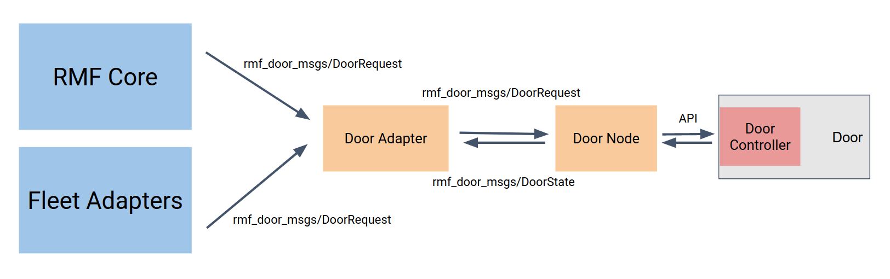

## Doors

### Map Requirements

Before a door can be properly integrated, be sure to draw up the door locations with the correct door names on the navigation graph using `traffic_editor`. The instructions to do so can be found in the [Traffic Editor](./traffic-editor.md) chapter.

### Integration

Door integration is required when integrating RMF into a new environment. For hopefully obvious reasons, only automated doors can be integrated with RMF though it may be possible to trigger an alert to a designated human to open a manual door but this is not recommended. An automated door can be defined as an electronically powered door that is remotely controllable, either using a remote trigger or has been outfitted with a computing unit capable of commanding the door to open and close when needed, using certain interfaces.

Doors can be integrated with RMF using a ROS 2 door node and a door adapter, which we sometimes refer to as a door supervisor. The block diagram below displays the relationship and communication modes between each component:

The door node will have to be implemented based on the make and model of the door that is being integrated in order to address the specific API of the door controller module. The communication protocol will also be dependent on the door and controller model, which might be some form of `REST`, `RPCXML`, etc. The door node is in charge of publishing its state and receiving commands over ROS 2, using the messages and topics listed below:

| Message Types               | ROS2 Topic               | Description                                                                           |
| --------------------------- | ------------------------ | ------------------------------------------------------------------------------------- |
| `rmf_door_msgs/DoorState`   | `/door_states`           | State of the door published by the door node                                          |
| `rmf_door_msgs/DoorRequest` | `/door_requests`         | Direct requests subscribed by the door node and published by the door adapter         |
| `rmf_door_msgs/DoorRequest` | `/adapter_door_requests` | Requests to be sent to the door adapter/supervisor to request safe operation of doors |

The door adapter stands in between the rest of the RMF core systems, fleet adapters, and the door node, and acts like a state supervisor ensuring that the doors are not acting on requests that might obstruct an ongoing mobile robot task or accidentally closing on it. It keeps track of the door state from the door node, and receives requests from the `adapter_door_requests` topic which are published by either fleet adapters or other parts of the RMF core system. Only when the door adapter deems that a request is safe enough to be performed, it will instruct the door node using a request. It should also be noted that direct requests sent to the door node, without going through the door adapter will be negated by the door adapter, to return it to its prior state in order to prevent disruptions during operations with mobile robots.

## Door Adapter Template

To make the process of integrating doors with RMF even simpler, we have open-sourced a [template package](https://github.com/open-rmf/door_adapter_template) where users only need to update certain blocks of code with the API calls to their specific door controller.

## Triggering a Door Request before robot reaches the door

There is no way to trigger a door request before a robot reaches the door by default, however it can be implemented by the user by following the steps below:

The fleet adapter integration can track the position of the robot. If it is detected that the robot is "close enough" to a door, a door request can be published to the `adapter_door_requests` topic. The robot will still stop for a moment at door_in to make sure that the door is open before proceeding, but this should only take a fraction of a second if the network is decent.

Note: The user should make sure that `requester_id` matches what the fleet adapter is using for your robot, which will be `fleet_name/robot_name`. Using the correct `requester_id` for the robot means that the task management system will automatically clear the `DoorOpen` request once the robot reaches `door_out`. If a different `requester_id` is used, then the fleet adapter integration will need to clear the request itself by sending a `DoorClose` request with the same `requester_id` once the robot has moved far enough away from the door.
