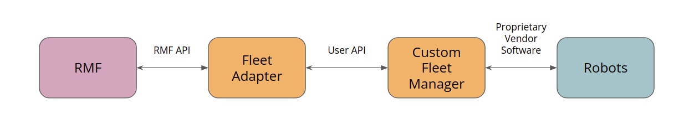

# Mobile Robot Fleet Integration

Here we will cover integrating a mobile robot fleet that offers the **Full Control** category of fleet adapter, as discussed in the [RMF Core Overview](./rmf-core.md) chapter.
This means we assume the mobile robot fleet manager allows us to specify explicit paths for the robot to follow, and that the path can be interrupted at any time and replaced with a new path.
Furthermore, each robot's position will be updated live as the robots are moving.

## Route Map

Before such a fleet can be integrated, you will need to procure or produce a route map as described in the [previous section](./integration_nav-maps.md). The fleet adapter uses the route map to plan out feasible routes for the vehicles under its control, taking into account the schedules of all other vehicles. It will also use the route map to decide out how to negotiate with other fleet adapters when a scheduling conflict arises. The adapter will only consider moving the robots along routes that are specified on the route map, so it is important that the route coverage is comprehensive. At the same time, if there are extraneous waypoints on the route map, the adapter might spend more time considering all the possibilities than what should really be needed, so it is a good idea to have a balance of comprehensiveness and leanness.

## C++ API

The C++ API for **Full Control** automated guided vehicle (AGV) fleets can be found in the [`rmf_fleet_adapter`](https://github.com/open-rmf/rmf_ros2/tree/main/rmf_fleet_adapter) package of the `rmf_ros2` repo. The API consists of four critical classes:

* [`Adapter`](https://github.com/open-rmf/rmf_ros2/blob/main/rmf_fleet_adapter/include/rmf_fleet_adapter/agv/Adapter.hpp) - Initializes and maintains communication with the other core RMF systems. Use this to register one or more fleets and receive a `FleetUpdateHandle` for each fleet.
* [`FleetUpdateHandle`](https://github.com/open-rmf/rmf_ros2/blob/main/rmf_fleet_adapter/include/rmf_fleet_adapter/agv/FleetUpdateHandle.hpp) - Allows you to configure a fleet by adding robots and specifying settings for the fleet (e.g. specifying what types of deliveries the fleet can perform). New robots can be added to the fleet at any time.
* [`RobotUpdateHandle`](https://github.com/open-rmf/rmf_ros2/blob/main/rmf_fleet_adapter/include/rmf_fleet_adapter/agv/RobotUpdateHandle.hpp) - Use this to update the position of a robot and to notify the adapter if the robot's progress gets interrupted.
* [`RobotCommandHandle`](https://github.com/open-rmf/rmf_ros2/blob/main/rmf_fleet_adapter/include/rmf_fleet_adapter/agv/RobotCommandHandle.hpp) - This is a pure abstract interface class. The functions of this class must be implemented to call upon the API of the specific fleet manager that is being adapted.

The C++ API for **Traffic Light Control** fleets (i.e. fleets that only allow RMF to pause/resume each mobile robot) can also be found in the `rmf_fleet_adapter` package of the `rmf_ros2` repo. The API reuses the `Adapter` class and requires users to initialize their fleet using either of the APIs [here](https://github.com/open-rmf/rmf_ros2/blob/9b4b8a8cc38b323f875a55c70f307446584d1639/rmf_fleet_adapter/include/rmf_fleet_adapter/agv/Adapter.hpp#L106-L180). The user has the option to integrate via the [`TrafficLight`](https://github.com/open-rmf/rmf_ros2/blob/main/rmf_fleet_adapter/include/rmf_fleet_adapter/agv/TrafficLight.hpp) API or for greater convenience, via the [`EasyTrafficLight`](https://github.com/open-rmf/rmf_ros2/blob/main/rmf_fleet_adapter/include/rmf_fleet_adapter/agv/EasyTrafficLight.hpp) API.

The basic workflow of developing a fleet adapter is the following:

1. Create an application that links to the `rmf_fleet_adapter` library.
2. Have the application read in runtime parameters in whatever way is desired (e.g. command line arguments, configuration file, ROS parameters, REST API calls, environment variables, etc).
3. Construct a route graph for each fleet that this application is providing the adapter for (a single adapter application can service any number of fleets), and/or parse the route graph from a YAML file using the [`rmf_fleet_adapter::agv::parse_graph`](https://github.com/open-rmf/rmf_ros2/blob/main/rmf_fleet_adapter/include/rmf_fleet_adapter/agv/parse_graph.hpp) utility.
4. Instantiate an `rmf_fleet_adapter::agv::Adapter` using `Adapter::make(~)` or `Adapter::init_and_make(~)`.
5. Add the fleets that the application will be responsible for adapting, and save the `rmf_fleet_adapter::agv::FleetUpdateHandlePtr` instances that are passed back.
6. Implement the `RobotCommandHandle` class for the fleet manager API that is being adapted.
7. Add the robots that the adapter is responsible for controlling. The robots can be added based on the startup configuration, or they can be dynamically added during runtime as they are discovered over the fleet manager API (or both).
    - When adding a robot, you will need to create a new instance of the custom `RobotCommandHandle` that you implemented.
    - You will also need to provide a callback that will be triggered when the adapter is finished registering the robot. This callback will provide you with a new `RobotUpdateHandle` for your robot. It is imperative to save this update handle so you can use it to update the robot's position over time.
8. As new information arrives from the fleet manager API, use the collection of `RobotUpdateHandle` classes to keep the adapter up-to-date on the robots' positions.

An example of a functioning fleet adapter application can be found in the [`full_control` backwards-compatibility adapter](https://github.com/open-rmf/rmf_ros2/blob/main/rmf_fleet_adapter/src/full_control/main.cpp). This is a fleet adapter whose fleet-side API is the "Fleet Driver API", which is a deprecated prototype API for the RMF **Full Control** category of fleet adapters. This fleet adapter exists temporarily to maintain backwards compatibility with the old "Fleet Driver" implementations and to serve as an example of how to implement a fleet adapter using the new C++ API.

## Python Bindings

You may also choose to use Python to implement your fleet adapter. You can find Python bindings for the C++ API in the [rmf_fleet_adapter_python repo](https://github.com/open-rmf/rmf_ros2/tree/main/rmf_fleet_adapter_python). The Python bindings literally just port the C++ API into Python so that you can develop your fleet adapter using Python instead of C++. The above API and workflow are exactly the same, just in Python instead. This should be very useful for fleets that use REST APIs, because you'll have access to tools like [Swagger](https://swagger.io/tools/open-source/getting-started/) which can help you generate client code for the fleet's REST API server.

## Fleet Adapter Template
To make the process of integrating a robotic fleet with RMF even simpler, we have open-sourced a **Full Control** [template package](https://github.com/open-rmf/fleet_adapter_template) where users only need to update certain blocks of code with the API calls to their specific robot/fleet manager. This way, users can integrate RMF while using their preferred APIs between the fleet adapter and their robots. Do note that this template is just one of many ways to integrate fleets with REST or websocket based APIs. The following diagram illustrates how RMF can communicate with fleet robots using the APIs chosen by the user and the robot vendor.

This fleet adapter system is also integrated in our demos worlds with simulation robots, which is further elaborated in the next section.

Since the fleet adapter template already applies the C++ API and Python bindings, you can follow these steps to build your fleet adapter on top of the given template:
1. Modify [`RobotCommandHandle.py`](https://github.com/open-rmf/fleet_adapter_template/blob/main/fleet_adapter_template/fleet_adapter_template/RobotCommandHandle.py). As mentioned above, a new instance of `RobotCommandHandle` will be created for each robot in the fleet. You should look over the code and implement application-specific logic for navigation, arrival estimation and docking.
2. Create a fleet manager that interfaces with your fleet's robots. Your fleet manager should be able to retrieve state information from and send navigation commands to your robots over your robot vendor's API. This could be ROS messages or any custom API. If you have multiple fleets using different robot APIs, make sure to create separate fleet managers for these fleets. You should also pick an API to communicate with the adapter and design your fleet manager accordingly.
3. Fill in the missing code in [`RobotClientAPI.py`](https://github.com/open-rmf/fleet_adapter_template/blob/main/fleet_adapter_template/fleet_adapter_template/RobotClientAPI.py). This is the most important part of integration. Depending on the API you choose to interface between the adapter and manager, you will have to format your robot's data accordingly and return the values specified in the template. This is critical as the functions in `RobotClientAPI` are called from `RobotCommandHandle` when the adapter is planning tasks or updating traffic schedules.
4. For **each** robot fleet, create a [`config.yaml`](https://github.com/open-rmf/fleet_adapter_template/blob/main/fleet_adapter_template/config.yaml) file to include important fleet parameters. These parameters will be passed to the fleet adapter and configured when initializing the fleet.

Once you are done, you can run both the fleet adapter and your custom fleet manager. Remember to parse the configuration file and navigation graph when launching the adapter.

## Case Study: RMF Demos Fleet Adapter

The Python implementation of the **Full Control** fleet adapter classes is demonstrated in the [demos fleet adapter](https://github.com/open-rmf/rmf_demos/tree/main/rmf_demos_fleet_adapter). Building on top of the fleet adapter template, the demos fleet adapter uses REST API as an interface between the adapter and the simulation robots: the adapter sends out commands to the robots, while the robots update the adapter on their current state information. This is done by creating a [`fleet_manager`](https://github.com/open-rmf/rmf_demos/blob/main/rmf_demos_fleet_adapter/rmf_demos_fleet_adapter/fleet_manager.py) node that contains the necessary REST endpoints for `RobotClientAPI` to interact with.

### Demos Fleet Manager

Whenever a command is ready to be sent from the adapter's `RobotCommandHandle`, it will call the relevant API function defined in `RobotClientAPI` and query the corresponding endpoint from the API server in the `fleet_manager` node. Each function either retrieves specific information about the robot's current state (including but not limited to its last known position, remaining battery level, and whether it has completed a request), or sends a command to the robot to carry out a request. The robot state information is required for the fleet adapter to update the traffic schedule, plan for subsequent tasks, and guide robots across different paths in the environment.

The demos fleet adapter is integrated with the simulation robots which publish their state information via internal ROS2 messages, hence the `fleet_manager` also serves to consolidate the messages published by different robots from its fleet and sends them to the right robot's `RobotCommandHandle`. The API endpoints are designed such that the adapter can query information or send commands to a particular robot by specifying the robot's name. The `fleet_manager` will ensure that the robot exists in the fleet before returning the requested state information or relaying commands to the simulation robot. Additionally, the adapter can retrieve the status of the entire fleet's robots.

### Fleet Configuration

There are four **Full Control** fleets in our demo simulation, each with their own fleet-specific parameters. To better consolidate and set up these configurations upon initializing the fleet, they are stored in a [`config.yaml`](https://github.com/open-rmf/rmf_demos/blob/main/rmf_demos/config/office/tinyRobot_config.yaml) file. Paths to the configuration and navigation graph files are required when running the fleet adapter and manager. General fleet settings and capabilities are defined under the `rmf_fleet` section.

The config file also takes care of robot-specific parameters within the fleet, such as the number of robots in the fleet, each of their names and their starting waypoints. For example, the `tinyRobot` fleet in Office demo world has two robots, so we append the configurations for each robot to the `robots` section in the config file.

For users who are operating their robots in a different coordinate frame from RMF, the `reference_coordinate` section in the config file helps to perform any necessary transformations. Do note that RMF and the slotcar simulation robots share the same coordinate frame, so this transformation is not implemented in the demos fleet adapter.
