# Navigation Graph Strategies

This section elaborates on a few feature-driven strategies that would help optimize traffic flow. Many of them can be set up when creating your navigation graph, which is necessary for RMF integration with mobile robot fleets. The instructions and screenshots are specific to the [RMF Traffic Editor](https://github.com/open-rmf/rmf_traffic_editor) tool. If this is your first time setting up a navigation graph, the [Traffic Editor](./traffic-editor.md) section in this Book goes into detail how to use the RMF Traffic Editor to create one. Do note that this is a legacy tool, and that there is an experimental [RMF Site Editor](https://github.com/open-rmf/rmf_site) under rapid development.

## Important Considerations

Before setting up your navigation graph, consider the following for both physical and simulation integrations:
- Determine where your robots will be allowed to travel - visualize waypoints and lanes for these areas
- Plan for charger location(s) - at least one charger is required for each fleet
- Ensure sufficient space for your mobile robot to move around, leaving some room between waypoints and lanes. The amount of space required increases with the number of robots that will be integrated.
- Each area should be spacious enough to accommodate the maximum number of robots in your site. This includes adding the appropriate number of waypoints to handle these robots.
- Allocate space for holding points where possible to facilitate deconfliction

## Unidirectional Lanes

Lanes in RMF can be unidirectional or bidirectional. When a lane is unidirectional, robots can only travel across the lane from a specific start waypoint to an end waypoint, essentially restricting travel to a single direction. This can come in handy for tight spaces, lift entry/exits, and other scenarios where one-way traffic is needed. For example, when multiple robots are moving within an area where space may be constrained, unidirectional lanes can be used to create a traffic flow, reducing the risk of head-on conflicts between robots. 

### Example 1: Multiple robots visiting the same waypoint

This example illustrates multiple robots attempting to visit the same waypoint, `lot_A_pickup`, at the same time. The unidirectional lanes create a loop system that allows robots to access the waypoint one by one in a single direction.

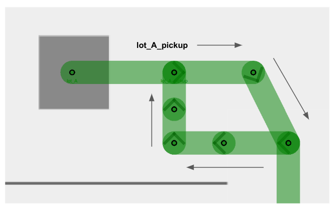

### Example 2: Lift entry and exit

Similarly, users are encouraged to make lift entry and exit lanes unidirectional, so as to facilitate robot movement in cases where a `robot_A` is exiting the lift, and a `robot_B` waiting to enter the lift. By creating separate lanes for each event and restricting their direction flow, the robots will less likely come into a deadlock and hold up an important building infrastructure that is the lift.

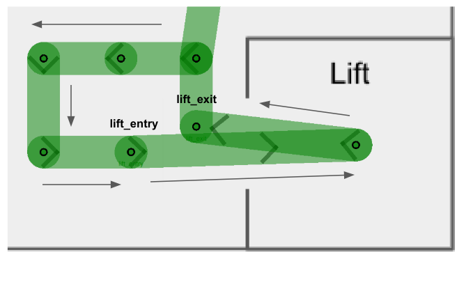

You will notice that in both examples there are several intermediate waypoints allotted. This is because these examples are designed to accommodate a site with five robots, and assigning more waypoints than the maximum number of robots help to ensure free space for each robot integrated.

## Mutex Groups

The concept of mutex groups was introduced to provide users with extra control over traffic flow between robots. Waypoints and lanes can be assigned to a mutex group. **At any point of time, only one robot is allowed to occupy any waypoint or lane belonging to the same mutex group.** By implementing them stragetically in navigation graphs, users can further enhance RMF's deconfliction capabilities to prevent deadlocks and clutter in a given space.
- Mutex groups can be assigned when designing your navigation graph. In the traffic editor, select an existing waypoint or lane, and add the `mutex` property to it.

  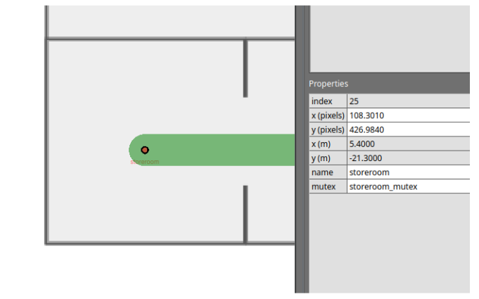

- Mutex groups are differentiated by name. To assign a group of waypoints and lanes to the same mutex group, you simply have to provide a unique name when adding the `mutex` property.
- You will not be able to assign multiple mutex groups to a single waypoint or lane.
- Mutex groups are obtained on a first-come-first-served basis.

### Example: Storeroom entry with queue

Imagine you have a storeroom with limited space, which only allows for one robot to enter at a time. With multiple robots tasked to enter the same room, you'd like them to queue up outside when the storeroom is occupied. You may design your navigation graph like this:

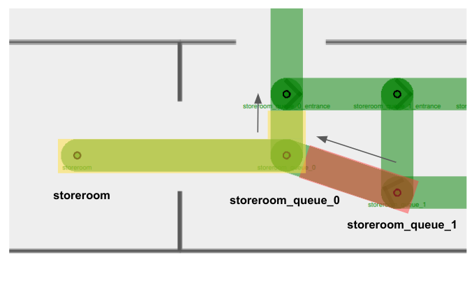

This example combines the use of unidirectional lanes (to set up a queueing system) and mutex groups (to ensure vacant waypoints for storeroom exits).
- There are two mutex groups in this example: `storeroom_mutex` highlighted in yellow, and `storeroom_queue_1_mutex` highlighted in red.
- Arrows indicate unidirectional lanes.
- Notice that both waypoints `storeroom` and `storeroom_queue_0`, as well as the lane connecting them, belong to the `storeroom_mutex` (in yellow). This ensures that when there is a `robot_A` inside the storeroom, no other robots will be allowed on the waypoint `storeroom_queue_0` despite it being unoccupied. This way, `robot_A` can smoothly exit the storeroom without facing a deadlock with an incoming robot.
- When you assign a mutex group to a waypoint, you are also encouraged to assign the same mutex group to the lane(s) it uses to leave the waypoint. This is especially important for tight spaces where you'd need to ensure that a waypoint is completely vacant before the next robot starts moving in.
  - Taking `storeroom_queue_1_mutex` (in red) as an example, if there is a `robot_B` sitting on the waypoint `storeroom_queue_1` and is moving towards `storeroom_queue_0`, the mutex in red would still be held while `robot_B` is travelling on the departure lane.
  - Other robots will not be able to begin travelling towards `storeroom_queue_1` while `robot_B` is moving away.
  - This mutex will only be released when `robot_B` has arrived at `storeroom_queue_0`, making space for the next robot to move to `storeroom_queue_1`.

## Lane Closure

RMF supports lane closure at runtime. When a `LaneRequest` is published, RMF will update the navigation graph with any lane openings or closures. No robots will be commanded to travel on a closed lane until it is marked as open again.

While this feature is primarily useful for site maintenance and other situations where an area should be temporarily off-limits to robots, it also allows for custom conditional lane traversal.

### Example 1: Maximum room occupancy

Lane closures can be useful to optimize queue systems. Consider the above example where robots are queueing to enter a storeroom.

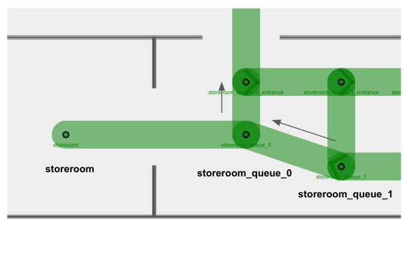

Suppose a `robot_A` is currently inside the storeroom, and `robot_B`, `robot_C`, `robot_D` and `robot_E` are all tasked to enter the same room. If we do not define a queueing system for our robots, it is possible for them to come in from any origin and clutter the storeroom entrance like this:

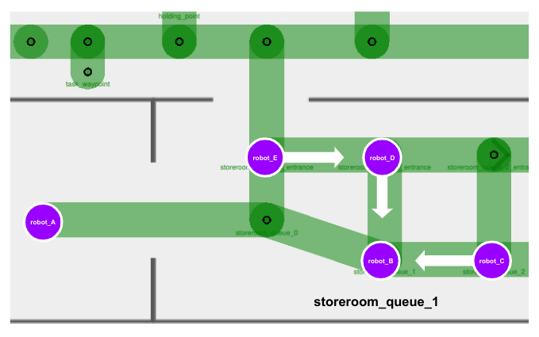

This is undesirable as there is no queue or sequence formed for waiting robots to enter the storeroom systematically. Furthermore, there is a possibility of waiting robots to block the storeroom exit, e.g. `robot_E`, creating a deadlock in this area.

At the same time, we also wouldn't want to remove the bridging lanes entirely, as it would force our robots to take unnecessary and possibly long detours in order to enter the queue, as illustrated below.

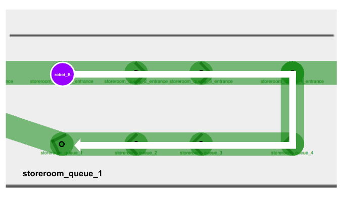

In this case, we can implement conditional lane closures on these bridging lanes.
- When `robot_B` arrives outside the storeroom with an empty queue, it can move directly to `storeroom_queue_1` and wait there.

  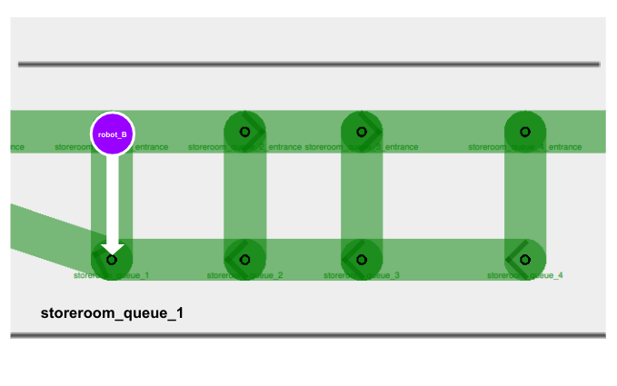
- In your fleet adapter or a separate ROS 2 node, you can add a function to detect waypoint occupancy. If the waypoint `storeroom_queue_1` is occupied, publish a `LaneRequest` to close the waypoint's bridging lane. Any other robots that come along will be restricted to join the queue on the next waypoint.

  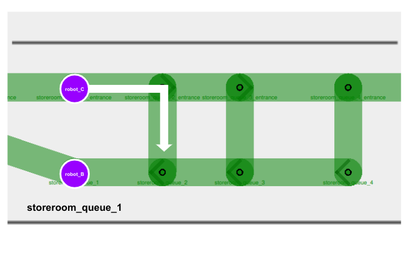

- As more robots join the queue, we close off more bridging lanes if they lead to a queue waypoint that is already occupied.

  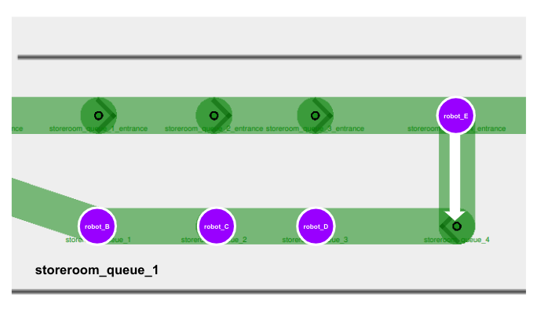

### Example 2: Taking alternate lifts

Lane closures are also helpful when you need to forcefully re-route robots regardless of what RMF determines to be the most optimized path. Consider this example:
- Your site consists of two lifts, `lift_A` and `lift_B`, that are far apart from each other.
- You have two robots, `robot_A` and `robot_B`, both parked right beside `lift_A` on Level 1.
- Each robot is allocated a task to travel to Level 2, which is accessible via both `lift_A` and `lift_B`.
- When `lift_A` is in use by `robot_A`, RMF might command `robot_B` to queue for the same `lift_A` because it is calculated to be the most optimized path, since `lift_B` is considerably far away.
- However, your site is subjected to several external environmental factors, e.g. foot traffic, that makes it suboptimal for robots to queue for an occupied lift.
- In this case, you may opt to implement a conditional lane closure where the entrance lane to `lift_A` closes as long as there is a robot occupying the lift. This would prompt RMF to re-route `robot_B` to use `lift_B` instead.

The use of lane closures is flexible and extensible to many custom logics. You may consider utilizing them wherever appropriate.

## Speed Limits

You are able to create priority in the paths taken by fleet robots by assigning speed limits to lanes. The speed limit property is originally designed to dictate robot velocities in specific areas. However, if it is not necessary for you to relay velocity data to your integrated robots, you can use this feature to create "preferred" lanes in your navigation graph instead.

RMF translates lanes with lower speed limits to higher cost, since theoretically it would take a longer time for a robot to travel across that lane. Hence RMF would usually direct robots to take routes involving lanes with higher or no speed limits if an alternate path exists. By default, lanes do not have any speed limits, indicated with `0.0` under the speed limit property.

With this, you may assign low speed limits to lanes that are necessary for certain tasks, but otherwise should be avoided by robots. 

### Example: Task waypoints vs. Holding points

Holding points (leaf nodes) are extremely useful and important in long, narrow hallways with a single bidirectional lane. They allow robots travelling in opposite directions to give way to one another. However, in certain sites these leaf nodes are not meant to be holding points, but instead are waypoints where tasks are being performed. This means no robots should be allowed on these waypoints unless they are assigned to perform a task there, even during traffic negotiation.

To prevent robots travelling across long hallways from using task waypoints as holding points, you can assign a low speed limit (e.g. `0.001`) to lanes connected to these waypoints.

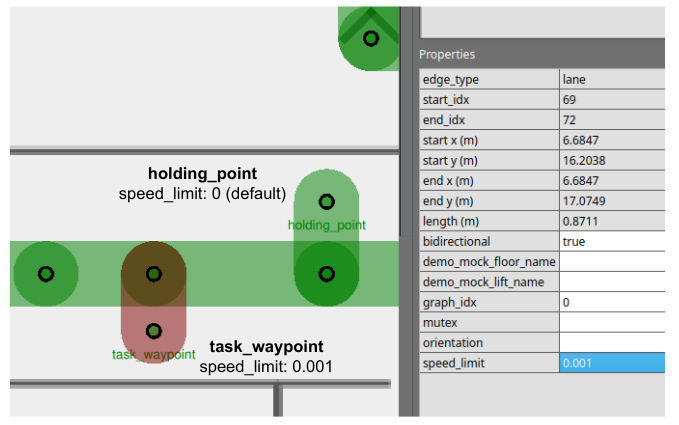

## Combining Strategies

Combining the use of multiple features and strategies can help us navigate through more complicated scenarios.

### Example: Maximum occupancy in two separate rooms

Consider this example:
- There are two activity rooms, `activity_room_A` and `activity_room_B`, each with a maximum occupancy of one robot.
- You would like robots waiting to enter either room to queue up outside, and enter only when their target room becomes vacant.

A navigation graph design to handle this scenario could look like this:

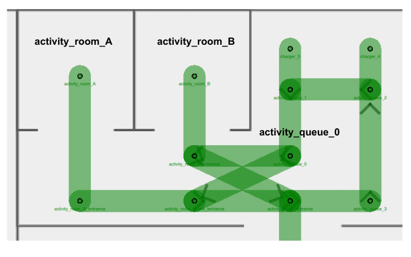

With detailed illustrations of the mutex groups and unidirectional lanes assigned:

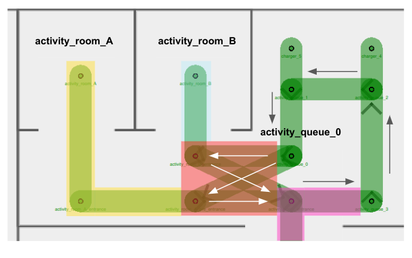

In this navigation graph,
- There are a few mutex groups present:
  - `activity_room_A_mutex` in yellow
  - `activity_room_B_mutex` in blue
  - `activity_cross_section_mutex` in red
  - `activity_entrance_mutex` in pink
- Arrows represent the direction assigned for unidirectional lanes
- Unidirectional lanes on the right of the diagram form a queue to enter either room
- Four unidirectional lanes intersect one another right outside `activity_room_B`, forming a cross-section for entrance into/exit from the activity rooms
  - Using separate unidirectional lanes for each activity room enables the next robot to enter its target room as long as it is vacant. Otherwise, it would continue to wait outside when any room is occupied, even if its target room is empty.
- _(Not shown in diagram)_ Lane closure logic is implemented for entrance lanes inside the cross-section area. Details are elaborated in [Scenario 3](#scenario-3-robot-queueing-for-an-occupied-room) below.

This setup introduces several different possible scenarios. Let's take a look at some of the more problematic ones and how our graph strategy deals with them.

#### Scenario 1: Two robots exiting activity rooms at the same time
- Suppose a `robot_A` currently occupies `activity_room_A` and a `robot_B` occupies `activity_room_B`. Both robots complete their tasks in the respective rooms and are ready to exit.
- `robot_A` holds the `activity_room_A_mutex` (in yellow), and `robot_B` holds `activity_room_B_mutex` (in blue).
- In order to exit, the robots would need to acquire the `activity_cross_section_mutex` (in red). Depending on which robot obtains the mutex in red first, they would be allowed to travel on their respective exit lane to leave the area. Additionally, they would also need the obtain the `activity_entrance_mutex` (in pink), since the exit waypoint belongs to this mutex group.
- The assignment of mutex groups ensures that only one robot is travelling within the cross-section area at any time, preventing any potential crashes or conflicts.

#### Scenario 2: Two robots waiting to use cross-section lanes
- Suppose a `robot_A` currently sits on `activity_queue_0`, ready to enter `activity_room_A` which is currently empty. Another `robot_B` is inside `activity_room_B`, ready to exit.
- Similar to above, the `activity_cross_section_mutex` (in red) ensures that `robot_A` and `robot_B` will not travel on any of the cross-section lanes at the same time.

#### Scenario 3: Robot queueing for an occupied room
- Suppose a `robot_A` currently occupies `activity_room_A` and a `robot_B` occupies `activity_room_B`. Both robots complete their tasks in the respective rooms and are ready to exit.
- A third `robot_C` is sitting on `activity_queue_0`, waiting to enter `activity_room_B`.

  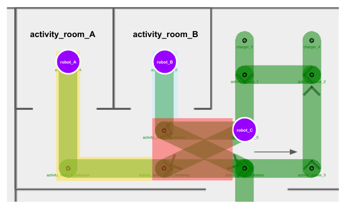
- `robot_A` holds the `activity_room_A_mutex` (in yellow), and `robot_B` holds `activity_room_B_mutex` (in blue).
- In order for any robot to move along to their next destination, they would need to obtain the `activity_cross_section_mutex` (in red). From the scenarios above, we know that the red mutex helps to facilitate a turn-by-turn use of the cross-section lanes.
- However, if `robot_C` happens to obtain the red mutex _first_, all three robots would come into a deadlock, since
  - `robot_A` and `robot_B` wouldn't be able to obtain the red mutex until `robot_C` releases it, but
  - `robot_C` wouldn't be able to obtain the blue mutex in order to enter `activity_room_B`, until `robot_B` releases it.
- Here is where lane closures could help. We can close off cross-section entry lanes when the respective activity rooms are occupied. `robot_C` would not be able to obtain the red mutex nor proceed with its task until `robot_B` leaves `activity_room_B`.

  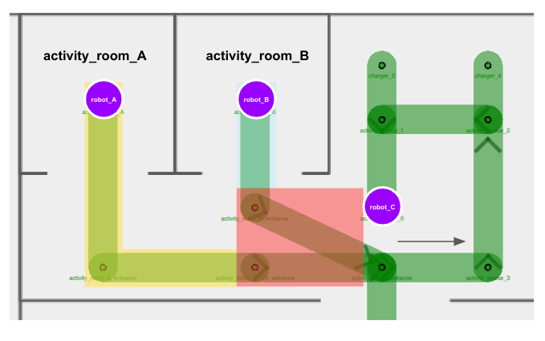
- After `robot_B` has successfully exited the activity room and this area altogether, the entry lane to `activity_room_B` can be opened up again for use.

  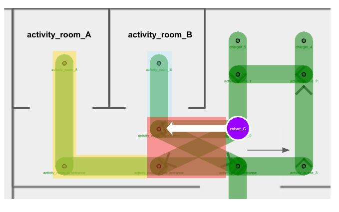

#### Other Considerations

> Instead of implementing lane closure, why don't we assign `activity_room_B_mutex` (in blue) to the entry lane towards `activity_room_B`, and `activity_room_A_mutex` (in yellow) to the entry lane towards `activity_room_A`?

We want the four cross-section lanes to belong to the same mutex group, in order to ensure that only one robot travels across any of these lanes at any point of time. This prevents situations where multiple robots move near or towards each other in a cramped corridor. Since each lane can only be assigned one mutex group, we can leverage on other features, such as lane closures, to ensure that queueing robots don't enter the cross-section if their target room is occupied.
