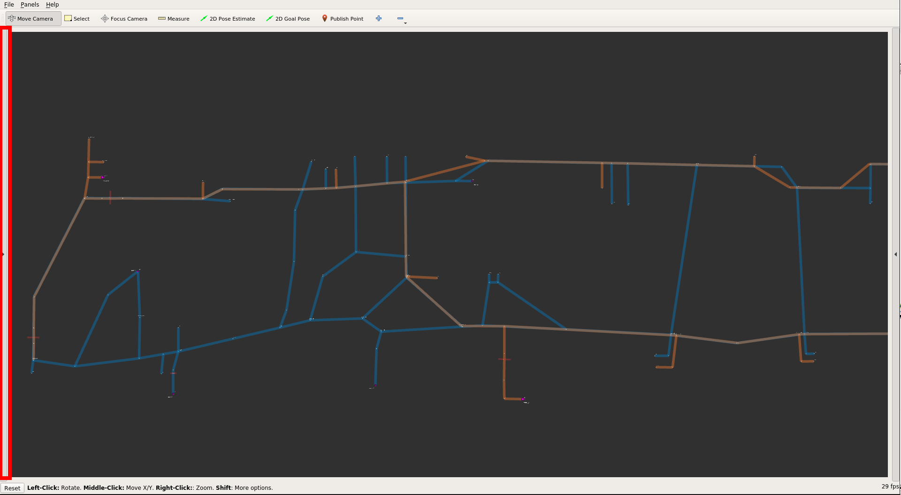
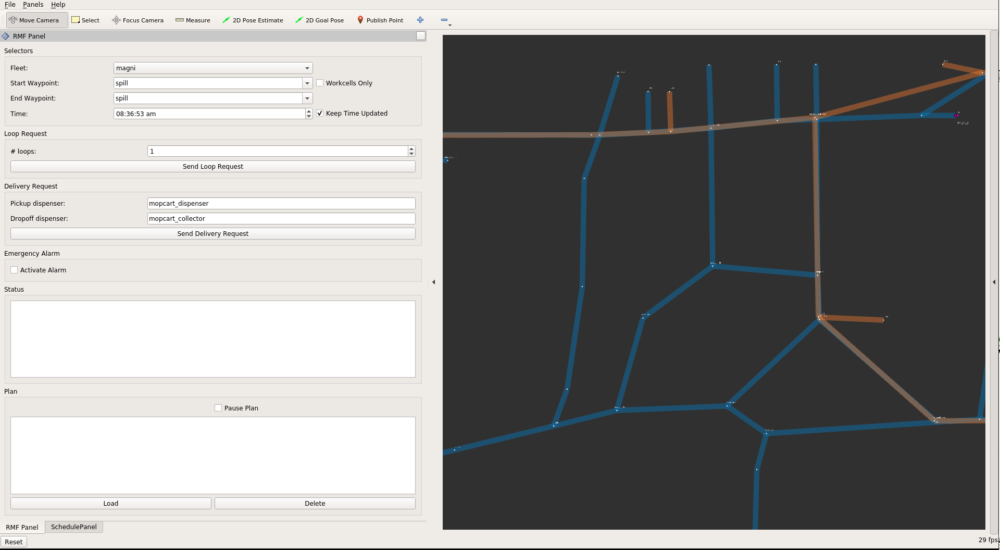

# Introduction

This section describes the motivation for ROS 2 and the RMF system for integrating multiple robots, as well as a high-level introduction to RMF and its utilities.

# ROS 2

The Robot Operating System (ROS) is a set of software libraries and tools for building robot applications.
From drivers to state-of-the-art algorithms, and with powerful developer tools, ROS has what you need for your next robotics project.
And it’s all open source.

Since ROS was started in 2007, a lot has changed in the robotics and ROS community.
ROS 1, originally just "ROS", began life as the development environment for the Willow Garage PR2 robot.
The primary goal was to provide the software tools users would need to undertake novel research and development projects with the PR2.
At the same time, the ROS 1 development team knew the PR2 would not be the only robot in the world, nor the most important, so they wanted ROS 1 to be useful on other robots, too.
The original focus was on defining levels of abstraction (usually through message interfaces) that would allow much of the software to be reused elsewhere.

ROS 1 satisfied the PR2 use case, but also became useful on a surprisingly wide variety of robots.
This included robots similar to the PR2, but also wheeled robots of all sizes, legged humanoids, industrial arms, outdoor ground vehicles (including self-driving cars), aerial vehicles, surface vehicles, and more.
ROS 1 adoption also took a surprising turn, happening in domains beyond the mostly academic research community that was the initial focus.
ROS-1-based products were coming to market, including manufacturing robots, agricultural robots, commercial cleaning robots, and others.
Government agencies were also looking more closely at ROS for use in their fielded systems; NASA, for example, expected to run ROS on the Robonaut 2 deployed to the International Space Station.

All of these applications certainly grew the ROS platform in unexpected ways.
Though it held up well, the ROS 1 team believed they could better meet the needs of the broader ROS community by tackling their new use cases head-on.
And so, ROS 2 was born.

The initial goal of the ROS 2 project was to adapt to the changing landscape, leveraging what was great about ROS 1 and improving what wasn’t.
But there was also a desire to preserve ROS 1 as it existed, to continue working and remain unaffected by the development of ROS 2.
So, ROS 2 was built as a parallel set of packages that can be installed alongside and interoperate with ROS 1 (for example, through message bridges).

At the time of writing, we have reached the 13th and last official ROS 1 release, [Noetic Ninjemys](https://www.openrobotics.org/blog/2020/5/23/noetic-ninjemys-the-last-official-ros-1-release), and the first LTS release of ROS 2, [Foxy Fitzroy](https://www.openrobotics.org/blog/2020/6/5/ros-2-foxy-fitzroy-release).

A large and growing amount of ROS 2 resources can be found on the web.
A great place to start is on the ROS Index page for [ROS 2](https://index.ros.org/doc/ros2/) and further along in this book in the ROS 2 chapter.
Enjoy your journey!

# Robotics Middleware Framework (RMF)

## Motivation for RMF

Imagine a world where robots available from diverse companies and manufacturers are able to co-exist in the same facility; gracefully sharing critical resources such as corridors, lifts (elevators), doors and other infrastructure to enable a more efficient overall system.
Imagine integrating a lift only once in a way that allows any robot to use the shared resource in a controlled and safe manner.
Imagine a world free of robot deadlocks in a shared corridor.
These ideas are achievable today using an amazing system called RMF.

The current generation of robots in production environments today are able to provide services including both bulk and single piece flow delivery, cleaning, disinfecting, security, monitoring, and much more.
These diverse use cases most likely mean the best-in-class robots for each task will come from different robot providers or system integrators.
This modern reality makes it critical for a common software framework in place to manage these heterogeneous resources and to ensure  information is being used effectively from different platforms to promote overall system efficiency.

Without a plan for a holistically efficient robotics system in place, there can be significant but hidden risks for end users when committing to a single system or platform provider.
Hidden risks are likely to force an end user to limit their selection of future solutions from that particular provider to minimize operational risk and avoid redundant integration costs.
As the scope and scale of robotic deployments increase, this problem is exacerbated, leaving the customer with the perception that there are no good options except to stay with their current provider.

Beyond the increased cost risk of scaling deployment with different providers, there is also the inherent conflict over shared resources such as lifts, doorways, corridors, network bandwidth, chargers, operations-center screen “real estate,” and human resources such as IT personnel and maintenance technicians.
As robotic scale increases, it becomes more cumbersome for an operations team to consider managing a large, heterogeneous, multi-vendor robot environment.

These problem statements were the foundational motivations for the development of RMF.
Historically, ROS development focused heavily on the software running on or near individual robots.
RMF is designed to operate at a higher abstraction layer to create networked fleets of robots that interoperate with building infrastructure systems, enterprise services, IOT devices, and human interfaces.

Unlock your options, your facility and your future with RMF.

We would like to acknowledge the Singapore government for their vision and support to start this ambitious research and development. The project is supported by MOH and NR2PO/ A*STAR under its project "Development of Standardised Robotics Middleware Framework - RMF detailed design and common services, large-scale virtual test farm infrastructure, and simulation modelling". The project is supported by MOH and NRP

Any opinions, findings and conclusions or recommendations expressed in this material are those of the author(s) and do not reflect the views of the NR2PO A*STAR and MOH.

## So what is RMF?

RMF is a collection of reusable, scalable libraries and tools building on top of ROS 2 that enable the interoperability of heterogeneous fleets of any type of robotic systems.
RMF utilizes standardized communication protocols to infrastructure, environments and automation where robots are deployed to optimize the use of critical resources (i.e. robots, lifts, doors, passageways, etc).
It adds intelligence to the system through resource allocation and by preventing conflicts over shared resources through the RMF Core which will be described in detail later in this book.

RMF is flexible and robust enough to operate over virtually any communications layer and integrate with any number of IOT devices.
The architecture of RMF is designed in such a way to allow scalability as the level of automation in an environment increases.
There are various ways for systems and users to interact with RMF via APIs and customizable user interfaces.
Once deployed in an environment, RMF will save costs by allowing resources to be shared and integrations to be minimized.
It is what robotic developers and robot customers have been looking for.
In a nutshell, here is RMF:


## How does RMF make the magic happen?

One of the principles of RMF's design is to simplify and standardize messaging as much as possible.
You can see all of the complex interactions and coordination currently boils down to only fourteen standard messages in the below diagram of the RMF Core:


We will explore each of these functional areas in more detail in later chapters of this book, but for now we'd like to also introduce some of the other utilities helpful when developing and integrating with RMF.

### RMF Demos

[The demos](https://github.com/osrf/rmf_demos) are demonstrations of the capabilities of RMF in various environments.
This repository serves as a starting point for working and integrating with RMF.

### Traffic Editor

[Traffic Editor](https://github.com/osrf/traffic_editor) is a GUI for creating and annotating floorplans for use in RMF.
Through Traffic Editor you are able to create traffic patterns for use in RMF and introduce simulation models to enhance your virtual simulation environments.
The `.yaml` files can be easily exported for use in Gazebo.

### Free Fleet

[Free Fleet](https://github.com/osrf/free_fleet) is an open-source robot fleet management system for robot developers who do not have their own fleet manager or who would prefer to use and contribute to an open-source fleet management utility.

### Systems of Systems Synthesizer (SOSS)

The [SOSS](https://github.com/osrf/soss) you've been missing! SOSS easily passes messages between various message formats and types, including ROS 1, ROS 2, WebSocket, REST, FiWare, DDS, OPC-UA, and more.

### RMF Schedule Visualizer

This [visualizer](https://github.com/osrf/rmf_schedule_visualizer) is an rviz-based rmf_core visualizer and control panel.
It is intended to be a functional tool for RMF or RoMi-H developers.

### RoMi Dashboard

The Robotics Middleware for Healthcare (RoMi-H) is a healthcare specific implementation of RMF.
This [dashboard](http://github.com/osrf/romi-dashboard) is a web application that provides overall visualization and control over the RoMi-H system.
The dashboard is by design more "operator-friendly" compared to the previously mentioned schedule visualizer.

### Simulation Assets

The open-source and freely distributable [simulation assets](https://app.ignitionrobotics.org/fuel) are created and shared to accelerate simulation efforts.

## Installation of the RMF Essentials

The current version of RMF is 1.0.2. It targets ROS Eloquent, and Debian binary packages are released for Ubuntu Bionic 18.04 LTS.

RMF leverages the ROS and Gazebo-Ignition ecosystem. We will have to setup their repositories as the first steps of the RMF installation process. Since the current binary release targets Ubuntu Bionic please ensure you match the system and version before proceeding with the installation. If you have ROS 2 and Gazebo installed you can directly skip to the [Setup Sources and Installation of RMF](#setup-sources-and-installation-of-rmf) section.

### Setup Locale

Make sure you have a locale which supports UTF-8. If you are in a minimal environment, such as a docker container, the locale may be something minimal like POSIX. You can check your locale by running `locale` directly in your terminal.

We test with the following settings. It should be fine if you’re using a different UTF-8 supported locale. In case you need it, here is an example on how to switch to the US English UTF-8 locale:

```
sudo locale-gen en_US en_US.UTF-8
sudo update-locale LC_ALL=en_US.UTF-8 LANG=en_US.UTF-8
export LANG=en_US.UTF-8
```

### Setup and Install ROS 2

You will need to add the ROS 2 apt repositories to your system. To do so, first authorize our GPG key with apt like this:

```
sudo apt update && sudo apt install curl gnupg2 lsb-release
curl -s https://raw.githubusercontent.com/ros/rosdistro/master/ros.asc | sudo apt-key add -
```

And then add the repository to your sources list:

```
sudo sh -c 'echo "deb [arch=$(dpkg --print-architecture)] http://packages.ros.org/ros2/ubuntu $(lsb_release -cs) main" > /etc/apt/sources.list.d/ros2-latest.list'
```

If ROS 2 is not installed using at least `ros-eloquent-ros-base` you will need the following packages to run the RMF demos:

```
sudo apt-get install ros-eloquent-ros2cli ros-eloquent-ros2run ros-eloquent-ros2launch
```

In order to run ROS 2 commands we need to source the `setup.bash` file:

```
source /opt/ros/eloquent/setup.bash
```

### Setup Ignition-Gazebo Sources

You will also need to add the Ignition-Gazebo apt repositories similar to the ROS 2 setup. Let's authorize the key:

```
curl -s http://packages.osrfoundation.org/gazebo.key | sudo apt-key add -
```

You will also need to add the repository to your sources list:

```
sudo sh -c 'echo "deb http://packages.osrfoundation.org/gazebo/ubuntu-stable `lsb_release -cs` main" > /etc/apt/sources.list.d/gazebo-stable.list'
```

### Setup Sources and Installation of RMF

Next you will need to setup the source of RMF packages similar to the previous two steps. First authorizing the key:

```
curl -s http://rmf.servehttp.com/repos.key | sudo apt-key add -
```

Secondly adding the repository to the apt sources:

```
sudo sh -c 'echo "deb http://rmf.servehttp.com/ubuntu/main/ bionic main" > /etc/apt/sources.list.d/rmf.list'
```

And now we are ready to install. Let's update our packages:

```
sudo apt-get update
```

Finally, the following installs a basic set of packages that should get you going with RMF:

```
sudo apt-get install ros-eloquent-ament-cmake-catch2 ros-eloquent-building-gazebo-plugins ros-eloquent-building-map-msgs ros-eloquent-building-map-tools ros-eloquent-rmf-cmake-uncrustify ros-eloquent-rmf-dispenser-msgs ros-eloquent-rmf-door-msgs ros-eloquent-rmf-fleet-adapter ros-eloquent-rmf-fleet-msgs ros-eloquent-rmf-lift-msgs ros-eloquent-rmf-task-msgs ros-eloquent-rmf-traffic-msgs ros-eloquent-rmf-traffic-ros2 ros-eloquent-rmf-traffic ros-eloquent-rmf-utils ros-eloquent-traffic-editor
```

## Install and run RMF demos

You can install the provided RMF demos from their Debian package:

```
sudo apt-get install ros-eloquent-demos
```

Once everything is installed you can optionally download the 3D models so your simulation visuals are complete. You can do this for any of the available demos. Here is an example on how to do it for the airport terminal models:

```
ros2 run building_map_tools model_downloader rmf_demo_maps -s airport_terminal
```

You can learn more about the model downloader tool running:

```
ros2 run building_map_tools model_downloader -h
```

Finally run your desired demo. In this case we will run the airport terminal:

```
ros2 launch demos airport_terminal.launch.xml
```

The airport world was created to not spawn the robots when launched. Instead there are "RobotPlaceholder" models where they get dynamically spawned. To spawn the robots, run this command:

```
ros2 run demos airport_terminal_spawn_robots.sh
```

Now you should be able to see the airport terminal with the robots in Gazebo:


The RMF Schedule Visualizer should have loaded in an rviz window. The `RMF Panel` and `SchedulePanel` might appear hidden by default, so you might have to click in the left middle arrow to make them visible:



Now you should be able to see the `SchedulePanel`, click on the lower tab for the `RMF Panel`:


You can send up requests to the `magni` and `mir` fleets using this panel:



You can also send them directly using ROS 2 messages. Here we request a robot from the `magni` fleet to go from the waypoint `magni_n09` to `magni_s07` only once:

```
ros2 run rmf_demo_tasks request_loop -s magni_n09 -f magni_s07 -r magni -n 1
```

## Jump in, the water is fine!

So now you have an idea of what RMF is all about, it's time to jump in. We would suggest if you have not already that you take the time to review the [RMF Demos](https://github.com/osrf/rmf_demos) repository and if you want a really quick overview of RMF then take a look at this [Mock Airport Terminal video demo](https://vimeo.com/405803151) (Short film Oscar nominations most welcome). We hope you find RMF to be a useful tool to help you scale your robot deployments and operations and we look forward to the many improvements and contributions to come!
