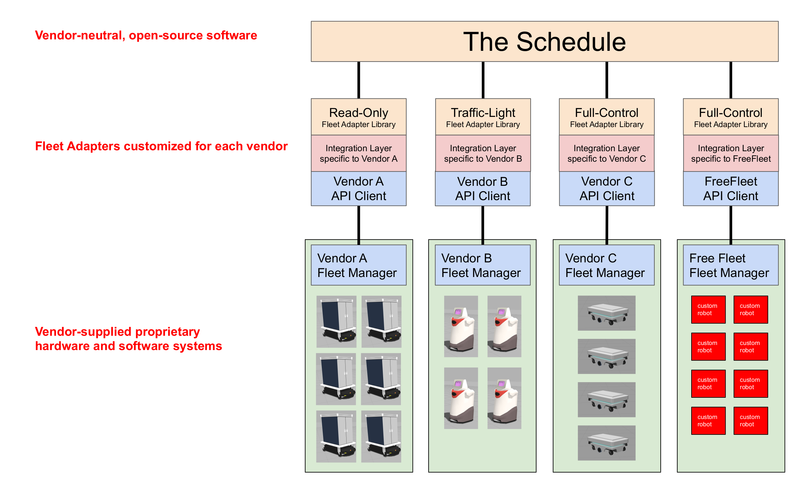
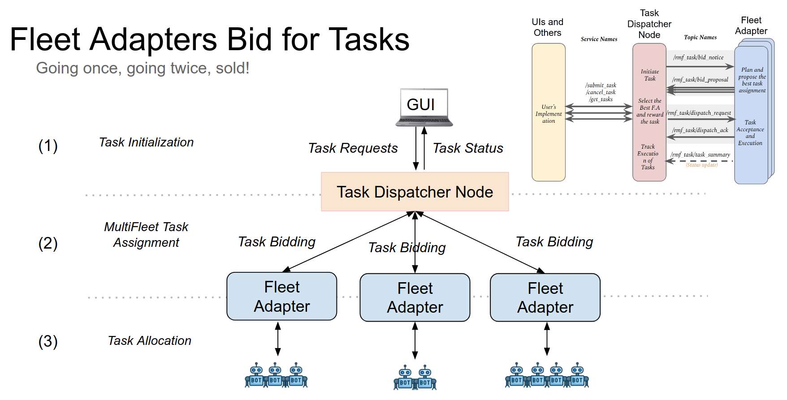

# RMF Core Overview

This chapter describes RMF, an umbrella term for a wide range of open specifications and software
tools that aim to ease the integration and interoperability of robotic systems,
building infrastructure, and user interfaces. [`rmf_core`](https://github.com/osrf/rmf_core)
is an implementation of some of the core scheduling and traffic management systems.

## Traffic deconfliction

Avoiding mobile robot traffic conflicts is a key functionality of `rmf_core`.
There are two levels to traffic deconfliction: (1) prevention, and (2)
resolution.

### Prevention

Preventing traffic conflicts whenever possible is the best-case scenario.
To facilitate traffic conflict prevention, we have implemented a
platform-agnostic Traffic Schedule Database. The traffic schedule is a living
database whose contents will change over time to reflect delays, cancellations,
or route changes. All fleet managers that are integrated into an RMF deployment must
report the expected itineraries of their vehicles to the traffic schedule. With
the information available on the schedule, compliant fleet managers can plan
routes for their vehicles that avoid conflicts with any other vehicles, no
matter which fleet they belong to. `rmf_traffic` provides a
[`Planner`](https://github.com/osrf/rmf_core/blob/master/rmf_traffic/include/rmf_traffic/agv/Planner.hpp)
class to help facilitate this for vehicles that behave like standard AGVs (Automated Guided Vehicles),
rigidly following routes along a pre-determined grid. In the future
we intend to provide a similar utility for AMRs (Autonomous Mobile Robots) that can perform ad hoc motion
planning around unanticipated obstacles.

### Negotiation

It is not always possible to perfectly prevent traffic conflicts.
Mobile robots may experience delays because of unanticipated obstacles in their
environment, or the predicted schedule may be flawed for any number of reasons.
In cases where a conflict does arise, `rmf_traffic` has a Negotiation scheme.
When the Traffic Schedule Database detects an upcoming conflict between two or
more schedule participants, it will send a conflict notice out to the relevant
fleet managers, and a negotiation between the fleet managers will begin. Each
fleet manager will submit its preferred itineraries, and each will respond with
itineraries that can accommodate the others. A third-party judge (deployed by
the system integrator) will choose the set of proposals that is considered
preferable and notify the fleet managers about which itineraries they should
follow.

There may be situations where a sudden, urgent task needs to take place
(for example, a response to an emergency), and the current traffic schedule does not
accommodate it in a timely manner. In such a situation, a traffic participant
may intentionally post a traffic conflict onto the schedule and force a
negotiation to take place. The negotiation can be forced to choose an itinerary
arrangement that favors the emergency task by implementing the third-party
judge to always favor the high-priority participant.

## Traffic Schedule

The traffic schedule is a centralized database of all the intended robot traffic
trajectories in a facility. Note that it contains the intended trajectories; it is
looking into the future. The job of the schedule is to identify conflicts in
the intentions of the different robot fleets and notify the fleets when a
conflict is identified. Upon receiving the notification, the fleets will begin
a traffic negotiation, as described above.

## Task Dispatcher

In RMF version 21.04 and above, tasks are awarded to robot fleets based on the outcome
of a bidding process that is orchestrated by a Dispatcher node, `rmf_dispatcher_node`.
When the Dispatcher receives a new task request from an external application, the dispatcher
will initiate the bidding process with a series of messages (`BidNotice`, `BidProposal`, `DispatchRequest`...).
If a fleet adapter is able to process that request, propose a cost to accommodate the task
to the `rmf_dispatcher_node`. An instance of rmf_task::agv::TaskPlanner is used by the fleet
adapters to determine how best to accommodate the new request.

Battery recharging is tightly integrated with the new task planner. `ChargeBattery` tasks
are optimally injected into a robot's schedule when the robot has insufficient charge to
fulfill a series of tasks. Currently we assume each robot in the map has a dedicated charging
location as annotated with the `is_charger` option in the traffic editor map.

## Fleet Adapters

Each robot fleet that participates in an RMF deployment is expected to have a
fleet adapter that connects its fleet-specific API to the interfaces
of the core RMF traffic scheduling and negotiation system. The fleet adapter is
also responsible for handling communication between the fleet and the various
standardized smart infrastructure interfaces, e.g. to open doors, summon lifts,
and wake up dispensers.

Different robot fleets have different features and capabilities, dependent on
how they were designed and developed. The traffic scheduling and negotiation system
does not postulate assumptions about what the capabilities of the fleets will be.
However, to minimize the duplication of integration effort, we have identified 4
different broad categories of control that we expect to encounter among various
real-world fleet managers.

* **Full Control** *(API available)* - RMF is provided with live status updates and full control over the paths that each individual mobile robot uses when navigating through the environment. This control level provides the highest overall efficiency and compliance with RMF, which allows RMF to minimize stoppages and deal with unexpected scenarios gracefully.

* **Traffic Light** *(API available)* - RMF is given the status as well as pause/resume control over each mobile robot, which is useful for deconflicting traffic schedules especially when sharing resources like corridors, lifts and doors.

* **Read Only** *(Preliminary API available)* - RMF is not given any control over the mobile robots but is provided with regular status updates. This will allow other mobile robot fleets with higher control levels to avoid conflicts with this fleet. _Note that any shared space is allowed to have a maximum of just one "Read Only" fleet in operation. Having none is ideal._

* **No Interface** *(Not compatible)* - Without any interface to the fleet, other fleets cannot coordinate with it through RMF, and will likely result in deadlocks when sharing the same navigable environment or resource. This level will not function with an RMF-enabled environment.

In short, the more collaborative a fleet is with RMF, the more harmoniously all of the fleets and systems are able to operate together.
Note again that there can only ever be one "Read Only" fleet in a shared space, as any two or more of such fleets will make avoiding deadlock or resource conflict nearly impossible.

Currently we provide a reusable C++ API (as well as Python bindings) for integrating the **Full Control** category of fleet management.
A preliminary ROS 2 message API is available for the **Read Only** category, but that API will be deprecated in favor of a C++ API 
(with [Python bindings](https://github.com/osrf/rmf_fleet_adapter_python/) available) in a future release.
The **Traffic Light** control category is compatible with the core RMF scheduling system, but we have not yet implemented a reusable API for it.
To implement a **Traffic Light** fleet adapter, a system integrator would have to use the core traffic schedule and negotiation APIs directly, as well as implement the integration with the various infrastructure APIs (e.g. doors, lifts, and dispensers).

The API for the **Full Control** category is described in the [Mobile Robot Fleets](./integration_fleets.md) section of the Integration chapter, and the **Read Only** category is described in the [Read Only Fleets](./integration_read-only.md) section of the Integration chapter.
