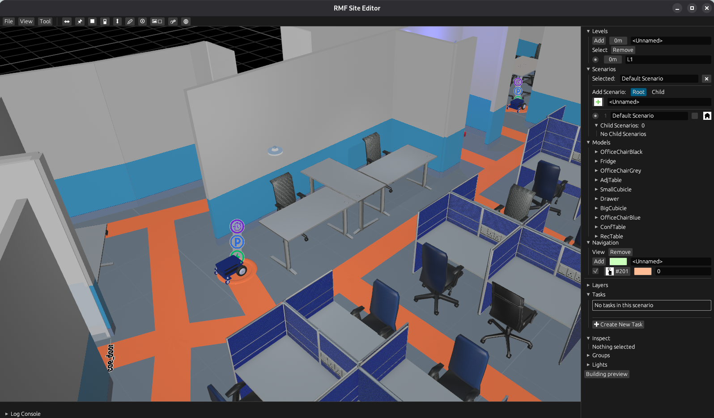
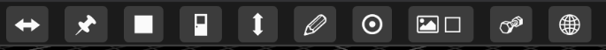
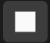
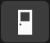
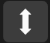
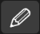
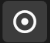
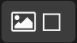
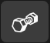
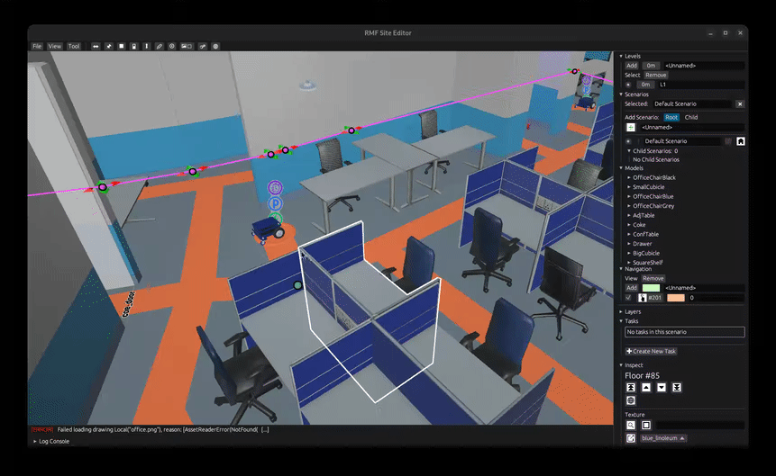

# RMF Site Editor

This section describes the RMF Site Editor GUI and provides a guide for building a world.

## Overview

The `rmf_site` [repository](https://github.com/open-rmf/rmf_site) is home to the RMF Site Editor which serves as a replacement to the  `traffic_editor` [repository](https://github.com/open-rmf/rmf_traffic_editor) and is the recommended approach for visualizing and editing RMF sites.

## GUI Layout

In the sections below, we will provide a detailed breakdown of the `rmf_site` GUI which includes a `Toolbar`, a `Working Area` and a `Sidebar` as seen in the figure below:

### Toolbar

The toolbar located at the top contains a variety of tools for site creation which includes adding robot traffic lanes, creation of doors, walls, lifts and simulated flooring, adding virtual models and importing drawings.

The functions of the individual menu buttons are explained below:

|                    Icon                           |  Name  |                Function               |
|:-------------------------------------------------:|:------:|:------------------------------------:|
|  | Lane | Create a new traffic lane |
|  | Location | Create a new location |
|  | Wall | Create a new wall |
|  | Door | Create a new door |
|  | Lift | Add a new lift. The lifts define the point of access between different floors of a building. |
|  | Floor | Add a new building floor. |
|  | Fiducial | Add a new fiducial. Fiducials act as a means to scale and align different levels with respect to a reference level. |
|  | Drawing | Import a new drawing |
|  | Model | Spawn a new virtual model from a new or existing model description |
|  | Fuel Asset Browser | Opens the Gazebo Fuel asset gallery |

### Working Area

The `Working Area` is where the levels, along with their annotations, are rendered. Here, the user can zoom, pan and rotate using the mouse.

Panning, zooming and rotation in the world is primarily achieved using the different mouse buttons.

Pan around the world by holding down the right mouse button:

Rotate about a fixed point by holding down the middle mouse wheel:

Zoom using by scrolling the middle mouse wheel:

### Sidebar

<!-- TODO(@johntgz) Add a picture of the sidebar -->

The `Sidebar` on the right side of the window contains multiple tabs with various functionalities:
* **Levels:** to add a new level to the building or switch between existing levels of the building.
* **Scenarios:** TODO(@johntgz)
* **Models:** TODO(@johntgz)
* **Navigation:** TODO(@johntgz)

* **Layers:** to control the overlap of different image layers by controlling settings such as transparency. Some commonly used image layers are lidar maps or building drawings.
* **Tasks:** TODO(@johntgz)

* **Inspect:** TODO(@johntgz)
* **Groups:** TODO(@johntgz)
* **Lights:** to control the lighting in the scene by configuring existing lights or adding new light sources

