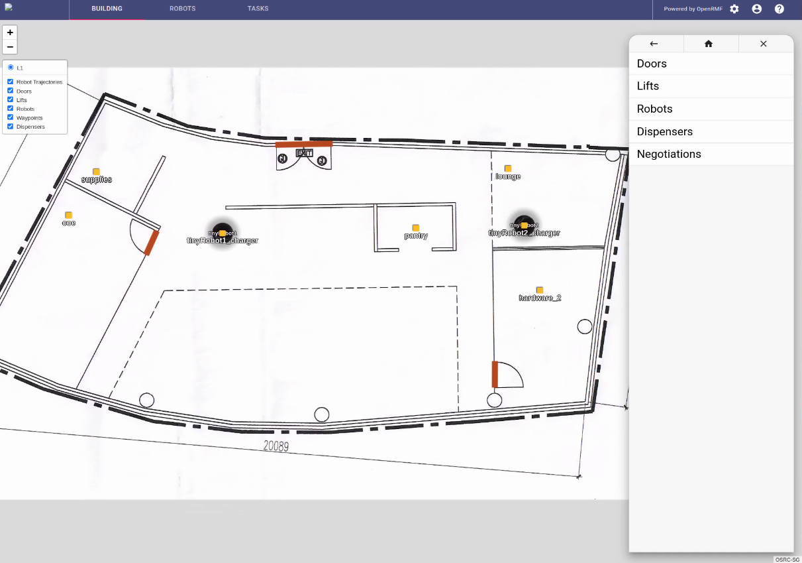

# RMF Web

## Introduction

Rmf web is the web application side of RMF. It provides the user with a configurable front end dashboard, along with back end infrastructures.

For more information, please refer to the `rmf-web` repo.

# Related Repositories

 - [rmf-web](https://github.com/open-rmf/rmf-web)
 - [example deployment](https://github.com/open-rmf/rmf-web/tree/main/example-deployment)
 - [rmf-cloud](https://github.com/open-rmf/rmf-cloud-tools)
