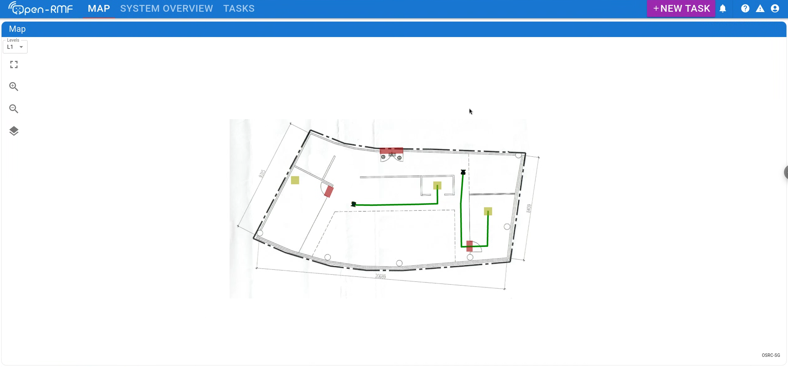
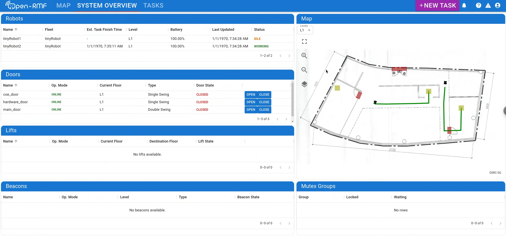
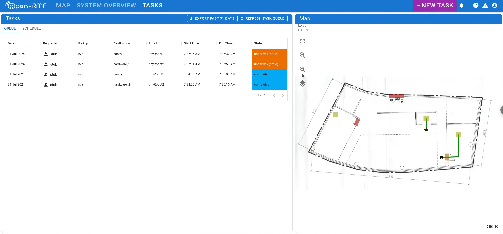

# RMF Web

## Introduction

Open-RMF Web provides a comprehensive web application toolkit, with an API server, re-usable frontend components, as well as a customizable frontend dashboard.

For more information on setup and documentation, please refer to the `rmf-web` repo.

For users looking to set up a full deployment of Open-RMF with its core libraries, building infrastructure adapters, fleet adapters and Open-RMF web, please refer to the [Open-RMF deployment template](https://github.com/open-rmf/rmf_deployment_template).

# Related Repositories

 - [rmf-web](https://github.com/open-rmf/rmf-web)
 - [Open-RMF deployment template](https://github.com/open-rmf/rmf_deployment_template)
