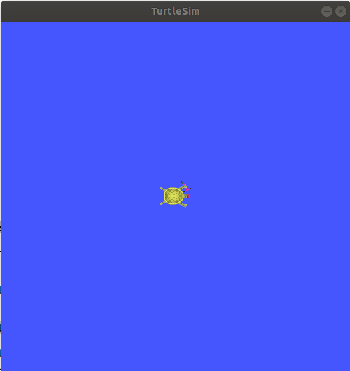
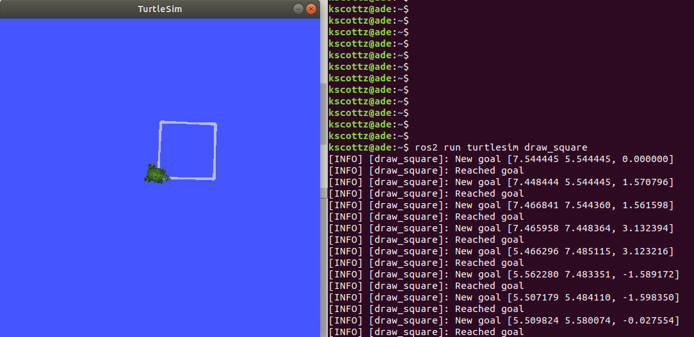
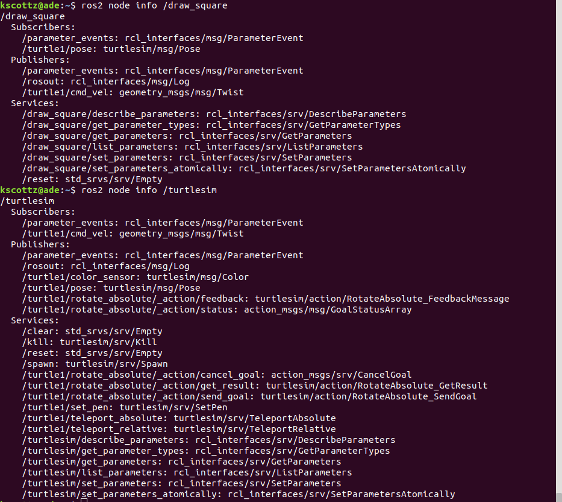
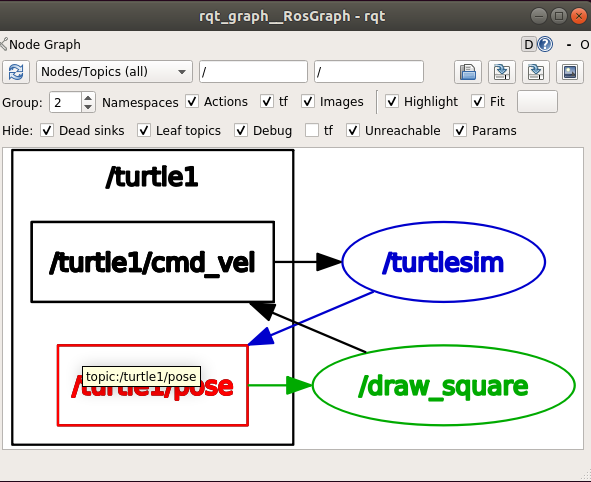
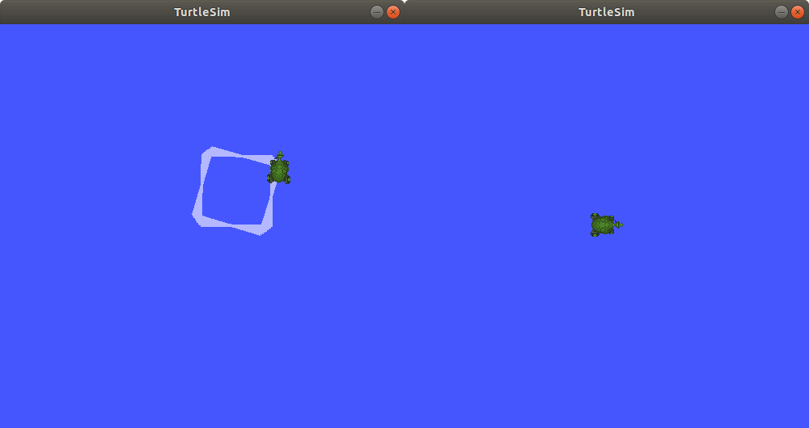

# An Introduction to ROS 2


{{#include ros2_tools_resources.md}}

{{#include ros2_design_patterns.md}}

{{#include ros2_cli.md}}

{{#include ros2_api.md}}


Pull from slide content below

Getting Help!

**ROS has a ton of resources to help you be succeed. You should be aware
of these before you begin.**

-   We have our own QA website like Stack Overflow called ROS Answers.
    -   [<http://answers.ros.org>](https://answers.ros.org/questions/)
    -   ROS answers actually predates the rise of Stack Overflow!
-   Check out ROS Discourse. It is the community hub for news and
    discussion.
    -   [<https://discourse.ros.org/>](https://discourse.ros.org/)
    -   *DO NOT* ask questions on discourse.
-   We have a very large ROS wiki. It is mostly ROS 1.
    -   [<http://wiki.ros.org/>](http://wiki.ros.org/)
    -   Most of the content is still highly useful.
-   Most of this talk comes from the ROS 2 documentation.
    -   [<https://index.ros.org/doc/ros2/>](https://index.ros.org/doc/ros2/)
    -   This is probably where you should look.

Other and/or Unofficial Resources

-   The ROS / Robotics Sub Reddits are Great!
-   There is an "unofficial" [ROS
    Discord](https://discord.com/invite/HnVcz5a).
    -   Please try using ROS Answers first.
-   We have a yearly ROS developers conference
    [ROSCon.](https://roscon.ros.org/2020/)
    -   Most of old talks are free on the web.
-   We're not big on social media but we're busy on the twitter.
    -   [@OpenRoboticsOrg](https://twitter.com/openroboticsorg) is a bit
        more active.
    -   [@ROSOrg](https://twitter.com/rosorg) "Official" ROS
        announcements.
-   [Open Robotics](https://www.openrobotics.org/) is the non-profit
    that administers ROS and Ignition Gazebo.
    -   We take donations and take contract work from time to time.

History of ROS

Herein we shall discuss Deep Thoughts about ROS 2


-   This lesson is intended to be an hour long crash course in the ROS 2
    Dashing API and build tools.
-   After this lesson you should be able to code and build a rudimentary
    ROS 2 application.
-   It should be noted, that since this is a "crash course" we are
    giving you a pre-configured Docker environment call ADE.
    -   We will not cover setting up the ROS environment.
    -   This will be left as an exercise to the reader.
    -   As much as possible we have used the tooling available *ROS 2
        Dashing desktop full* installation.
-   This crash course was written for ROS 2 Dashing.
    -   ROS 2 Foxy is about to be released.
    -   This release is the first major, stable, release of ROS 2.


*PR2 Image*

-   Let's go back to the early 2000's.
-   Open Source is growing, but Windows dominates.
-   What about Robots?:
    -   Robots are expensive and mainly for mass manufacturing and R&D.
    -   Mostly is "real-time" control systems. Just make arms move the
        same way over and over.
    -   Not a lot of Open Source.
-   \~2006, Former Google VPs decide to work on Robots.
    -   Create a company called [Willow
        Garage.](https://en.wikipedia.org/wiki/Willow_Garage)
    -   From this org we get OpenCV, PCL, ROS, PR2 Robot, and many spin
        outs.
-   \~2012 Willow Garage folds, Open Robotics emerges.
    -   2017 ROS 2 Begins to move ROS out of the lab (it was already out
        of the lab).
    -   Address security and robustness concerns.
    -   Add RTOS support and support other OS's.

Concepts that Motivate ROS

ROS's design was informed by *design patterns* that were successfully
used in prior robotic systems. We can't cover each of these in detail,
but reading about them will help you better understand ROS.

-   **Processes / Threads ==&gt; ROS Nodes** -- A ROS Node is a self
    contained execution process, like a program. ROS is really a lot of
    tooling for running a bunch of programs in parallel.
-   **Buses / PubSub ==&gt; ROS Topics** -- The backbone of ROS is a
    [publish/subscribe
    bus](https://en.wikipedia.org/wiki/Publish%E2%80%93subscribe_pattern).
    If you have ever used ZeroMQ, RabbitMQ, or ModBus, ROS topics are
    very similar.
-   **Serialization ==&gt; ROS Messages / ROS Bags** -- ROS uses a
    predefined messages to move data over topics. This allows data to be
    [serialized](https://en.wikipedia.org/wiki/Serialization) between
    nodes in different programming languages. An analog would be Google
    Protocol Buffers. ROS can be written to file, called a bag. A good
    analogy is a python pickle file.
-   **Black Board Pattern ==&gt; ROS Params** -- A
    [blackboard](https://en.wikipedia.org/wiki/Blackboard_(design_pattern))
    is a way to create global variables between nodes/programs. A good
    analogy would be Redis.
-   **Synchronous Remote Procedure Call (RPC) ==&gt; ROS Services** -- A
    ROS service is a program that can be called by another program. The
    caller is blocked until the callee returns. This is formerly called
    a [remote procedure
    call](https://en.wikipedia.org/wiki/Remote_procedure_call).
-   **Asynchronous Remote Procedure Call (RPC) ==&gt; ROS Actions** -- A
    ROS action is a program that can be called by another program. The
    caller is **not** blocked until the callee returns.
-   **State Machines ==&gt; ROS Life cycles** -- [State
    machines](https://en.wikipedia.org/wiki/Finite-state_machine) are a
    tool to move between states, or modes. State machines are a useful
    way to model machine behavior.
-   **Matrix Math for 3D Operations ==&gt; URDF and TF** -- TF, short
    for transform, and URDF (universal robot description format) are
    tools for automatically [calculating robot geometry using matrix
    math](https://en.wikipedia.org/wiki/Matrix_(mathematics)) .

Jumping in the Deep End

Let's start ADE and install / update deps

-   First things first, let's make sure everything is ready to go.
-   Now is a good time to hit pause on the video make sure you have
    installed the requirements.
-   Install ADE as per Autoware Instructions.
-   Now were going to update the system, install ROS dashing, and a
    couple tools.

``` {.sourceCode .bash}
ade start
ade enter 
source /opt/ros/dashing/setup.bash 
sudo apt update
sudo apt install ros-dashing-turtlesim
sudo apt install ros-dashing-rqt-*
sudo apt-install byobu
```


The command line

-   ROS is effectively Linux for Robots.
-   From Last Time:
    -   ROS has your cross platform build tools.
    -   ROS has ployglot builds.
-   Now lets talk about runtime.
    -   ROS presents command line interface (CLI) for robot execution.
    -   Most of these commands follow a regular format.
    -   These commands have auto-tab complete (yay!)
    -   Most blank commands will spit out error or info.
    -   Most commands will behave nicely with `--help`

*Example of --help*

Here is ros2 `--help`

``` {.sourceCode .bash}
kscottz@ade:~$ ros2 --help
usage: ros2 [-h] Call `ros2 <command> -h` for more detailed usage. ...

ros2 is an extensible command-line tool for ROS 2.

optional arguments:
-h, --help            show this help message and exit

Commands:
action     Various action related sub-commands
bag        Various rosbag related sub-commands
component  Various component related sub-commands
daemon     Various daemon related sub-commands
launch     Run a launch file
lifecycle  Various lifecycle related sub-commands
msg        Various msg related sub-commands
multicast  Various multicast related sub-commands
node       Various node related sub-commands
param      Various param related sub-commands
pkg        Various package related sub-commands
run        Run a package specific executable
security   Various security related sub-commands
service    Various service related sub-commands
srv        Various srv related sub-commands
test       Run a ROS2 launch test
topic      Various topic related sub-commands
```

Call ros2 &lt;command&gt; -h for more detailed usage.

That's all your commands!

ROS 2 run

`ros2 run` is used to execute ROS nodes.

General format is `ros2 run <package_name> <executable_name> <flags>`

-   *TAB COMPLETIONS!* are baked in.
-   Generally if tabbing works, you are good to go.
-   Don't know a full package name? Try tabbing.
-   Don't know the executables in a package?
    \* TRY TABBING!!!
-   Why don't we try starting this turtlesim node.
-   In your terminal type `ros2 run turtlesim turtlesim_node`

TA-DA! A wild ROS turtle appears

-   When you run `ros2 run turtlesim turtlesim_node`, this should
    happen:

{width="200"}

-   This is our simple virtual turtle. Don't worry if the turtle looks
    different. Let's make the turtle move.
    -   Press `F2` to create a new terminal.
    -   Source `source /opt/ros/dashing/setup.bash`
    -   We're going to run another node, let's check out this
        `draw_square`.
    -   `ros2 run turtlesim draw_square`

Moving your turtle

If everything is setup correctly your turtle should move.

{width="800"}

You can stop the simulation using `CTRL+C`

Let's explore what's happening

-   We have two terminals open, running two "programs".
    -   We have the `turtlesim` "program" running in the first terminal.
    -   The `draw_square` "program" is running in a second terminal.
    -   The two are communicating over ros topics.
-   *What if we didn't know what was going on?*
-   What if we worked with a large team and a lot of programs, or nodes,
    were created by our team mates?

How can we figure out what nodes are running on our simulated robot?

Inspecting nodes

-   Open a new terminal by pressing `F2`
-   Source your bash file `source /opt/ros/dashing/setup.bash`

Let's try inspecting our running nodes

``` {.sourceCode .bash}
kscottz@ade:~$ source /opt/ros/dashing/setup.bash

kscottz@ade:~$ ros2 node --help
  Commands:
    info  Output information about a node
    list  Output a list of available nodes

    Call `ros2 node <command> -h` for more detailed usage.

kscottz@ade:~$ ros2 node list --help
  usage: ros2 node list [-h] [--spin-time SPIN_TIME] [-a] [-c]
  Output a list of available nodes
  optional arguments:
  -h, --help            show this help message and exit
  -a, --all             Display all nodes even hidden ones
  -c, --count-nodes     Only display the number of nodes discovered
```

Let's try node list

Let's try `ros2 node list`

``` {.sourceCode .bash::}
kscottz@ade:~$ ros2 node list
/draw_square  <== This is the node moving the turtle.
/turtlesim    <== This is the node rendering the turtle. 
```

We can see the two nodes we started.

Can we dig down deeper into each of these nodes?

Let's try node info

Let's try this `ros2 node info` command!

{width="400"}

*WOW, THAT'S A LOT OF INFO!!!*

-   What's there?
    -   Subscribers and message types.
    -   Publishers and message types.
    -   Services
    -   Actions

ROS topic CLI interface

-   Recall from last lesson that ROS topics are short hand for the ROS
    pub/sub bus.
-   ROS topics by analogy:
    -   If you have worked with
        [RabbitMQ](https://en.wikipedia.org/wiki/RabbitMQ) or
        [ZeroMQ](https://en.wikipedia.org/wiki/ZeroMQ) it is very
        similar.
    -   In terms of hardware if you have worked with
        [ModBus](https://en.wikipedia.org/wiki/Modbus) ROS topics are
        the software equivalent.
    -   ROS messages are basically a serialization protocol. A good
        analogy would be [Google
        protobuff](https://en.wikipedia.org/wiki/Protocol_Buffers).
-   The short of it is that ROS nodes communicate over ROS topics, which
    are like phone numbers that anyone can dial into and listen.
-   These topics have namespaces which are kinda like phone numbers or
    file paths. These topic names can be changed, or remapped, to
    connect nodes.

ros2 topic *&lt;xxxx&gt;*

Let's use help to see our options for this command.

In your terminal run `ros2 topic -h`

Try this:

``` {.sourceCode .bash}
kscottz@ade:~$ ros2 topic
usage: ros2 topic [-h] [--include-hidden-topics]
    Call `ros2 topic <command> -h` for more detailed usage. ...

Various topic related sub-commands
optional arguments:
-h, --help                show this help message and exit
--include-hidden-topics   Consider hidden topics as well
Commands:
  bw     Display bandwidth used by topic
  delay  Display delay of topic from timestamp in header
  echo   Output messages from a topic
  hz     Print the average publishing rate to screen
  info   Print information about a topic
  list   Output a list of available topics
  pub    Publish a message to a topic

  Call `ros2 topic <command> -h` for more detailed usage.
```

Interesting, some let us "introspect" the messages, look at performance,
and even send off our own messages.

Let's look at the topics in TurtleSim

Let's start with `ros2 topic list`.

``` {.sourceCode .bash}
kscottz@ade:~$ ros2 topic list -h
usage: ros2 topic list [-h] [--spin-time SPIN_TIME] [-t] [-c]
                      [--include-hidden-topics]

Output a list of available topics
optional arguments:
-h, --help            show this help message and exit
--spin-time SPIN_TIME
                      Spin time in seconds to wait for discovery (only
                      applies when not using an already running daemon)
-t, --show-types      Additionally show the topic type
-c, --count-topics    Only display the number of topics discovered
--include-hidden-topics
                     Consider hidden topics as well
kscottz@ade:~$ ros2 topic list
/parameter_events
/rosout
/turtle1/cmd_vel
/turtle1/color_sensor
/turtle1/pose      
kscottz@ade:~$ 
```

One thing of interest, note how `/turtle1/` is in front of the last
three topics. We call this a namespace.

Digging into topics

-   *Echo* is an old Unix/Linux term that basically means print. We
    print, or echo the data on any given topic. Let's give it a shot.
-   Why don't we take a look at `/turtle1/pose/`?
-   First, we'll look at the docs for echo using the `-h` or help flag.

``` {.sourceCode .bash}
kscottz@ade:~$ ros2 topic echo -h
usage: ros2 topic echo [-h] [--csv] [--full-length]
                       [--truncate-length TRUNCATE_LENGTH]
                       topic_name [message_type]
Output messages from a topic
positional arguments:
  topic_name            Name of the ROS topic to listen to (e.g. '/chatter')
  message_type          Type of the ROS message (e.g. 'std_msgs/String')
optional arguments:
  -h, --help            show this help message and exit
  --csv                 Output all recursive fields separated by commas (e.g.
                        for plotting)
  --full-length, -f     Output all elements for arrays, bytes, and string with
                        a length > '--truncate-length', by default they are
                        truncated after '--truncate-length' elements with
                       '...''
  --truncate-length TRUNCATE_LENGTH, -l TRUNCATE_LENGTH
                       The length to truncate arrays, bytes, and string to
                       (default: 128)
```

Let's echo a topic, but there are a couple things to keep in mind!

-   You need to give the full path to your topic.
-   *However, you can use tab complete to go fast.*
-   This will spit out a lot of data really fast.
-   You can stop the command with `CTRL+C`. This works for almost all
    CLI programs.

You should see roughly the following...

``` {.sourceCode .bash}
kscottz@ade:~$ ros2 topic echo /turtle1/pose
---
x: 6.5681657791137695     <-- X position of turtle 
y: 5.584629058837891      <-- Y position of turtle 
theta: 0.2597956657409668 <-- Orientation of turtle
linear_velocity: 1.0      <-- Speed 
angular_velocity: 0.0     <-- Rotation Speed
---
<THIS JUST KEEPS GOING!>
```

Wow! That's a lot of data.

Topic echo tips / tricks

Topic echo is handy for a quick checkup to see if a piece of hardware is
running and getting a sense of its position, but topics can generate a
lot of data. There are some tricks to work with this data.

-   You can use unix file pipes to dump the data to file.
    -   `ros2 topic echo /turtle2/pose/ > MyFile.txt`
    -   This will output to the file MyFile.txt
    -   `CTRL+C` will still exit the program.
    -   You can use `less MyFile.txt` to read the file
    -   You can use grep to find a specific line.
    -   Try this: `grep theta ./MyFile.txt`
-   Topic echo has some nice flags that are quite handy!
    -   The `--csv` flag outputs data in CSV format.
    -   You will still need to use the file pipe mentioned above.
    -   Example: `ros2 topic echo --csv /turtle1/pose > temp.csv`

Topic diagnostics!

Our Turtle simulation is pretty simple and doesn't generate a lot of
data. Camera and LIDAR sensors for autonomous vehicles can generate so
much data that they saturate network connections. It is really helpful
to have some diagnostic tools. Let's look at a few.

-   The `topic bw`, or bandwidth command, is used to measure the amount
    of bandwidth, or network capacity, that a topic uses. It requires a
    "window size" parameter, which is the number of messages to sample
    from.
-   Like all CLI commands close it with `CTRL+C`

``` {.sourceCode .bash}
kscottz@ade:~$ ros2 topic bw -w 100 /turtle1/pose
Subscribed to [/turtle1/pose]
average: 1.54KB/s
     mean: 0.02KB min: 0.02KB max: 0.02KB window: 61
average: 1.51KB/s
     mean: 0.02KB min: 0.02KB max: 0.02KB window: 100
```

Topic Diagnostics

-   The `topic hz` command, or hertz command, is used to measure how
    frequently a given topic publishes. Frequencies are usually measured
    in a unit of Hertz, or cycles per second.
-   The `hz` command will publish the low, high, average, and standard
    deviation of the message publishing frequency.

``` {.sourceCode .bash}
kscottz@ade:~$ ros2 topic hz /turtle1/pose 
average rate: 63.917
        min: 0.001s max: 0.017s std dev: 0.00218s window: 65
average rate: 63.195
        min: 0.001s max: 0.017s std dev: 0.00159s window: 128
```

Topic info

Another helpful command for inspecting a topic is the `info` command.
The `info` command lists the number of publishers and subscribers

Let's take a quick look:

``` {.sourceCode .bash}
kscottz@ade:~$ ros2 topic info /turtle1/pose 
Topic: /turtle1/pose
Publisher count: 1
Subscriber count: 1
```

Topic Info Continued

Another related tool for looking at topics is the `msg show` command.
ROS topics use standard messaging formats. If you would like to know the
types and format of a message this command will do that. Below is an
example for TurtleSim. Be aware that this tool uses tab completion. If
you know don't know where or what you are looking for it can help!

``` {.sourceCode .bash}
kscottz@ade:~$ ros2 msg show turtlesim/msg/
turtlesim/msg/Color  turtlesim/msg/Pose   
kscottz@ade:~$ ros2 msg show turtlesim/msg/Pose 
float32 x
float32 y
float32 theta

float32 linear_velocity
float32 angular_velocity
```

Publishing a message the hard way

-   Sometimes when you are debugging and testing you need to send a
    message manually.
-   The command is `ros2 topic pub`
-   The format is as follows:
    `ros2 topic pub <topic_name> <msg_type> <args>`
-   This command is difficult to get right as you have to write the
    message in YAML format.
-   The `ros2 msg show` command will help with this.

To run this command you'll need to stop the draw square node. Use F2/F3 to change to the correct screen and then enter CTRL+C

``` {.sourceCode .bash}
kscottz@ade:~$ ros2 topic pub --once /turtle1/cmd_vel geometry_msgs/msg/Twist '{linear: {x: 2.0,
y: 0.0, z: 0.0}, angular: {x: 0.0, y: 0.0, z: 1.8}}'
publisher: beginning loop
publishing #1: geometry_msgs.msg.Twist(linear=geometry_msgs.msg.Vector3(x=2.0, y=0.0, z=0.0),
angular=geometry_msgs.msg.Vector3(x=0.0, y=0.0, z=1.8))
```

This command has a lot options that are super helpful for debugging. You
can set QoS parameters for the messages, mock the sending node, and
modify the publishing rate.

But there is also a GUI tool!

If the command line isn't your thing quite a few things can be
accomplished via the `rqt_topic`. The rqt GUI can be started by running
`rqt` in the command line. You'll want to restart the draw square node
by running `ros2 run turtlesim draw_square` in the command line. You
should be able to press the arrow up key to get the command back.

{width="200"}

RQT starts off blank, so we'll have to turn on the topic tab by clicking
`Plugins=>Topics=>Topic Monitor`. Once you do that you should see
something like what's below. You may need to resize the window.

{width="400"}

Node GUI Tools

-   Understanding complex graphs as a list of node and topic names in
    our shell is really hard.
-   Good news: we have a GUI tool!
-   Type `rqt_graph` in the terminal.
-   The little double arrow in the top left will load nodes.

{width="400"}

ROS parameters

[The full ROS Param tutorial can be found
here.](https://index.ros.org/doc/ros2/Tutorials/Parameters/Understanding-ROS2-Parameters/)

In ROS, parameters are values that are shared between nodes in the
system (if you are familiar with the [blackboard design
pattern](https://en.wikipedia.org/wiki/Blackboard_(design_pattern)) in
software engineering). Parameters are values that any node can query or
write to, another good analogy would be global constants in normal
software programs. Parameters are best used to configure your robot. For
example, if you were building an autonomous vehicle and wanted to cap
the maximum velocity of the vehicle at 100 km/h, you could create a
parameter called "MAX\_SPEED" that is visible to all the nodes.

Let's take a look at the high level param program.

``` {.sourceCode .bash}
kscottz@ade:~$ ros2 param --help
Various param related sub-commands

Commands:
  delete  Delete parameter
  get     Get parameter
  list    Output a list of available parameters
  set     Set parameter
  Call `ros2 param <command> -h` for more detailed usage.
```

Params used by TurtleSim

Let's see what the docs say and then see what happens when we call
`ros2 param list`

``` {.sourceCode .bash}
kscottz@ade:~$ ros2 param --help
usage: ros2 param [-h]
optional arguments:
  use_sim_time
/turtlesim:
  background_b
  background_g
  background_r
usage: ros2 param list [-h] [--spin-time SPIN_TIME] [--include-hidden-nodes]

positional arguments:
  node_name             Name of the ROS node
< CLIPPED >  

kscottz@ade:~$ ros2 param list 
/draw_square:
  use_sim_time
/turtlesim:
  background_b
  background_g
  background_r
  use_sim_time
```

Let's try getting/setting parameters

The syntax for getting a parameter is as follows:

`ros2 param get <node name> <param name>`

Let's give it a shot.

``` {.sourceCode .bash}
kscottz@ade:~$ ros2 param get /turtlesim background_b
Integer value is: 255
```

Let's try setting a parameter. The syntax for that is as follows:

`ros2 set <node name> <param name> <value>`

``` {.sourceCode .bash}
kscottz@ade:~$ ros2 param set /turtlesim background_b 0
Set parameter successful
```

Note that THIS SEEMS TO BE BROKEN!?

Services

-   The full ROS 2 Services tutorials [can be found
    here.](https://index.ros.org/doc/ros2/Tutorials/Services/Understanding-ROS2-Services/)
-   ROS2 Services, as we have discussed previously, are another level of
    extraction built on top of ROS 2 topics.
-   At its core, a service is just an API for controlling a robot task.
-   A good analogy for ROS Services are [remote procedure
    calls](https://en.wikipedia.org/wiki/Remote_procedure_call) .
-   Another good analogy for services would be making an REST API call.
-   Curling a remote REST API endpoint to query data on a remote server
    is very similar to a ROS service.
-   Essentially the ROS API allows every node to publish a list of
    services, and subscribe to services from other nodes.

Services Continued

-   The root command for ROS services is the `ros2 service` command.
-   Just like all the other commands we have looked at, let's run
    `ros2 service --help` to see what we can do.
-   There is an important distinction between ros2 srv and ros2 service.

\* The former is for installed services while the latter is for running
services. We'll focus on the latter, but `srv` is very similar.

``` {.sourceCode .bash}
kscottz@ade:~$ ros2 service --help
usage: ros2 service [-h] [--include-hidden-services]
                    Call `ros2 service <command> -h` for more detailed usage.

Commands:
  call  Call a service
  list  Output a list of available services
```

-   Services look fairly straight forward, with only two commands,
    `list` and `call`.

Listing available services

Let's take a look at what we can do with `ros2 service list`.

``` {.sourceCode .bash}
kscottz@ade:~$ ros2 service list --help
usage: ros2 service list [-h] [--spin-time SPIN_TIME] [-t] [-c]

Output a list of available services

optional arguments:

   -t, --show-types      Additionally show the service type
   -c, --count-services  Only display the number of services discovered
```

This command is fairly straight forward with only two utility flags.
Let's use the `-t` flag

``` {.sourceCode .bash}
kscottz@ade:~$ ros2 service list -t
/clear [std_srvs/srv/Empty]
/draw_square/describe_parameters [rcl_interfaces/srv/DescribeParameters]
/draw_square/get_parameter_types [rcl_interfaces/srv/GetParameterTypes]
/draw_square/get_parameters [rcl_interfaces/srv/GetParameters]
/draw_square/list_parameters [rcl_interfaces/srv/ListParameters]
/draw_square/set_parameters [rcl_interfaces/srv/SetParameters]
/draw_square/set_parameters_atomically [rcl_interfaces/srv/SetParametersAtomically]
/kill [turtlesim/srv/Kill]
/reset [std_srvs/srv/Empty]
/spawn [turtlesim/srv/Spawn]
... SNIP ...
/turtlesim/list_parameters [rcl_interfaces/srv/ListParameters]
/turtlesim/set_parameters [rcl_interfaces/srv/SetParameters]
/turtlesim/set_parameters_atomically [rcl_interfaces/srv/SetParametersAtomically]
```

Calling a ROS 2 service

Let's explore the `ros2 service call` command.

``` {.sourceCode .bash}
kscottz@ade:~$ ros2 service call -h
usage: ros2 service call [-h] [-r N] service_name service_type [values]

Call a service
positional arguments:
  service_name    Name of the ROS service to call to (e.g. '/add_two_ints')
  service_type    Type of the ROS service (e.g. 'std_srvs/srv/Empty')
  values          Values to fill the service request with in YAML format (e.g.
                  "{a: 1, b: 2}"), otherwise the service request will be
                  published with default values

optional arguments:
  -r N, --rate N  Repeat the call at a specific rate in Hz
```

The format is pretty straight forward:

`ros2 service call <service_name> <service_type> [values]`

Basic example, blank services.

-   If we look at the list of services we see a `/reset/` service that
    has the type `[std_srvs/srv/Empty]`.
-   What this means is that this service can be called with an empty
    message.
-   It is worth noting that a empty message still has a type, it is just
    that the type is empty.
-   Our turtle has been drawing a box for a while, why don't we see if
    we can reset the screen?
    -   First kill the draw\_square node. Use `F3` to go to the right
        window.
    -   Now use `CTRL+C` to stop the program.

Why don't we give it a call. The empty service message can be found in
`std_srvs/srv/Empty`, thus our call is as follows:

``` {.sourceCode .bash}
kscottz@ade:~$ ros2 service call /reset std_srvs/srv/Empty
waiting for service to become available...
requester: making request: std_srvs.srv.Empty_Request()

response:
std_srvs.srv.Empty_Response()
```

Service call result

{width="800"}

The service reset the screen, and changed our turtle icon!

Try toggling the `draw_square` program and the `reset` service a few
times.

More complex service calls

Next we're going to try a more complex service call that requires an
actual message. For this example we'll use the spawn service that
creates a new turtle.

The spawn service, looking at our `ros2 service list` call uses a
`[turtlesim/srv/Spawn]` message.

The best way to determine the name of a service is to use the `srv` verb
in ROS 2.

The way we do this is running `ros2 srv show turtlesim/srv/Spawn`.

``` {.sourceCode .bash}
kscottz@ade:~$ ros2 srv show turtlesim/srv/Spawn
float32 x
float32 y
float32 theta
string name # Optional.  A unique name will be created and returned if this is empty
---
string 
```

We can see now that this message takes an x,y position, an angle theta,
and an optional name. The service will return a string (as noted by the
string below the `---`)

Services with complex messages

The format of the message is YAML inside quotation marks. Following from
the information above let's make a few turtles.

``` {.sourceCode .bash}
string namekscottz@ade:~$ ros2 service call /spawn turtlesim/srv/Spawn "{x: 2, y: 2, theta: 0.2, name: 'larry'}"
waiting for service to become available...
requester: making request: turtlesim.srv.Spawn_Request(x=2.0, y=2.0, theta=0.2, name='larry')

response:
turtlesim.srv.Spawn_Response(name='larry')

kscottz@ade:~$ ros2 service call /spawn turtlesim/srv/Spawn "{x: 3, y: 3, theta: 0.3, name: 'moe'}"
waiting for service to become available...
requester: making request: turtlesim.srv.Spawn_Request(x=3.0, y=3.0, theta=0.3, name='moe')

response:
turtlesim.srv.Spawn_Response(name='moe')

kscottz@ade:~$ ros2 service call /spawn turtlesim/srv/Spawn "{x: 4, y: 3, theta: 0.4, name: 'curly'}"
waiting for service to become available...
requester: making request: turtlesim.srv.Spawn_Request(x=4.0, y=3.0, theta=0.4, name='curly')

response:
turtlesim.srv.Spawn_Response(name='curly')

kscottz@ade:~$ 
```

Service call results!

If everything went well we should see something like this.

{width="400"}

*We've now created four turtles!*

ROS action CLI

ROS Actions and Services are very similar in terms of what they do and
likewise their APIs are also fairly similar.

ROS actions are the prefered tool for *asynchronus* tasks while services
are the preffered means of deploying *synchronus* tasks.

In more practical terms services should be used for quick, short tasks,
while actions should be used for long term behaviors (like moving to a
waypoint).

The other big difference between actions and services, is that actions
can send periodic updates about their progress.

``` {.sourceCode .bash}
kscottz@ade:~$ ros2 action -h

Various action related sub-commands

Commands:
  info       Print information about an action
  list       Output a list of action names
  send_goal  Send an action goal
  show       Output the action definition
```

Looks familiar! Let's dif into list, and info.

Actions: list & info

Let's see what actions are availabe to us using `ros2 action list`

``` {.sourceCode .bash}
kscottz@ade:~$ ros2 action list
/curly/rotate_absolute
/larry/rotate_absolute
/moe/rotate_absolute
/turtle1/rotate_absolute
```

We see each of our turtles have one service called `rotate_absolute`.
Let's dig into this action using the info verb. This command has a `-t`
flag to list the types of messages.

``` {.sourceCode .bash}
kscottz@ade:~$ ros2 action info /moe/rotate_absolute -t
Action: /moe/rotate_absolute
Action clients: 0
Action servers: 1
  /turtlesim [turtlesim/action/RotateAbsolute]
```

Interesting, what do these terms mean. The first line lists the action
name. The second line gives the current number of clients for the
action. The `Action servers` line gives the total number of action
servers for this action. The last line gives the package and message
type for the action.

Calling an action and giving it a goal

Let's take a look at the `ros2 action send_goal` help command.

``` {.sourceCode .bash}
kscottz@ade:~$ ros2 action send_goal -h
usage: ros2 action send_goal [-h] [-f] action_name action_type goal

Send an action goal
positional arguments:
  action_name     Name of the ROS action (e.g. '/fibonacci')
  action_type     Type of the ROS action (e.g. 'example_interfaces/action/Fibonacci')
  goal            Goal request values in YAML format (e.g. '{order: 10}')

optional arguments:
  -f, --feedback  Echo feedback messages for the goal
```

We can see here that we need to know the action name, the type, and the
values. Now the only problem is figuring out the format of the
action\_type.

Let's understand the RotateAbsolute action message

The `ros2 action show` command can be used to find the type of action
message. Let's take a look.

``` {.sourceCode .bash}
kscottz@ade:~$ ros2 action show turtlesim/action/RotateAbsolute
# The desired heading in radians
float32 theta  #< --- This section is the GOAL 
---
# The angular displacement in radians to the starting position
float32 delta  #< --- This section is the final result, different from the goal.
---
# The remaining rotation in radians
float32 remaining # < --- This is the current state. 
```

What does this say about rotate absolute?

-   There is a float input, `theta` the desired heading. This first
    section is the actual goal.
-   `delta` -- the angle from the initial heading. This is the value
    returned when the action completes.
-   `remaining` -- the remaining radians to move. This is the value
    posted by the action while the action is being done.

Executing the action

With this information we can create our call to the action server. We'll
use the `-f` flag to make this a bit clearer.

Keep an eye on your turtle! It should move, slowly.

``` {.sourceCode .bash}
kscottz@ade:~$ ros2 action send_goal -f /turtle1/rotate_absolute turtlesim/action/RotateAbsolute {'theta: 1.70'}
Waiting for an action server to become available...
Sending goal:
  theta: 1.7

Feedback:
  remaining: 0.11599969863891602

Goal accepted with ID: 35c40e91590047099ae5bcc3c5151121

Feedback:
 remaining: 0.09999966621398926

Feedback:
 remaining: 0.06799960136413574

Feedback:
 remaining: 0.03599953651428223

Result:
 delta: -0.09600019454956055

Goal finished with status: SUCCEEDED
```

ROS Bag!

-   ROS Bags are ROS's tool for recording, and replaying data.
-   ROSBags are kinda like log files that let you store data along with
    messages.
-   ROS systems can generate a lot of data, so you select which topics
    you want to bag.
-   Bags are a great tool for testing and debugging your application as
    well.

Let's take a look at the base `bag` verb.

``` {.sourceCode .bash}
kscottz@ade:~$ ros2 bag -h
usage: ros2 bag [-h] Call `ros2 bag <command> -h` for more detailed usage. ...

Various rosbag related sub-commands

Commands:
  info    ros2 bag info
  play    ros2 bag play
  record  ros2 bag record
```

Let's try recording our first Bag

First use `F2` or `F3` to go to the other terminal. Start the
`draw_square` demo again to get the default turtle moving.

The command for that is: `ros2 run turtlesim draw_square`

Now let's look at `ros2 bag -h`

``` {.sourceCode .bash}
kscottz@ade:~$ ros2 bag record -h
usage: ros2 bag record [-h] [-a] [-o OUTPUT] [-s STORAGE]
                       [-f SERIALIZATION_FORMAT] [--no-discovery]
           [-p POLLING_INTERVAL]
           [topics [topics ...]]
ros2 bag record
positional arguments:
  topics                topics to be recorded
optional arguments:
  -a, --all             recording all topics, required if no topics are listed explicitly.
  -o OUTPUT, --output OUTPUT
                        destination of the bagfile to create, defaults to a
                        timestamped folder in the current directory
  -s STORAGE, --storage STORAGE
                        storage identifier to be used, defaults to "sqlite3"
  -f SERIALIZATION_FORMAT, --serialization-format SERIALIZATION_FORMAT
                        rmw serialization format in which the messages are
                        saved, defaults to the rmw currently in use
```

Let's Bag!

-   Let's bag the pose data on the `/turtle1/pose topic`
-   Save the data to the directory `turtle1.bag` using the `-o` flag.
-   The program will bag until you hit `CTRL+C`. Give it a good 30
    seconds.

Here's my example.

``` {.sourceCode .bash}
kscottz@ade:~$ ros2 bag record /turtle1/pose -o turtle1
[INFO] [rosbag2_storage]: Opened database 'turtle1'.
[INFO] [rosbag2_transport]: Listening for topics...
[INFO] [rosbag2_transport]: Subscribed to topic '/turtle1/pose'
[INFO] [rosbag2_transport]: All requested topics are subscribed. Stopping discovery...
^C[INFO] [rclcpp]: signal_handler(signal_value=2)
```

Let's inspect our Bag.

You can introspect any bag file using the `ros2 bag info` command. This
command will list the messages in the bag, the duration of file, and the
number of messages.

``` {.sourceCode .bash}
kscottz@ade:~$ ros2 bag info turtle1
Files:             turtle1.db3
Bag size:          268.4 KiB
Storage id:        sqlite3
Duration:          68.705s
Start:             May  4 2020 16:10:26.556 (1588633826.556)
End                May  4 2020 16:11:35.262 (1588633895.262)
Messages:          4249
Topic information: Topic: /turtle1/pose | Type: turtlesim/msg/Pose | Count: 4249 | Serialization Format: cdr
```

Replaying a Bag

Bags are a great tool for debugging and testing. You can treat a ROS bag
like a recording of a running ROS system. When you play a bag file you
can use most of the ros2 cli tools to inspect the recorded topics.

To replay the bag, first use `F2/F3` and `CTRL+C` to turn off the main
turtle node and the `draw_square` node.

Now in a new terminal replay the bag file using the following command:

``` {.sourceCode .bash}
kscottz@ade:~$ ros2 bag play turtle1
[INFO] [rosbag2_storage]: Opened database 'turtle1'.
```

Nothing should happen visibly, but a lot is happening under the hood.
Use `F2` or `F3` to go to a second terminal. Just like a running robot,
you should be able `list` and `echo` topics.

``` {.sourceCode .bash}
kscottz@ade:~ros2 topic list 
/parameter_events
/rosout
/turtle1/pose

kscottz@ade:~$ ros2 bag info turtle1
x: 3.8595714569091797
y: 3.6481313705444336
theta: -1.2895503044128418
linear_velocity: 1.0
angular_velocity: 0.0
---
```

Pretty cool right?

You can kill the bag file with `CTRL+C`.

That's All Folks!

-   This is by no means complete but it covers the basics.
-   You should use your skills to explore more.
-   Remember your resources!

    > -   [<http://answers.ros.org>](https://answers.ros.org/questions/)
    > -   [<https://discourse.ros.org/>](https://discourse.ros.org/)
    > -   [<http://wiki.ros.org/>](http://wiki.ros.org/)
    > -   [<https://index.ros.org/doc/ros2/>](https://index.ros.org/doc/ros2/)

Homework?!

-   The TurtleBot comes from a long line of turtle tutorials.
-   The original one was the [Logo programming
    language](https://en.wikipedia.org/wiki/Logo_(programming_language))
    for computer graphics.
-   I would recommend using the turtle to make some cool graphics.
-   [Here's an example of what people did with
    LOGO.](https://www.youtube.com/watch?v=m4a0jcrDgK0).


===
This divides the lecture 2 and 3


You should now be ready for the class!

Some Nomenclature as we Begin

-   **Package** -- A collection of code.
-   **Workspace** -- A workspace is a collection of source code / ROS
    packages that will run on a robot. It has a uniform directory
    structure. A good analogy is python virtual env, or "project" in
    most IDEs.
-   **Overlay** -- A second workspace with more/different/new packages.
    If there are multiple versions of a package/code then the one at the
    bottom is used.
-   **Underlay** -- The workspace, underneath an overlay, we're aware
    this is confusing.
-   **Colcon** -- The ROS 2 build tool. Think of it as a layer above
    CMake/Make/SetupTools that helps these tools work together smoothly.

This is a bit confusing. You may ask yourself why we have our own build
tool. The short of it is that the ROS ecosystem consists of tens of
thousands of developers, working on thousands of packages, across a
handful of platforms, using multiple languages. We needed a flexible
system to build code and one didn't exist at the time, and still doesn't
exist.

Let's Get Started

As we're diving headfirst into ROS our first job is to checkout a
repository of examples and build it. Roughly the steps to do this are as
follows.

-   Fire up a terminal manager inside the container. I use byobu. You
    can use whatever you want. You can also fire up 3 real terminals and
    call ade enter on them.
-   Source the ROS setup.bash file so we have the right version of ROS
    in our path.
-   Make a workspace called ros2\_example\_ws. We usually use \_ws to
    indicate a workspace.
-   Clone an example repository and change to the dashing branch.
    -   Generally ROS repos have a branch per release.
-   Use Colcon to build the source.

``` {.sourceCode .bash}
source /opt/ros/dashing/setup.bash
mkdir -p ~/ros2_example_ws/src
cd ~/ros2_example_ws
git clone https://github.com/ros2/examples src/examples
cd ~/ros2_example_ws/src/examples/
git checkout dashing 
cd ~/ros2_example_ws
colcon build --symlink-install
```

Nodes and Publishers

-   The core of ROS is the ROS pub/sub bus. In ROS parlance this is
    called topic.
    -   A topic has a message type that is published on the bus. These
        messages are defined in a yaml file and define the
        serialization/deserialization format for ROS messages.
    -   ROS has a lot of built in message types. There are lots of
        pre-defined messages for controlling a robot, distributing
        sensor data, and understanding the geometry of your robot.
    -   ROS publishers produce messages and slowly or as quickly as they
        need to.
    -   A ROS subscriber, subscribes to a topic and then does things
        with the information.
-   ROS has lots of built-in tools for managing topics. You can list
    them, echo (watch) them, rename them (called remap), and store them
    to file (called bagging).
-   ROS Nodes are basically programs, or processes that run concurrently
    on ROS.
    -   A ROS node can publish to one or more topics.
    -   That same node can subscribe to other topics.
    -   Many nodes subscribe to topics, process the data, and publish
        the results.
    -   ROS has tooling to start and stop multiple nodes at the same
        time.

Preparing to Run a ROS Node

-   Open a new terminal, in Byobu you can do this by pressing F2.
-   First we need to source the setup.bash file for our workspace. This
    will help ROS find the programs we built.
    -   source ./ros2\_example\_ws/install/setup.bash
    -   Protip: you can find any file using
        find ./ -name &lt;file name&gt;
-   **ROS Best Practice** *ALWAYS* build and execute in different
    terminals.
    -   The build terminal should source the global ROS setup.bash file
        (i.e. /opt/ros/dashing/setup.bash).
    -   The execution terminal should source the setup.bash of your
        workspace
    -   This is a common failure mode for new users. If something seems
        weird or funky. Create a new terminal and source the correct
        bash file.

Let's Run a Simple C++ Publisher Node.

-   ROS has an advanced, and fairly complex CLI interface. We'll cover
    it in depth in our next lesson.
-   We are going to ask ros to run the EXECUTABLE publisher\_lambda in
    our WORKSPACE named examples\_rclcpp\_minimal\_publisher.
-   The syntax for doing this is
    ros2 run &lt;WORKSPACE&gt; &lt;EXECUTABLE&gt;
-   To run our publishing node, let's run the following command in our
    execution terminal:
    ros2 run examples\_rclcpp\_minimal\_publisher publisher\_lambda
-   If everything works you should see something like this:

``` {.sourceCode .bash}
kscottz@ade:~$ ros2 run examples_rclcpp_minimal_publisher publisher_lambda 
[INFO] [minimal_publisher]: Publishing: 'Hello, world! 0'
[INFO] [minimal_publisher]: Publishing: 'Hello, world! 1'
[INFO] [minimal_publisher]: Publishing: 'Hello, world! 2'
[INFO] [minimal_publisher]: Publishing: 'Hello, world! 3'
...
```

-   To exit the program press CTRL-C

What just happened?

-   We just executed a ROS node that publishes a simple string message
    to a topic called /topic twice a second.
-   I'll show you how I know this with some tools. We'll cover these
    tools in detail next time.

``` {.sourceCode .bash}
kscottz@ade:~$ ros2 topic list
/parameter_events
/rosout
/topic
kscottz@ade:~$ ros2 topic echo /topic
data: Hello, lambda world! 63
---
data: Hello, lambda world! 64
---
data: Hello, lambda world! 65
---
kscottz@ade:~$ ros2 topic hz /topic 
average rate: 2.000
min: 0.500s max: 0.500s std dev: 0.00011s window: 4
kscottz@ade:~$ 
```

Digging into the Code

-   Let's take a look at the code. Like a lot of software there is more
    than one way to skin a cat. Let's look at the member function
    approach.
-   Using your favorite editor open the following source file,
    ./ros2\_example\_ws/src/examples/rclcpp/minimal\_publisher/member\_function.cpp
-   **rclcpp** is an abbreviation of "ROS Client Library C++", its the
    ROS C++ API

``` {.sourceCode .c++}
#include <chrono>
#include <memory>

#include "rclcpp/rclcpp.hpp" // THIS the header file for ROS 2 C++ API
#include "std_msgs/msg/string.hpp" // This is header for the messages we
                                   // want to user
                                   // These are usually auto generated. 

using namespace std::chrono_literals;

/* This example creates a subclass of Node and uses std::bind() to register a
* member function as a callback from the timer. */
  // Make a class called Minimal Publisher
  class MinimalPublisher : public rclcpp::Node
  // Have it inherit from the ROS Node Class
```

Let's Build our Node's Constructor

-   The MinimalPublisher constructor inherits from the RCLCPP Base
    Class, gives the name a node, and sets our counter.
-   The next line creates a publisher object that publishes
    std\_msgs::msg.
-   The constructor then creates a callback to the function
    timer\_callback that gets called every 500ms.

``` {.sourceCode .c++}
class MinimalPublisher : public rclcpp::Node // Inherit from ROS Node
{
  public:
    MinimalPublisher()
    : Node("minimal_publisher"), count_(0) // Set the node name
    {   //Create a publisher that pushes std_msgs::msg to the topic "topic" 
      publisher_ = this->create_publisher<std_msgs::msg::String>("topic", 10); 
      timer_ = this->create_wall_timer( // Call timer_callback every 500ms
      500ms, std::bind(&MinimalPublisher::timer_callback, this));
    }
```

Now to Handle the Callback

-   In the callback function we do the following:
    -   Create the ROS std\_msgs::msg::String() to send to our topic.
    -   Construct the message that will be pushed to the ROS Topic
    -   Log the results.
    -   Actually publish the newly constructed message.

``` {.sourceCode .c++}
private:
void timer_callback()
{
  auto message = std_msgs::msg::String(); // create message
  message.data = "Hello, world! " + std::to_string(count_++); // Fill it up
  RCLCPP_INFO(this->get_logger(), "Publishing: '%s'", message.data.c_str()); // Log it
  publisher_->publish(message); // Publish
}
// Create our private member variables. 
rclcpp::TimerBase::SharedPtr timer_;
rclcpp::Publisher<std_msgs::msg::String>::SharedPtr publisher_;
size_t count_;
```

Finally, Let's Create the Main for our Node

-   This last little bit creates the main node entry point.
-   Initializes rcpcpp with the values from the command line.
-   Run's the MinimalPublisher, until a terminate is given
-   Finally the node cleans up everything and exits.

``` {.sourceCode .c++}
int main (int argc, char * argv[])
{
  rclcpp::init(argc, argv); // Init RCL
  rclcpp::spin(std::make_shared<MinimalPublisher>());// Run the minimal publish
  rclcpp::shutdown(); // Cleanup on shut down.
  return 0;
}
```

Exercise: Modify and Build this Node

-   Let's try to make a few modification to our node for practice.
    -   Make it run at 10Hz (100ms) instead of 500.
    -   Change the topic name from "topic" to "greetings."
    -   Change the message "Hello Open Road."
    -   Change the node name from minimal\_publisher,
        revenge\_of\_minimal\_publisher
-   Once you make these changes
    -   Save the file.
    -   Toggle over to your execution window run
    -   Run colcon build
    -   In your execution window run
        ros2 run examples\_rclcpp\_minimal\_publisher publisher\_member\_function

Let's Try Subscribing.

-   The pattern here is similar to publishing.
-   We basically inherit from the Node class, and define the topic and
    message we want.
-   Whenever that topic is published we hit a callback.
-   If everything is correctly configured the file is at
    -   /ros2\_example\_ws/src/examples/rclcpp/minimal\_subscriber/member\_function.cpp

``` {.sourceCode .c++}
#include "rclcpp/rclcpp.hpp"
#include "std_msgs/msg/string.hpp"
using std::placeholders::_1;
// Again we inherit the public interface of a ROS node. 
class MinimalSubscriber : public rclcpp::Node
{
  public:
  MinimalSubscriber() // Construct our node, calling it minimal_subscriber
  : Node("minimal_subscriber")
  { // Create a subscription, to messages of the format stdmsg:msg:String
    subscription_ = this->create_subscription<std_msgs::msg::String>(
    // Subscribe to the topic, "topic" and set a callback for when things are pub'd 
    "topic", 10, std::bind(&MinimalSubscriber::topic_callback, this, _1));
  }
  ...
```

More Subscriber

-   The subscriber node looks fairly similar to our publisher but
    instead of publishing on a regular callback, we get a callback when
    a new message hits our topic.

``` {.sourceCode .c++}
private:
  // Whenever we get a new messaged published on our topic
  // this callback will be executed.    
  void topic_callback(const std_msgs::msg::String::SharedPtr msg) const
  {
    // Log the message that we are subscribed to 
    RCLCPP_INFO(this->get_logger(), "I heard: '%s'", msg->data.c_str());
  }
  rclcpp::Subscription<std_msgs::msg::String>::SharedPtr subscription_;
};

// This is effectively the same boiler plate from last time. 
int main(int argc, char * argv[])
{
  rclcpp::init(argc, argv);
  rclcpp::spin(std::make_shared<MinimalSubscriber>());
  rclcpp::shutdown();
  return 0;
}
```

Let's Modify the Subscriber

-   In the publisher we changed the name of our publisher topic to
    greetings.
-   Let's change the subscribed topic to greetings.
-   Note that there are a lot of ways to change topic names, modifying
    source is just one approach. Often we just remap topics instead of
    changing source.
-   Once you have modified the subscriber run colocon build (it will
    build everything)
-   Open another terminal, source the bash file, and start the
    publisher.
    -   ros2 run examples\_rclcpp\_minimal\_publisher publisher\_member\_function
-   Now run our subscriber.
    -   ros2 run examples\_rclcpp\_minimal\_subscriber subscriber\_member\_function

The Result

If everything went well you should have two screens. The first screen
with the publisher should be spitting out the following

``` {.sourceCode .bash}
[INFO] [revenge_of_minimal_publisher]: Publishing: 'Hello, Open Road! 1000'
[INFO] [revenge_of_minimal_publisher]: Publishing: 'Hello, Open Road! 1001'
[INFO] [revenge_of_minimal_publisher]: Publishing: 'Hello, Open Road! 1002'
[INFO] [revenge_of_minimal_publisher]: Publishing: 'Hello, Open Road! 1003'
[INFO] [revenge_of_minimal_publisher]: Publishing: 'Hello, Open Road! 1004'
```

The subscriber screen should be pushing out:

``` {.sourceCode .bash}
[INFO] [minimal_subscriber]: I heard: 'Hello, Open Road! 1000'
[INFO] [minimal_subscriber]: I heard: 'Hello, Open Road! 1001'
[INFO] [minimal_subscriber]: I heard: 'Hello, Open Road! 1002'
[INFO] [minimal_subscriber]: I heard: 'Hello, Open Road! 1003'
[INFO] [minimal_subscriber]: I heard: 'Hello, Open Road! 1004'
```

**You can terminate both of these programs with CTRL-C**

*Congratulations, you now know the three most important ROS components,
nodes, publishers, and subscribers.*

Making Things Happen with Services

-   Publishing and subscribing nodes are the bread and butter of ROS.
    This pattern is great for moving around a lot of data, and
    processing it quickly.
-   However, we often want our robots to respond to data. To construct
    simple behaviors in ROS we use services.
-   A service is a robotic task that can be performed *synchronously*,
    which is just a fancy word for, "while you wait".
-   A good analogy for services would be a regular old function call. In
    most programs when you call a function, the code making the call
    waits for the function to return before proceeding.
-   A few toy examples of services for autonomous driving would be:
    -   Turning Lights Off/On.
    -   Checking a sensor and returning the results.
    -   Lock / Unlock a door or window.
    -   Beeping a horn.
-   Services can be called via the command line or through an API call
    within another node.
-   In ROS services are hosted within a ROS Node, and they can co-exist
    with other services as well as publishers and subscribers.

C++ Service Example

-   As a toy example of a ROS service we are going to make a node that
    offers an "AddTwoInts" service.
-   What will happen is the service has two inputs, and returns a single
    output.
-   There is a full tutorial [about the process
    here](https://index.ros.org/doc/ros2/Tutorials/Writing-A-Simple-Cpp-Service-And-Client/).
    It goes into more detail and it is worth looking at.

Let's start by looking at a prebuilt srv file for this tutorial. If you
were writing this service from scratch you would need to build this srv
file yourself, but for this example there is one ready for us already.
We'll use less to peek into the srv file.

Run the following:
less /opt/ros/dashing/share/example\_interfaces/srv/AddTwoInts.srv

The file should have the following:

``` {.sourceCode .yaml}
int64 a     # <== An input, of type int64, called a 
int64 b     # <== An input, of type int64, called b
---
int64 sum   # <== An output, of type int64, called sum
```

Defining A Service

Essentially our service is a remote procedure call of a function that
looks like this in pseudocode: int64 sum = AddTwoInts(int64 a, int64b);.

Let's take a look at the C++ code that defines the service. Use your
favorite text editor to open the following file:
./ros2\_example\_ws/src/examples/rclcpp/minimal\_service/main.cpp.

``` {.sourceCode .C++}
// This hpp file is autogenerated from the srv file. 
#include "example_interfaces/srv/add_two_ints.hpp"
#include "rclcpp/rclcpp.hpp"// ROS header.
// Scope resolution to our services. 
using AddTwoInts = example_interfaces::srv::AddTwoInts;
// shared pointer to logger
rclcpp::Node::SharedPtr g_node = nullptr;
// Perform the service call 
void handle_service(
  const std::shared_ptr<rmw_request_id_t> request_header,// Header with timestamp etc 
  const std::shared_ptr<AddTwoInts::Request> request,    // This is the input, two int64 a,b
  const std::shared_ptr<AddTwoInts::Response> response)  // This response is int64 sum
{
  (void)request_header;
  RCLCPP_INFO( // Logger message. 
    g_node->get_logger(),
    "request: %" PRId64 " + %" PRId64, request->a, request->b);
 response->sum = request->a + request->b; // the actual function. 
```

> }

ROS 2 Service Main

``` {.sourceCode .C++}
int main(int argc, char ** argv)
{
  rclcpp::init(argc, argv);
  // get global ROS pointer
  g_node = rclcpp::Node::make_shared("minimal_service"); 
  // Create a service, of type AddTwoInts, named add_two_ints, that points to handle_service
  auto server = g_node->create_service<AddTwoInts>("add_two_ints", handle_service);
  rclcpp::spin(g_node); // run until shutdown
  rclcpp::shutdown();
  g_node = nullptr;
  return 0;
}
```

The main entry point is pretty simple. It does the following.

-   Initialize the program.
-   Get a shared pointer to the ROS node interface.
-   Create the service, of type AddTwoInts, named add\_two\_ints,
    pointing to the function handle\_service.
-   Run the node until shutdown.

Let's Build and Run our Service

First we will fire up our service! The syntax for this is
ros2 run &lt;pkg&gt; &lt;program&gt;.

``` {.sourceCode .bash}
kscottz@ade:~$ ros2 run examples_rclcpp_minimal_service service_main 
```

At this point nothing should happen. We need to *call* the service. To
do that we'll use a command line tool that's a little... long.

We'll talk about this more in the next lesson, but the syntax is
roughly,
ros2 service call &lt;service\_name&gt; &lt;service\_call\_format&gt; &lt;actual\_data&gt;.

In this case our service name is /add\_two\_ints and the data type can
be found in example\_interfaces/AddTwoInts, and the input is yaml
encased in quotation marks. Move over to a new terminal and enter the
following:

``` {.sourceCode .bash}
kscottz@ade:~/ros2_example_ws$ ros2 service call /add_two_ints example_interfaces/AddTwoInts "{a: 1, b: 1}"
waiting for service to become available...
requester: making request: example_interfaces.srv.AddTwoInts_Request(a=1, b=1)

response:
example_interfaces.srv.AddTwoInts_Response(sum=2)
```

Now switch back to your original terminal, you should see something like
this:

``` {.sourceCode .bash}
kscottz@ade:~$ ros2 run examples_rclcpp_minimal_client client_main  
3[INFO] [minimal_service]: Incoming request
a: 1 b: 1
```

Congratulations, you just made your first service call!

Using a Service in Code

We just called our service from the command line to test it, but more
often than not we would want to do this in source code.

Let's look at an example of how to do that. In your editor or using less
take a look at the following file:
/home/kscottz/ros2\_example\_ws/src/examples/rclcpp/minimal\_client/main.cpp

``` {.sourceCode .C++}
// snipped 
#include "example_interfaces/srv/add_two_ints.hpp" // include the service header file. 
#include "rclcpp/rclcpp.hpp"
// Scope resolution on underlying call signature. 
using AddTwoInts = example_interfaces::srv::AddTwoInts;

int main(int argc, char * argv[])
{
   rclcpp::init(argc, argv); //  init ROS C++ interface. 
   auto node = rclcpp::Node::make_shared("minimal_client"); // shared node memory.  
   auto client = node->create_client<AddTwoInts>("add_two_ints"); // create client interface.
   while (!client->wait_for_service(std::chrono::seconds(1))) {// poll for service to come online
     if (!rclcpp::ok()) {  // if service doesn't come online, exit gracefully                    
       RCLCPP_ERROR(node->get_logger(), 
       "client interrupted while waiting for service to appear.");
   return 1;
   }
   RCLCPP_INFO(node->get_logger(), "waiting for service to appear...");
}
```

C++ Service Client Part Deux

``` {.sourceCode .C++}
// shared memory to request 
auto request = std::make_shared<AddTwoInts::Request>(); 
request->a = 41;  // set the input values
request->b = 1;   // set the input values
auto result_future = client->async_send_request(request); // Send the request
if (rclcpp::spin_until_future_complete(node, result_future) != // spin until result
   rclcpp::executor::FutureReturnCode::SUCCESS)
{
   RCLCPP_ERROR(node->get_logger(), "service call failed :("); 
   return 1;
}
auto result = result_future.get(); // Get the result 
RCLCPP_INFO(node->get_logger(), "result of %" PRId64 " + %" PRId64 " = %" PRId64,
   request->a, request->b, result->sum); // print the result
```

> rclcpp::shutdown(); // shutdown return 0; }

Let's Run Our Client

-   Now we're going to run our service and then call it from the client.
-   You'll need two terminals to do this. Remember F2/F3 let you open
    and switch to a new terminal in ADE.

First fire up your service if it isn't already running.

``` {.sourceCode .bash}
$ ros2 run examples_rclcpp_minimal_service service_main 
```

Now start the client in a second terminal.

``` {.sourceCode .bash}
$ ros2 run examples_rclcpp_minimal_client client_main 
[INFO] [minimal_client]: Result of add_two_ints: for 41 + 1 = 42
```

The client should fire off a request right away. You can see the result.

Finally, toggle back to the service.

``` {.sourceCode .bash}
$ ~/ros2_example_ws$ ros2 run examples_rclcpp_minimal_service service_main 
[INFO] [minimal_service]: Incoming request
a: 41 b: 1
```

You can see the debug input has been printed to the terminal.

ROS C++ Actions

-   Actions are ROS / ROS 2's answers to asynchronous remote procedure
    calls.
-   Notice how quickly how fast our service call happened. It was more
    or less instant.
-   Actions are the preferred approach for things that may not happen
    instantaneously.
-   The canonical example of a ROS Action would be sending the robot a
    command to navigate to a way point.
-   The process of navigation is going to take a bit of time, what we
    want to do is to kick off the process, wait for updates, and then
    once things are complete we get a result.
-   Just like services there are two parts of an action. The action
    server and the action client. *Note that there can be more than one
    client.*
-   Actions become fairly complex as they can serve multiple clients.
    This means the action may need to keep track of multiple concurrent
    connections.
    -   Since action servers can get overwhelmed by requests, they need
        to *accept* every request before proceeding to process it.
    -   The clients can also *cancel* at any time, so that needs to be
        handled.

Parts of an Action

-   Find the action. An action server may be down!
-   The Action Request -- the service *can* decline to take an action.
-   The Action being accepted.
-   The Action being canceled. Sometimes the client changes its mind.
-   The action "feedback", sending back info from server to client.
-   Send the result to the client -- the result could be the thing
    happened succesfully, or not!

Fibonacci Action

For our action server we're going to create a toy example, this example
will calculate the Nth number in the [Fibonacci
series](https://en.wikipedia.org/wiki/Fibonacci_number). So, what will
happen when we call this toy action?

-   We will call the action with a single integer indicating the
    sequence number of the Fibonacci number we want.
-   The action will update us as it calculates the sequence of numbers
    and update it us as it calculates a new one.
-   When the action gets to our desired number in the sequence, it will
    return the results.
-   For example, if we called action with the input 7, we would get the
    seventh Fibonacci number. Which means, given the series &lt;0, 1, 1,
    2, 3, 5, 8&gt;, would be the number 8.
-   The action should update us along the way in the calculation. It
    should return the series of numbers every time it calculates a new
    number.

Action Definition Files

-   Actions use a definition file to build all of the ROS boiler plate
    like cross language header/definition files for use in multiple
    programming languages.
-   These action files are written in YAML and use the \*.action suffix.
-   The ROS meta build system colcon will use these action files to
    auto-magically generate all of the header files.

Let's take a look at an action file.

``` {.sourceCode .bash}
/opt/ros/dashing/share/example_interfaces/action/Fibonacci.action
# Goal -- the input, the order we want like 7
int32 order 
---
# Result -- the *final result*, here the list of values 0,1,1,2,3,5,8....
int32[] sequence
---
# Feedback -- the *intermediate result* so <0>,<0,1>,<0,1,1>,<0,1,1,2> ...
int32[] sequence
Fibonacci.action (END)
```

Really quick, let's look under the hood!

As we said previously, the \*.action is used to auto-generate a bunch of
other files. We can see this if we go down one directory to msg.

What we'll see is that the \*.action file is used to generate a bunch of
ROS topic messages mapping to states in our action.

Essentially a ROS action is built upon ROS nodes and ROS topics

``` {.sourceCode .bash}
kscottz@ade:/opt/ros/dashing/share/example_interfaces/action/msg$ cd ~/
kscottz@ade:~$ cd /opt/ros/dashing/share/example_interfaces/action/msg/
kscottz@ade:/opt/ros/dashing/share/example_interfaces/action/msg$ ls
FibonacciActionFeedback.msg  FibonacciAction.msg        FibonacciFeedback.msg  FibonacciResult.msg
FibonacciActionGoal.msg      FibonacciActionResult.msg  FibonacciGoal.msg
kscottz@ade:/opt/ros/dashing/share/example_interfaces/action/msg$ less FibonacciActionGoal.msg
# This file is automatically generated by rosidl-generator
std_msgs/Header header
actionlib_msgs/GoalID goal_id
FibonacciGoal goal
FibonacciActionGoal.msg (END)
kscottz@ade:/opt/ros/dashing/share/example_interfaces/action/msg$ cd ~
```

Let's take a look at Action Server

-   Let's take a look at how our Fibonacci action server.
-   Use your favorite text editor to open:
    /home/kscottz/ros2\_example\_ws/src/examples/rclcpp/minimal\_action\_server/member\_functions.cpp

``` {.sourceCode .C++}
<headers cut>
class MinimalActionServer : public rclcpp::Node
{
public:  // Pre-defined interface files. 
   using Fibonacci = example_interfaces::action::Fibonacci;
   using GoalHandleFibonacci = rclcpp_action::ServerGoalHandle<Fibonacci>;
   explicit MinimalActionServer(const rclcpp::NodeOptions & options = rclcpp::NodeOptions())
   : Node("minimal_action_server", options)
   {
     using namespace std::placeholders;
 // SCARY call to define that this is a Fib. action and what functions
 // attach to what events in the action lifecycle. 
 this->action_server_ = rclcpp_action::create_server<Fibonacci>(
 this->get_node_base_interface(),      // The action server is basically
 this->get_node_clock_interface(),     // a node and we need return pointers
 this->get_node_logging_interface(),   // to all of standard interaces. 
 this->get_node_waitables_interface(),
 "fibonacci",  // and bind our member functions to topic events. 
 std::bind(&MinimalActionServer::handle_goal, this, _1, _2), 
 std::bind(&MinimalActionServer::handle_cancel, this, _1),
 std::bind(&MinimalActionServer::handle_accepted, this, _1));
   }
```

Actions: Accept or Cancel

Let's deal with accepting a goal, or canceling a goal.

``` {.sourceCode .C++}
private:
  rclcpp_action::Server<Fibonacci>::SharedPtr action_server_;

  rclcpp_action::GoalResponse handle_goal(
   const rclcpp_action::GoalUUID & uuid, // Each request gets a UUID 
   std::shared_ptr<const Fibonacci::Goal> goal) // The goal object
  {
     RCLCPP_INFO(this->get_logger(), "Received goal request with order %d", goal->order);
 (void)uuid;
 // Let's reject sequences that are over 9000
 if (goal->order > 9000) {
   return rclcpp_action::GoalResponse::REJECT;
   } // respond with "yes, we'll process this request. 
   return rclcpp_action::GoalResponse::ACCEPT_AND_EXECUTE;
}

rclcpp_action::CancelResponse handle_cancel(
   const std::shared_ptr<GoalHandleFibonacci> goal_handle)
{
   RCLCPP_INFO(this->get_logger(), "Received request to cancel goal");
   (void)goal_handle;
   return rclcpp_action::CancelResponse::ACCEPT;
}
```

The Meat of the Fib Function

``` {.sourceCode .C++}
void execute(const std::shared_ptr<GoalHandleFibonacci> goal_handle)
{ // This is the meaty part of the function 
   RCLCPP_INFO(this->get_logger(), "Executing goal");
   rclcpp::Rate loop_rate(1);
   const auto goal = goal_handle->get_goal(); // this is our goal value
   auto feedback = std::make_shared<Fibonacci::Feedback>(); // this is our feedback object
   auto & sequence = feedback->sequence; // this is our list of fib values. 
   sequence.push_back(0);
   sequence.push_back(1);
   auto result = std::make_shared<Fibonacci::Result>(); // This is the final result. 

   // Do fib as long as ROS is ok!
   for (int i = 1; (i < goal->order) && rclcpp::ok(); ++i) {
   // Check if there is a cancel request
   if (goal_handle->is_canceling()) { // Handle a cancel result!
     result->sequence = sequence;
     goal_handle->canceled(result);
     RCLCPP_INFO(this->get_logger(), "Goal Canceled");
     return;
   }
   // Update sequence
   sequence.push_back(sequence[i] + sequence[i - 1]);
   // Publish feedback
   goal_handle->publish_feedback(feedback);
   RCLCPP_INFO(this->get_logger(), "Publish Feedback");

   loop_rate.sleep();
   }

 // Check if goal is done
 if (rclcpp::ok()) {
   result->sequence = sequence;
   goal_handle->succeed(result);
   RCLCPP_INFO(this->get_logger(), "Goal Succeeded");
 }
```

> }
>
> void handle\_accepted(const
> std::shared\_ptr&lt;GoalHandleFibonacci&gt; goal\_handle) { // Our
> request was accepted, fire off a new thread. using namespace
> std::placeholders; // this needs to return quickly to avoid blocking
> the executor, so spin up a new thread
> std::thread{std::bind(&MinimalActionServer::execute, this, \_1),
> goal\_handle}.detach(); }

Let's Put our Class into an Executable

``` {.sourceCode .C++}
int main(int argc, char ** argv)
{
   rclcpp::init(argc, argv);

   auto action_server = std::make_shared<MinimalActionServer>();

   rclcpp::spin(action_server);

   rclcpp::shutdown();
   return 0;
}
```

Let's Run Our Action and Call It.

-   Ordinarily you would call colcon build in your workspace to build
    the source code. We're just inspecting this method so this isn't
    necessary.
-   We'll start the action server and then call it manually using the
    ROS 2 CLI.

``` {.sourceCode .bash}
kscottz@ade:~/ros2_example_ws$ ros2 run examples_rclcpp_minimal_action_server action_server_member_functions
```

Now we're going to manually call the server from the ROS 2 CLI. We'll
cover this in more depth in the next lesson. If you're using byobu use
F3 to go to a second terminal or F2 to make a new one.

``` {.sourceCode .bash}
$ ros2 action send_goal /fibonacci example_interfaces/action/Fibonacci '{order: 10}'
Waiting for an action server to become available...
Sending goal:
   order: 10

Goal accepted with ID: 0c1b3779c7ea44b69d54c6e1cfac3ff6

Result:
   sequence: [0, 1, 1, 2, 3, 5, 8, 13, 21, 34, 55]

Goal finished with status: SUCCEEDED
```

Meanwhile, Back at The Server

You can use F3 to see what happened to our action and its status
updates.

``` {.sourceCode .bash}
[INFO] [minimal_action_server]: Received goal request
[INFO] [minimal_action_server]: Executing goal...
[INFO] [minimal_action_server]: Publishing feedback: array('i', [0, 1, 1])
[INFO] [minimal_action_server]: Publishing feedback: array('i', [0, 1, 1, 2])
[INFO] [minimal_action_server]: Publishing feedback: array('i', [0, 1, 1, 2, 3])
[INFO] [minimal_action_server]: Publishing feedback: array('i', [0, 1, 1, 2, 3, 5])
... SNIP ... 
[INFO] [minimal_action_server]: Returning result: array('i', [0, 1, 1, 2, 3, 5, 8, 13, 21, 34, 55])
```

Action Client

-   Let's take at the client side API implementation. Open the file:

\~/ros2\_example\_ws/src/examples/rclcpp/ minimal\_action\_client/member\_functions.cpp

-   We'll address the basic implementation but that directory has
    additional examples for other use cases and things like canceling an
    action mid-process.
-   It is worth understanding what we're doing, it is more than sending
    just the goal. Roughly this class does the following:
    -   Check's for a connection to ROS, and the action server.
    -   Sends the goal.
    -   Checks that the goal was "accepted" after sending.
    -   Updates the log/screen as interim feedback gets sent.
    -   Receives the final results.

Let's Create A Client Class

``` {.sourceCode .C++}
#include "example_interfaces/action/fibonacci.hpp"
#include "rclcpp/rclcpp.hpp"
#include "rclcpp_action/rclcpp_action.hpp"
class MinimalActionClient : public rclcpp::Node
{
   public: // looks familiar, pulling in the action interface, and the goal type
   using Fibonacci = example_interfaces::action::Fibonacci;
   using GoalHandleFibonacci = rclcpp_action::ClientGoalHandle<Fibonacci>;

   explicit MinimalActionClient(const rclcpp::NodeOptions & node_options = rclcpp::NodeOptions())
   : Node("minimal_action_client", node_options), goal_done_(false)
   {  // Create a client interface. 
      this->client_ptr_ = rclcpp_action::create_client<Fibonacci>(
  this->get_node_base_interface(),
  this->get_node_graph_interface(),
  this->get_node_logging_interface(),
  this->get_node_waitables_interface(),
  "fibonacci");
  // Create a time and have callback to send goal in 500ms
  this->timer_ = this->create_wall_timer(
  std::chrono::milliseconds(500),
  std::bind(&MinimalActionClient::send_goal, this));
   }
```

Sending the Goal

Our client constructor above set a time to call send\_goal after 500ms.
We'll bind our member functions to the action events and then send the
goals.

Handling the Responses

Next up we create our private member variables and define the functions
that get called with the goal response and the periodic feedback.

``` {.sourceCode .C++}
private:
   rclcpp_action::Client<Fibonacci>::SharedPtr client_ptr_;
   rclcpp::TimerBase::SharedPtr timer_;
   bool goal_done_;
   // handle the response to our request 
   void goal_response_callback(std::shared_future<GoalHandleFibonacci::SharedPtr> future)
   {
      auto goal_handle = future.get();
  if (!goal_handle) {
      RCLCPP_ERROR(this->get_logger(), "Goal was rejected by server");
  } else {
  RCLCPP_INFO(this->get_logger(), "Goal accepted by server, waiting for result");
  }
   }
   // handle the feedback calls, these should be the format of feedback. 
   void feedack_callback(
   GoalHandleFibonacci::SharedPtr,
   const std::shared_ptr<const Fibonacci::Feedback> feedback)
   {
      RCLCPP_INFO(
  this->get_logger(),
  "Next number in sequence received: %" PRId64,
  feedback->sequence.back());
   }
```

Handling The Result

``` {.sourceCode .C++}
// handle result callback
void result_callback(const GoalHandleFibonacci::WrappedResult & result)
{
   this->goal_done_ = true;
   switch (result.code) {
     case rclcpp_action::ResultCode::SUCCEEDED:
       break;
 case rclcpp_action::ResultCode::ABORTED:
   RCLCPP_ERROR(this->get_logger(), "Goal was aborted");
       return;
 case rclcpp_action::ResultCode::CANCELED:
        RCLCPP_ERROR(this->get_logger(), "Goal was canceled");
        return;
 default:
       RCLCPP_ERROR(this->get_logger(), "Unknown result code");
       return;
    }

    RCLCPP_INFO(this->get_logger(), "Result received");
    for (auto number : result.result->sequence) {
      RCLCPP_INFO(this->get_logger(), "%" PRId64, number);
    }
  }
};  // class MinimalActionClient
```

Running our Client Class

Finally the main function that attaches to our node class. It simply
creates a class instance and runs until completion.

``` {.sourceCode .C++}
int main(int argc, char ** argv)
{
   rclcpp::init(argc, argv);
   auto action_client = std::make_shared<MinimalActionClient>();

   while (!action_client->is_goal_done()) {
     rclcpp::spin_some(action_client);
   }

   rclcpp::shutdown();
   return 0;
}
```

Let's Run our Client

-   We'll start the action server the same way as before

``` {.sourceCode .bash}
kscottz@ade:~/ros2_example_ws$ ros2 run examples_rclcpp_minimal_action_server action_server_member_functions
```

Next we'll run our client.

``` {.sourceCode .bash}
kscottz@ade:~/ros2_example_ws$ ros2 run examples_rclcpp_minimal_action_client action_client_member_functions 
[INFO] [minimal_action_client]: Waiting for action server...
[INFO] [minimal_action_client]: Sending goal request...
[INFO] [minimal_action_client]: Goal accepted :)
[INFO] [minimal_action_client]: Received feedback: array('i', [0, 1, 1])
[INFO] [minimal_action_client]: Received feedback: array('i', [0, 1, 1, 2])
[INFO] [minimal_action_client]: Received feedback: array('i', [0, 1, 1, 2, 3])
[INFO] [minimal_action_client]: Received feedback: array('i', [0, 1, 1, 2, 3, 5])
[INFO] [minimal_action_client]: Received feedback: array('i', [0, 1, 1, 2, 3, 5, 8])
[INFO] [minimal_action_client]: Received feedback: array('i', [0, 1, 1, 2, 3, 5, 8, 13])
[INFO] [minimal_action_client]: Received feedback: array('i', [0, 1, 1, 2, 3, 5, 8, 13, 21])
[INFO] [minimal_action_client]: Received feedback: array('i', [0, 1, 1, 2, 3, 5, 8, 13, 21, 34])
[INFO] [minimal_action_client]: Received feedback: array('i', [0, 1, 1, 2, 3, 5, 8, 13, 21, 34, 55])
[INFO] [minimal_action_client]: Goal succeeded! Result: array('i', [0, 1, 1, 2, 3, 5, 8, 13, 21, 34, 55])
```

Wrapping Up...

-   We've just seen the set of API primitives upon which most ROS
    systems are made.
-   Generally speaking, when you build a robot you work from simple to
    complex. You build the nodes and topics first, then the services,
    and finally the actions.
-   While we addressed all of these topics with the C++ API there is an
    equivalent Python API that works similarly.
-   Moreover, there are additional API primitives that you can check
    out.
-   All of these examples are in the workspace that we created.
-   I would encourage you to modify these examples to build a better
    idea of how they work.

**Next time we'll cover the ROS 2 CLI**
