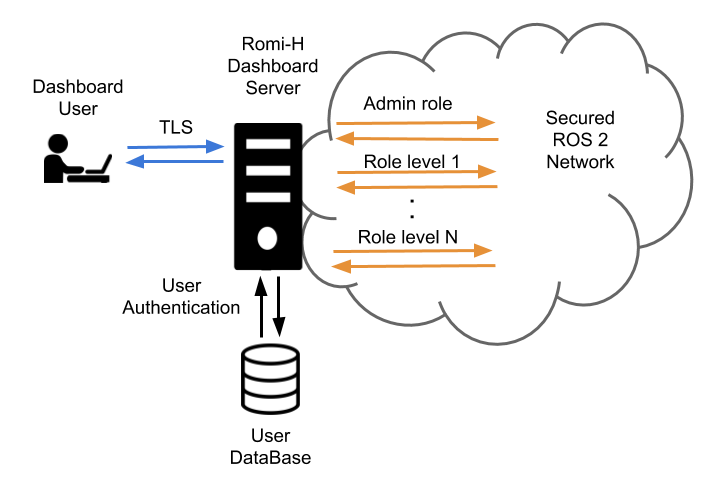

# Security

This chapter describes how to use DDS Security tools to provide authentication,
encryption, and access control to a RoMi-H system. 

The security of the RoMi-H system can be divided into two main parts: 
its ROS 2 elements and the dashboard. The security of the ROS 2 
elements is provided by the DDS security tools which help ensure authentication, 
encryption and access control. The dashboard provides the user with an 
instruments panel while ensuring encryption, integrity and authentication of 
the connection to the server through TLS. User authentication and access control 
is made by user/password checking against a database and then 
 providing that user with access to the secured ROS 2 network at a level that
corresponds to the role of that user.
 


The [RMF demos][rmf_demos] repository contains an example of a 
full RMF application using secured ROS 2 communications along with
step by step explanations. 

## ROS 2 Security

ROS 2 contains tools that help create and load the needed security artifacts 
to enable DDS-security. RoMi-H makes uses of these tools in order to enable 
security on its ROS 2 elements. A brief introduction to these tools and its 
usage is provided here. For a deeper understanding of the whole system, 
please refer to the [ROS 2 DDS-Security integration][SROS] documentation.

### DDS-Security overview

The [DDS-Security specification][dds_security] expands upon the [DDS specification][dds], 
adding security enhancements by defining a Service Plugin Interface (SPI) 
architecture, a set of builtin implementations of the SPIs, and the security model enforced by the SPIs.
Specifically, there are five SPIs defined:

- **Authentication**: Verify the identity of a given domain participant.
- **Access control**: Enforce restrictions on the DDS-related operations that can be 
performed by an authenticated domain participant.
- **Cryptographic**: Handle all required encryption, signing, and hashing operations.
- **Logging**: Provide the ability to audit DDS-Security-related events.
- **Data tagging**: Provide the ability to add tags to data samples.

ROS 2's security features currently utilize only the first three.
This is due to the fact that neither **Logging** nor **Data Tagging** 
are required in order to be compliant with the [DDS-Security spec][dds_security] 
(see section 2.3), and thus not all DDS implementations support them.

### SROS 2 tools

Since the DDS-Security plugins require a set of security files per domain participant, these 
need to be created beforehand in order to provide authentication, access control and encryption
to the ROS 2 elements of RoMi-H. Domain participants usually map to a context within the 
process in ROS 2, therefore each process will require a set of these files.

Since SROS 2 has no support for launch files yet, each binary needs to be launched separately
on its own terminal. Alternatively we recommend the creation of scripts to automate this process. 
An example of this is the `tmux` script used in the [Office SROS 2 demo][office_sros].

The `ros2 security` command is the way to access the SROS 2 set of tools to create and manage
your DDS-security artifacts. You can get a glimpse at its features by accessing the documentation
through the `-h` flag:

``` {.sourceCode .bash}
$ ros2 security -h
usage: ros2 security [-h] Call `ros2 security <command> -h` for more detailed usage. ...

Various security related sub-commands

optional arguments:
  -h, --help            show this help message and exit

Commands:
  create_key          Create key
  create_keystore     Create keystore
  create_permission   Create permission
  generate_artifacts  Generate keys and permission files from a list of identities and policy files
  generate_policy     Generate XML policy file from ROS graph data
  list_keys           List keys

  Call \`ros2 security <command> -h\` for more detailed usage.
```

#### SROS 2 environment variables

There are a few environment variables you should be aware of when using SROS 2: 

- **ROS_SECURITY_ENABLE** is the SROS 2 enabler variable, it takes a boolean value 
(true or false) and indicates if the security is enabled or not. 
- **ROS_SECURITY_STRATEGY** can be set to `Enforce` or `Permissive`, with the first one it 
will fail to run a participant if the security files are not found, whereas with the second one will 
just run the participant in non secure mode if those files are not found. 
- **ROS_SECURITY_KEYSTORE** should point to the root of the keystore directory tree. This will help `RCL`
find the location of the security artifacts to initialize the ROS 2 security environment.

#### SROS 2 security keystore

The keystore is the root directory where the DDS security artifacts are stored. `RCL` will use the 
contents of this directory to provide the DDS security to the ROS 2 network. The 
`ROS_SECURITY_KEYSTORE` environment variable should by convention point to this directory. In order 
to initalize and populate `keystore_storage` directory files the following command can be used:

``` {.sourceCode .bash}
$ ros2 security create_keystore keystore_storage
creating keystore: keystore_storage
creating new CA key/cert pair
creating governance file: keystore_storage/enclaves/governance.xml
creating signed governance file: keystore_storage/enclaves/governance.p7s
```

After creating the keystore, its initial structure would look like this:

    keystore_storage
    ├── enclaves
    |   ├── governance.p7s
    |   └── governance.xml
    ├── private
    |   ├── ca.key.pem
    |   ├── identity_ca.key.pem
    |   └── permissions_ca.key.pem
    └── public
        ├── ca.key.pem
        ├── identity_ca.key.pem
        └── permissions_ca.key.pem

The `public` directory contains anything permissible as public, such as public certificates for 
the identity or permissions Certificate Authorities (CA). As such, this can be given read access to all 
executables. Note that in the default case, both `identity_ca` and `permissions_ca` point to the 
same CA certificate.

The `private` directory contains anything permissible as private, such as private key material for 
aforementioned certificate authorities. This directory should be removed before deploying the 
keystore onto the target device/robot.

The `enclaves` directory contains the security artifacts associated with individual security enclaves. 
SROS 2 introduces the concept of a security “enclave”, 
where an “enclave” is a process or group of processes that will share the same identity and access 
control rules. The enclaves folder may recursively nest sub-paths for organizing separate enclaves. 

#### SROS 2 enclave keys

Once the `keystore` has been initialized you may wish to create the security keys for your 
enclaves. This will populate the `enclaves` directory with the necessary keys and governance
files. As an example, in order to create the security files for our`/hospital/rviz` enclave the
following command would be issued:

``` {.sourceCode .bash}
$ ros2 security create_key keystore_storage /hospital/rviz
creating key for identity: '/hospital/rviz'
creating cert and key
creating permission
```

After this, they `keystore_storage` directory should contain the rviz enclave:

    keystore_storage
    ├── enclaves
    |   ├── governance.p7s
    |   ├── governance.xml
    │   └── hospital
    |       ├── rviz
    │       |   ├── cert.pem
    │       |   ├── key.pem
    │       |   ├── governance.p7s
    |       |   ├── identity_ca_cert.pem
    |       |   ├── permissions_ca.cert.pem
    |       |   ├── permissions.p7s
    |       |   └── permissions.xml
    ...     ... 
    
Now there is an enclave containing the following files:

- **identity_ca.cert.pem**: The x.509 certificate of the CA trusted by the **Authentication** plugin 
(the "Identity" CA).
- **cert.pem**: The x.509 certificate of this enclave instance (signed by the Identity CA).
- **key.pem**: The private key of this enclave instance.
- **permissions_ca.cert.pem**: The x.509 certificate of the CA trusted by the **Access control** plugin 
(the "Permissions" CA).
- **governance.p7s**: The XML document that specifies to the **Access control** plugin how the domain 
should be secured  (signed by the Permissions CA).
- **permissions.p7s**: The XML document that specifies the permissions of this particular enclave 
instance to the **Access control** plugin (also signed by the Permissions CA).

#### SROS 2 access control

In order to provide access control the security permissions need to be added to the permissions files
of the enclave and signed by the CA. In order to do this a policy file following the
[SROS 2 policy schema][access_control] is needed. 
This file specifies the permissions awarded to the enclave within the ROS 2 network.
To create and sign the permissions the `create_permission` option can be used:

``` {.sourceCode .bash}
$ ros2 security create_permission keystore_storage /hospital/rviz policy.xml 
creating permission file for identity: '/hospital/rviz'
creating permission
```

After running this command, the `permissions.p7s` and `permissions.xml` files for the 
`enclave` /hospital/rviz will contain the signed permissions specified in policy.xml. 
We will have to specify this enclave through rosargs when starting our process:

``` {.sourceCode .bash}
$ ros2 run <package> <executable> --rosargs ---enclave /hospital/rviz
```

# SROS 2 automated generation

The process of generating keys and permissions can be sometimes tedious, so SROS 2 provides tools 
to automate this process. An automated way to generate the policy is provided, it can be
triggered by running the following command:

``` {.sourceCode .bash}
$ ros2 security generate_policy policy.xml
```

This command will take the ROS graph at the point of running and generate the policy.xml file 
that corresponds to it. Note that this, as it only uses the current ROS graph as a source of 
information, might still miss policies for future publishers, subscribers, services or others.

The process and key and permissions generation can also be troublesome, SROS 2 provides a 
command that you can use to generate all of them at once:

``` {.sourceCode .bash}
$ ros2 security generate_artifacts -k keystore_storage -p policy.xml
keystore_storage is not a valid keystore, creating new keystore
creating keystore: keystore_storage
creating new CA key/cert pair
creating governance file: keystore_storage/enclaves/governance.xml
creating signed governance file: keystore_storage/enclaves/governance.p7s
all done! enjoy your keystore in keystore_storage
cheers!
creating key for identity: '/hosptial/rviz'
creating cert and key
creating permission
creating permission file for identity: '/hosptical/rviz'
creating permission
...
```

Finally SROS 2 also provides a way to easily list the keys of a certain keystorage:

``` {.sourceCode .bash}
$ ros2 security list_keys keystore_storage
/hospital/building_map_server
/hopsital/building_systems_visualizer
/hospital/door_supervisor
/hospital/fleet_state_visualizer
/hosptial/loop_request_publisher
/hosptial/rviz2
...
```

## RoMi-H Dashboard Security

The RoMi-H Dashboard is a web application that provides overall visualization and control over the 
RoMi-H system. It is served over TLS to ensure encryption, integrity and authentication of the 
communication with the final user. The server uses [openid-connect (OIDC)][openid_connect] for 
authentication, an open standard based on [oauth 2.0][oauth2] and [JOSE][jose]. Currently the 
dashboard makes use of [Keycloack][keycloack], an open source implementation of OIDC. It provides 
an user management system, which is used to create/delete users. Each user gets assigned a role 
which is reflected on an id token generated on the user. This id token is signed securely 
and sent to the api server which it can then look at the role of the user and act accordingly.
The api server runs a secured ROS 2 node per each role and provides access to them based on 
the id token of each user.

[SROS]: https://design.ros2.org/articles/ros2_dds_security.html
[dds_security]: https://www.omg.org/spec/DDS-SECURITY/1.1/PDF
[dds]: https://www.omg.org/spec/DDS/1.4/PDF
[rmf_demos]: https://github.com/osrf/rmf_demos
[office_sros]: https://github.com/osrf/rmf_demos/blob/master/demos/sros2/office_deploy.bash
[fasdds]: https://github.com/eProsima/Fast-DDS
[cyclonedds]: https://github.com/ros2/rmw_cyclonedds
[enclaves]: https://design.ros2.org/articles/ros2_security_enclaves.html
[access_control]: https://design.ros2.org/articles/ros2_access_control_policies.html
[openid_connect]: https://openid.net/connect/
[oauth2]: https://oauth.net/2/
[jose]: https://jose.readthedocs.io/en/latest/
[keycloack]: https://www.keycloak.org
