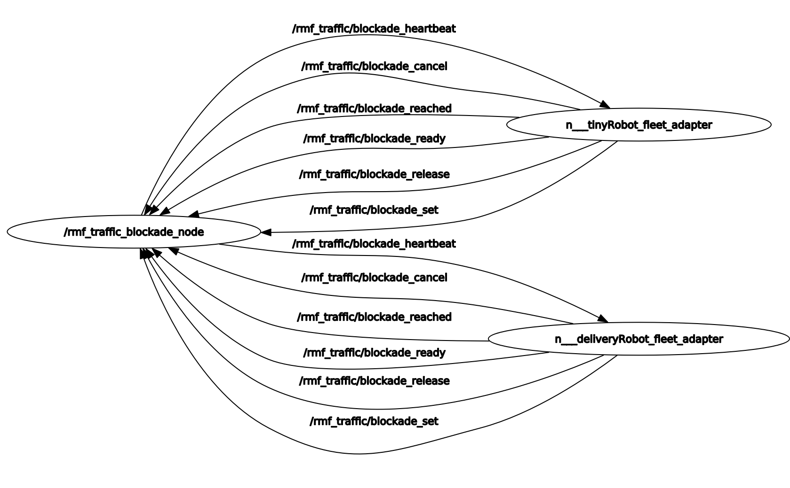

## Blockade Moderator

Checks if a blockade has occurred anywhere.

```xml
  <!-- Blockade Moderator -->
  <node pkg="rmf_traffic_ros2" exec="rmf_traffic_blockade" output="both">
    <param name="use_sim_time" value="$(var use_sim_time)"/>
  </node>
```

The code for the blockade node can be found [here](https://github.com/open-rmf/rmf_ros2/blob/main/rmf_traffic_ros2/src/rmf_traffic_ros2/blockade/Node.cpp)
The blockade node has the following topics:

- [BlockadeCancel](https://github.com/open-rmf/rmf_internal_msgs/blob/main/rmf_traffic_msgs/msg/BlockadeCancel.msg)
- [BlockadeHeartbeat](https://github.com/open-rmf/rmf_internal_msgs/blob/main/rmf_traffic_msgs/msg/BlockadeHeartbeat.msg)
- [BlockadeReached](https://github.com/open-rmf/rmf_internal_msgs/blob/main/rmf_traffic_msgs/msg/BlockadeReached.msg)
- [BlockadeReady](https://github.com/open-rmf/rmf_internal_msgs/blob/main/rmf_traffic_msgs/msg/BlockadeReady.msg)
- [BlockadeRelease](https://github.com/open-rmf/rmf_internal_msgs/blob/main/rmf_traffic_msgs/msg/BlockadeRelease.msg)
- [BlockadeSet](https://github.com/open-rmf/rmf_internal_msgs/blob/main/rmf_traffic_msgs/msg/BlockadeSet.msg)
- [BlockadeStatus](https://github.com/open-rmf/rmf_internal_msgs/blob/main/rmf_traffic_msgs/msg/BlockadeStatus.msg)

The blockade node is connected to the both the robots as seen in the graph below.

