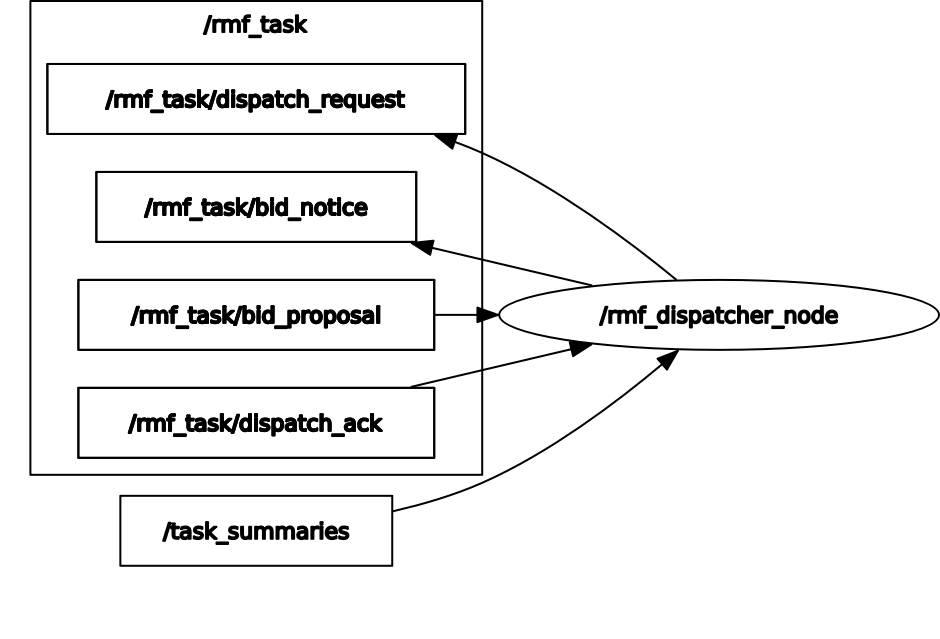

## Dispatcher Node

Used for task dispatch. Every fleet that can perform a task request will offer a bid for how much it would "cost" them to perform a task, and the bid with the lowest "cost" will be the winner. The "cost" will be determined by two factors:

- How quickly the task is finished
- How much other tasks get delayed if the new task needs to preempt them

```xml
  <!-- Dispatcher Node -->
  <group>
    <node pkg="rmf_task_ros2" exec="rmf_task_dispatcher"  output="screen">
      <param name="use_sim_time" value="$(var use_sim_time)"/>
      <param name="bidding_time_window" value="$(var bidding_time_window)"/>
    </node>
  </group>
```

The code for the dispatcher node can be found [here](https://github.com/open-rmf/rmf_ros2/blob/main/rmf_task_ros2/src/dispatcher_node/main.cpp)
The dispatcher node has the following topics:

- [DispatchAck](https://github.com/open-rmf/rmf_internal_msgs/blob/main/rmf_task_msgs/msg/DispatchAck.msg)
- [DispatchCommand](https://github.com/open-rmf/rmf_internal_msgs/blob/main/rmf_task_msgs/msg/DispatchCommand.msg)
- [DispatchState](https://github.com/open-rmf/rmf_internal_msgs/blob/main/rmf_task_msgs/msg/DispatchState.msg)
- [DispatchStates](https://github.com/open-rmf/rmf_internal_msgs/blob/main/rmf_task_msgs/msg/DispatchStates.msg)

The dispatcher node is responsible for dispatching tasks to the robots.It responds to the `dispatch_request` and `bid_notice`.It takes information from the `bid_proposal` and `dispatch_ack` which is published by `rmf_task`.

