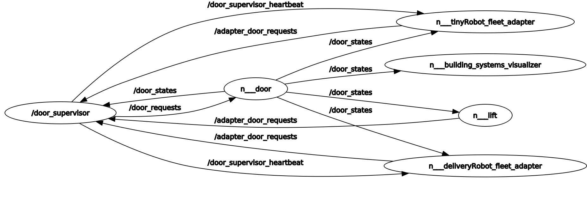

## Door Supervisor

It is part of `rmf_fleet_adapter`. It is used to supervise the door. To perform action based on request.The door can be opend or closed based on request.

```xml
  <!-- Door Supervisor -->
  <group>
    <node pkg="rmf_fleet_adapter" exec="door_supervisor">
      <param name="use_sim_time" value="$(var use_sim_time)"/>
    </node>
  </group>
```

The code for the Door Supervisor node can be found [here](https://github.com/open-rmf/rmf_ros2/blob/main/rmf_fleet_adapter/src/door_supervisor/Node.cpp)
The Door Supervisor has following topics:

- [DoorMode](https://github.com/open-rmf/rmf_internal_msgs/blob/main/rmf_door_msgs/msg/DoorMode.msg)
- [DoorRequest](https://github.com/open-rmf/rmf_internal_msgs/blob/main/rmf_door_msgs/msg/DoorRequest.msg)
- [DoorSessions](https://github.com/open-rmf/rmf_internal_msgs/blob/main/rmf_door_msgs/msg/DoorSessions.msg)
- [DoorState](https://github.com/open-rmf/rmf_internal_msgs/blob/main/rmf_door_msgs/msg/DoorState.msg)

The Door Supervisor attends to requests and keeps track of the state of the Door.
  
