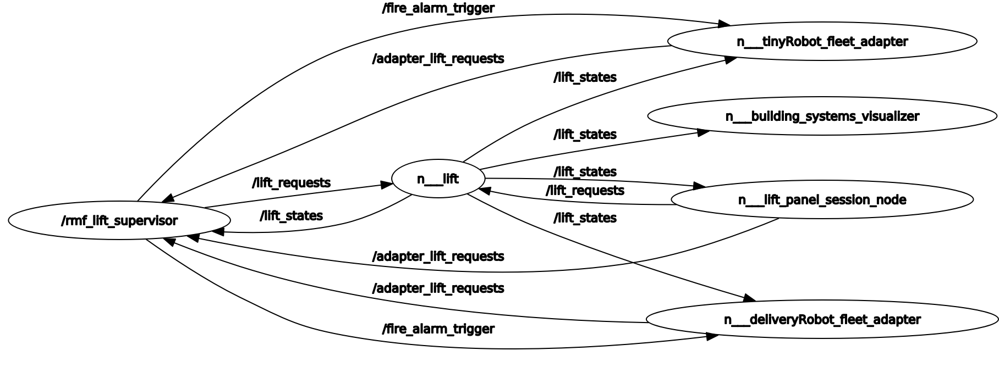

## Lift Supervisor

It is part of `rmf_fleet_adapter`. It is used to supervise the lift. To perform action based on request. A lift adapter subscribes to `lift_states` while keeping track of the internal and desired state of the lift in order to prevent it from performing any actions that might interrupt

```xml
 <!-- Lift Supervisor -->
 <group>
   <node pkg="rmf_fleet_adapter" exec="lift_supervisor">
     <param name="use_sim_time" value="$(var use_sim_time)"/>
   </node>
 </group>
```

The code for the blockade node can be found [here](https://github.com/open-rmf/rmf_ros2/blob/main/rmf_fleet_adapter/src/lift_supervisor/Node.cpp)
The Life Supervisor has following topics:

- [LiftRequest](https://github.com/open-rmf/rmf_internal_msgs/blob/main/rmf_lift_msgs/msg/LiftRequest.msg)
- [LifeState](https://github.com/open-rmf/rmf_internal_msgs/blob/main/rmf_lift_msgs/msg/LiftState.msg)

The Life Supervisor does the job of maintaining the status of the Lift and attend to any requests by the robots.

