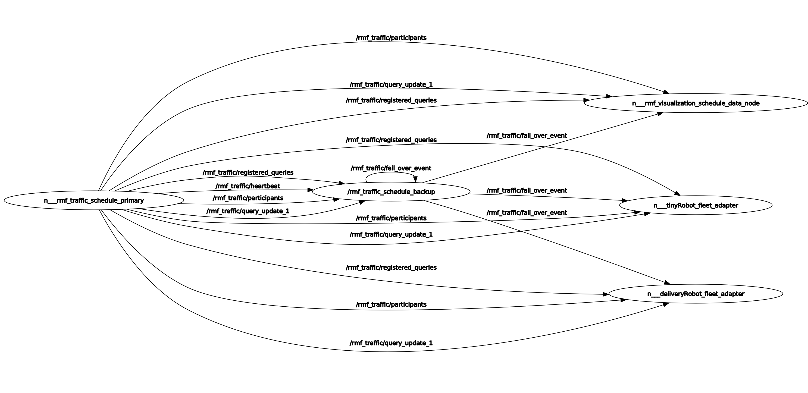

## Traffic Schedule monitor and replacement node

This node is helps in monitoring the `rmf_traffic_schedule` and provides a replacement if the rmf_traffic_schedule faces any conflicts.

```xml
  <node pkg="rmf_traffic_ros2" exec="rmf_traffic_schedule_monitor" output="both" name="rmf_traffic_schedule_backup">
    <param name="use_sim_time" value="$(var use_sim_time)"/>
  </node>
```

The code for the blockade node can be found [here](https://github.com/open-rmf/rmf_ros2/blob/main/rmf_traffic_ros2/src/rmf_traffic_schedule_monitor/main.cpp)
The Traffic Schedule monitor has following topics:

- [ScheduleChangeAdd](https://github.com/open-rmf/rmf_internal_msgs/blob/main/rmf_traffic_msgs/msg/ScheduleChangeAdd.msg)
- [ScheduleChangeAddItem](https://github.com/open-rmf/rmf_internal_msgs/blob/main/rmf_traffic_msgs/msg/ScheduleChangeAddItem.msg)
- [ScheduleChangeCull](https://github.com/open-rmf/rmf_internal_msgs/blob/main/rmf_traffic_msgs/msg/ScheduleChangeCull.msg)
- [ScheduleChangeDelay](https://github.com/open-rmf/rmf_internal_msgs/blob/main/rmf_traffic_msgs/msg/ScheduleChangeDelay.msg)
- [ScheduleChangeProgress](https://github.com/open-rmf/rmf_internal_msgs/blob/main/rmf_traffic_msgs/msg/ScheduleChangeProgress.msg)
- [ScheduleIdentity](https://github.com/open-rmf/rmf_internal_msgs/blob/main/rmf_traffic_msgs/msg/ScheduleIdentity.msg)
- [ScheduleInconsistency](https://github.com/open-rmf/rmf_internal_msgs/blob/main/rmf_traffic_msgs/msg/ScheduleInconsistency.msg)
- [ScheduleInconsistencyRange](https://github.com/open-rmf/rmf_internal_msgs/blob/main/rmf_traffic_msgs/msg/ScheduleInconsistencyRange.msg)
- [ScheduleParticipantPatch](https://github.com/open-rmf/rmf_internal_msgs/blob/main/rmf_traffic_msgs/msg/ScheduleParticipantPatch.msg)
- [SchedulePatch](https://github.com/open-rmf/rmf_internal_msgs/blob/main/rmf_traffic_msgs/msg/SchedulePatch.msg)
- [ScheduleQueries](https://github.com/open-rmf/rmf_internal_msgs/blob/main/rmf_traffic_msgs/msg/ScheduleQueries.msg)
- [ScheduleQuery](https://github.com/open-rmf/rmf_internal_msgs/blob/main/rmf_traffic_msgs/msg/ScheduleQuery.msg)
- [ScheduleQueryParticipants](https://github.com/open-rmf/rmf_internal_msgs/blob/main/rmf_traffic_msgs/msg/ScheduleQueryParticipants.msg)
- [ScheduleQuerySpacetime](https://github.com/open-rmf/rmf_internal_msgs/blob/main/rmf_traffic_msgs/msg/ScheduleQuerySpacetime.msg)


