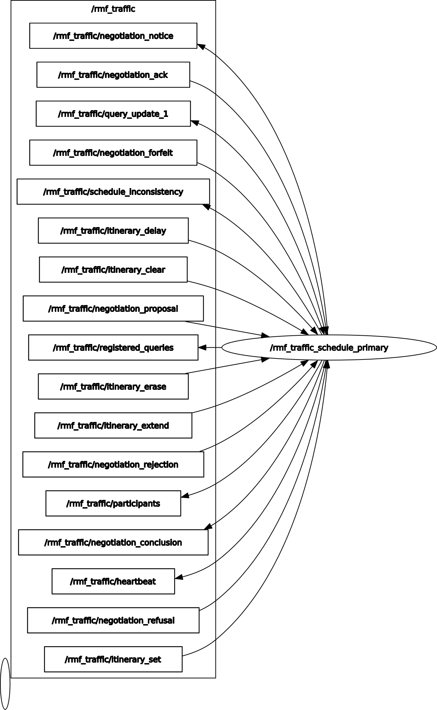

## Traffic Schedule

The `rmf_traffic_schedule` handles core scheduling and traffic management systems.

```xml
  <!-- Traffic Schedule  -->
  <node pkg="rmf_traffic_ros2" exec="rmf_traffic_schedule" output="both" name="rmf_traffic_schedule_primary">
    <param name="use_sim_time" value="$(var use_sim_time)"/>
  </node>
```

The code for the schedule node can be found [here](https://github.com/open-rmf/rmf_ros2/blob/main/rmf_traffic_ros2/src/rmf_traffic_schedule/main.cpp)

Traffic Schedule has following topics

- [NegotiationNotice](https://github.com/open-rmf/rmf_internal_msgs/blob/main/rmf_traffic_msgs/msg/NegotiationNotice.msg)
- [NegotiationAck](https://github.com/open-rmf/rmf_internal_msgs/blob/main/rmf_traffic_msgs/msg/NegotiationAck.msg)
- [NegotiationForfeit](https://github.com/open-rmf/rmf_internal_msgs/blob/main/rmf_traffic_msgs/msg/NegotiationForfeit.msg)
- [ScheduleInconsistency](https://github.com/open-rmf/rmf_internal_msgs/blob/main/rmf_traffic_msgs/msg/ScheduleInconsistency.msg)
- [Trajectory](https://github.com/open-rmf/rmf_internal_msgs/blob/main/rmf_traffic_msgs/msg/Trajectory.msg)
- [ItineraryDelay](https://github.com/open-rmf/rmf_internal_msgs/blob/main/rmf_traffic_msgs/msg/ItineraryDelay.msg)
- [ItineraryClear](https://github.com/open-rmf/rmf_internal_msgs/blob/main/rmf_traffic_msgs/msg/ItineraryClear.msg)
- [ItineraryErase](https://github.com/open-rmf/rmf_internal_msgs/blob/main/rmf_traffic_msgs/msg/ItineraryErase.msg)
- [ItineraryExtend](https://github.com/open-rmf/rmf_internal_msgs/blob/main/rmf_traffic_msgs/msg/ItineraryExtend.msg)
- [NegotiationProposal](https://github.com/open-rmf/rmf_internal_msgs/blob/main/rmf_traffic_msgs/msg/NegotiationProposal.msg)
- [NegotiationRejection](https://github.com/open-rmf/rmf_internal_msgs/blob/main/rmf_traffic_msgs/msg/NegotiationRejection.msg)
- [Participants](https://github.com/open-rmf/rmf_internal_msgs/blob/main/rmf_traffic_msgs/msg/Participants.msg)
- [NegotiationConclusion](https://github.com/open-rmf/rmf_internal_msgs/blob/main/rmf_traffic_msgs/msg/NegotiationConclusion.msg)
- [Heartbeat](https://github.com/open-rmf/rmf_internal_msgs/blob/main/rmf_traffic_msgs/msg/Heartbeat.msg)
- [NegotiationRefusal](https://github.com/open-rmf/rmf_internal_msgs/blob/main/rmf_traffic_msgs/msg/NegotiationRefusal.msg)
- [ItinerarySet](https://github.com/open-rmf/rmf_internal_msgs/blob/main/rmf_traffic_msgs/msg/ItinerarySet.msg)

The Traffic Schedule does the job of planning what paths robots will follow,scheduling and performs negotiations between different robots.


