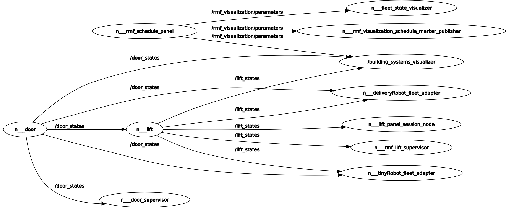

## Visualizer

Used for visualization using rviz.

```xml
<!-- Visualizer -->
  <group>
    <include file="$(find-pkg-share rmf_visualization)/visualization.launch.xml">
      <arg name="use_sim_time" value="$(var use_sim_time)"/>
      <arg name="map_name" value="$(var initial_map)"/>
      <arg name="viz_config_file" value ="$(var viz_config_file)"/>
      <arg name="headless" value="$(var headless)"/>
    </include>
  </group>
```


