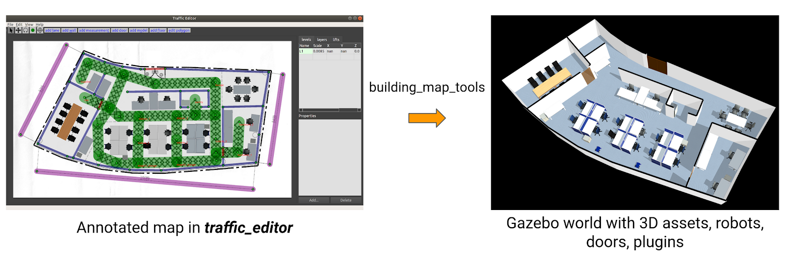
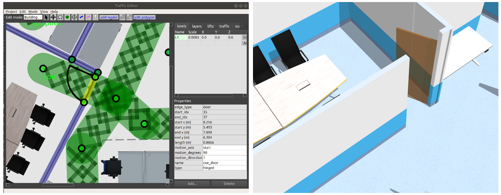

# Simulation

This chapter will describe how to generate building models from the
`traffic-editor` files and simulate fleets of robots in them.

## Motivation

Simulation environments for testing robotic solutions offer immense value across
various stages of R&D and deployment. More notably, simulations provide the
following benefits.

- **Time and resource saving:** While testing with hardware is indispensible,
  the process can slow the pace of development with additional setup time, robot
  downtime and and reset periods between trials. As the number of participants
  scale, so do costs associated with purchasing hardware and consumables for
  testing. This is especially true with solutions such as RMF which aim to
  integrate several mobile/stationary robots, and building systems such as doors
  and lifts. Simulations provide a cost effective and time saving alternative
  for evaluating the behavior of robot systems at scale. More importantly
  simulations can help answer questions with deployment such as how many
  participants can be supported or how the existing behavior would change with
  the introduction of a new fleet, both of which can inform purchasing decisions
  for facility owners. 

- **Robust testing:** Robots in simulation do not run out of battery. Scenarios
  can be tested for hours at a stretch, at faster speeds, to fine tune
  algorithms and verify their robustness. As scenarios in simulation are
  repeatable, fixes for undesirable bugs encountered can be readily validated.
  Reaction of the system to edge cases which are rare but have severe
  consequences can also be studied through simulation. Data logged from hardware
  trials can be used to recreate the scenario in simulation which may be further
  helpful for debugging. Lastly, long running simulations can instill confidence
  in facility owners prior to deployment.

Physics-based simulators such as `Gazebo`, carry the benefit of easily
interfacing with ROS2 nodes through wrappers provided by `gazebo_ros_pkgs`.
Gazebo plugins can be developed that accurately emulate the behavior of robots,
sensors and infrastructure systems which enhance the overall fidelity of
simulations. It is worth emphasizing here that the code used to run simulations
will be run on physical hardware as well without any changes.

However, despite these compelling benefits, simulations are sparingly employed
by developers and system integrators citing complexity over generating
environments and configuring them with appropriate plugins. The RMF project also
aims to address these hurdles by simplifying the process of setting up
simulation environments for multi-fleet traffic control.

## Building Map Generator
The `traffic_editor` as discussed previously is a tool to annotate building
floor plans with fleet specific traffic information in a vendor neutral manner.
This includes waypoints of interest, traffic lanes and shared resources such as
doorways and lifts. It can also be used to markup the walls and floors and add
thumbnails of artifacts in the environment. The ability to auto-generate a 3D
world using this annotated map is of significant value towards simplifying the
creation and management of simulations. To this end, the `building_map_tools`
package in `traffic_editor` contains an executable `building_map_generator`. The
executable operates in two modes 1) To generate a Gazebo/Ignition compliant
`.world` file and 2) Export the fleet specific traffic information in the form
of navigation graphs which are utilized by `fleet_adapters` for planning.




To auto-generate a Gazebo simulation world, the executable takes in the command arugment "gazebo" along with others described below.

```bash
usage: building_map_generator gazebo [-h] [-o [OPTIONS [OPTIONS ...]]] [-n]
                                     [-m MODEL_PATH] [-c CACHE]
                                     INPUT OUTPUT_WORLD OUTPUT_MODEL_DIR

positional arguments:
  INPUT                 Input building.yaml file to process
  OUTPUT_WORLD          Name of the .world file to output
  OUTPUT_MODEL_DIR      Path to output the map model files

optional arguments:
  -h, --help            show this help message and exit
  -o [OPTIONS [OPTIONS ...]], --options [OPTIONS [OPTIONS ...]]
                        Generator options
  -n, --no_download     Do not download missing models from Fuel
  -m MODEL_PATH, --model_path MODEL_PATH
                        Gazebo model path to check for models
  -c CACHE, --cache CACHE
                        Path to pit_crew model cache
```

The script parses the `.building.yaml` file and generates meshes for the
flooring and walls for each level which are combined into a `model.sdf` file in
the `OUTPUT_MODEL_DIR/` directory. The `model.sdf` files for each level are
imported into the `.world` with filepath `OUTPUT_WORLD`. Model sub-elements for
various static objects annotated in the `traffic_editor` are included in the
`.world` as seen in the snippet below. Similar blocks for annotated robots are
generated. It is the responsibility of the user to append the environment
variable `$GAZEBO_MODEL_PATH` with the relevant paths to the models prior to
loading the `.world` file in Gazebo. This process can be simplified through ROS2
launch files and will be discussed in later sections.

```xml
<include>
  <name>OfficeChairBlack_6</name>
  <uri>model://OfficeChairBlack</uri>
  <pose>4.26201267190027 -7.489812761393875 0 0 0 1.1212</pose>
  <static>True</static>
</include>
```
The parser also includes Sdf elements for other dynamic assets such as doors and
lifts. Their mechanisms are discussed in the ensuing section. An `Ignition`
compatible world can be generated by using the "command" argument "ignition".

Reconfiguring simulation environments becomes as trivial as editing the
annotations on the 2D drawing and re-running the `building_map_generator`. This
is exceedingly useful to quickly evaluate traffic flow as the spatial
configuration in the facility changes.

To generate navigation graphs for fleet adapters, the `building_map_generator` is executed with `command` argument "nav". The navigation graph is generated as a `.yaml` file and is parsed during launch by the corresponding fleet adapter.
```bash
usage: building_map_generator nav [-h] INPUT OUTPUT_DIR

positional arguments:
  INPUT       Input building.yaml file to process
  OUTPUT_DIR  Path to output the nav .yaml files

```

## RMF Assets and Plugins

Assets play a pivotal role in recreating environments in simulation. Through the
RMF project, several 3D models of robots, mechanical infrastructure systems and
scene objects have been open sourced. They are available for download [here](https://app.ignitionrobotics.org/OpenRobotics/fuel/collections/Hospital).
Beyond imparting visual accuracy, assets may be dynamic and interface with rmf
core systems through the aid of plugins. 

To simulate the behavior of hardware such as robot models and infrastructure
systems, several Gazebo plugins have been architected. These plugins are derivates of the [ModelPlugin](http://osrf-distributions.s3.amazonaws.com/gazebo/api/dev/classgazebo_1_1ModelPlugin.html) class and tie in standard ROS2 and rmf_core messages to provide necessary functionality. The following sections briefly describe some of these plugins.

#### Robots
As highlighted earlier, several robot models (MiR100, Magni, Hospi) have been
open sourced for use in simulation. For these models to emulate the behavior of
their physical counterparts which have been integrated with RMF, they need to 1)
interface with `rmf_fleet_adapters` and 2) navigate to locations in the
simulated world. These functionalities, for a "_full control_" robot type, are
achieved through the `slotcar` [plugin](https://github.com/osrf/traffic_editor/blob/master/building_gazebo_plugins/src/slotcar.cpp).
The plugin subscribes to `/robot_path_requests` and `/robot_mode_requests`
topics and responds to relevant `PathRequest` and `ModeRequest` messages
published by its `rmf_fleet_adapter`. The plugin also publishes the robot's
state to the `/robot_state` topic.

To navigate the robot through waypoints in a `PathRequest` message, a simple
"rail-like" navigation algorithm is utilized which accelerates and decelerates
the robot along a straight line from its current position to the next waypoint.
The plugin relies on these fundamental assumptions
  * The robot model is a two-wheel differential drive robot
  * The left and right wheel joints are named  `joint_tire_left` and `joint_tire_right` respectively

Other parameters, majority of which are kinematic properties of the robot are inferred from sdf parameters. 
```xml
<plugin name="slotcar" filename="libslotcar.so">
  <nominal_drive_speed>0.5</nominal_drive_speed>
  <nominal_drive_acceleration>0.25</nominal_drive_acceleration>
  <max_drive_acceleration>0.75</max_drive_acceleration>
  <nominal_turn_speed>0.6</nominal_turn_speed>
  <nominal_turn_acceleration>1.5</nominal_turn_acceleration>
  <max_turn_acceleration>2.0</max_turn_acceleration>
  <tire_radius>0.1</tire_radius>
  <base_width>0.3206</base_width>
  <stop_distance>0.75</stop_distance>
  <stop_radius>0.75</stop_radius>
</plugin>
```

During simulation, it is assumed that the robot's path is free of static
obstacles but the plugin contains logic to pause the robot's motion if an
obstacle is detected in its path. While it is possible to deploy a sensor based
navigation stack, the approach is avoided to minimize the computational load on
the system from running a navigation stack for each robot in the simulation.
Given the focus on traffic management of heterogeneous fleets and not robot
navigation, the `slotcar` plugin provides an efficiently means to simulate the
interaction between rmf core systems and robots.

The `slotcar` plugin is meant to serve as a generalized solution. Vendors are
encouraged to develop and distribute plugins that more accurately represent the
capabilities of their robot and the level of integration with RMF.

TODO: readonly 
  
#### Doors
Unlike robot models whose geometries are fixed and hence can be directly
included in the generated `.world` file, doors are custom defined in
`traffic_editor` and have their own generation pipeline. As seen in the figure
below, an annotated door has several properties which include the location of
its ends, the type of door (hinged, double_hinged, sliding, double_sliding) and
its range of motion (for hinged doors).




The `building_map_generator gazebo` script parses a `.building.yaml` file for
any doors and automatically generates an sdf sub-element with links and joints
required for the door along with a configured plugin. The sdf sub-element
generated for the door in the figure above is presented below.

```xml
<model name="coe_door">
  <pose>8.077686357313898 -5.898342045416362 0.0 0 0 1.1560010438234292</pose>
  <plugin filename="libdoor.so" name="door">
    <v_max_door>0.5</v_max_door>
    <a_max_door>0.3</a_max_door>
    <a_nom_door>0.15</a_nom_door>
    <dx_min_door>0.01</dx_min_door>
    <f_max_door>500.0</f_max_door>
    <door left_joint_name="left_joint" name="coe_door" right_joint_name="empty_joint" type="SwingDoor" />
  </plugin>
  <link name="left">
    <pose>0 0 1.11 0 0 0</pose>
    <visual name="left">
      <material>
        <ambient>120 60 0 0.6</ambient>
        <diffuse>120 60 0 0.6</diffuse>
      </material>
      <geometry>
        <box>
          <size>0.8766026166317483 0.03 2.2</size>
        </box>
      </geometry>
    </visual>
    <collision name="left">
      <surface>
        <contact>
          <collide_bitmask>0x02</collide_bitmask>
        </contact>
      </surface>
      <geometry>
        <box>
          <size>0.8766026166317483 0.03 2.2</size>
        </box>
      </geometry>
    </collision>
    <inertial>
      <mass>50.0</mass>
      <inertia>
        <ixx>20.17041666666667</ixx>
        <iyy>23.36846728119012</iyy>
        <izz>3.20555061452345</izz>
      </inertia>
    </inertial>
  </link>
  <joint name="left_joint" type="revolute">
    <parent>world</parent>
    <child>left</child>
    <axis>
      <xyz>0 0 1</xyz>
      <limit>
        <lower>-1.57</lower>
        <upper>0</upper>
      </limit>
    </axis>
    <pose>0.44330130831587417 0 0 0 0 0</pose>
  </joint>
</model>
```

The door [plugin](https://github.com/osrf/traffic_editor/blob/master/building_gazebo_plugins/src/door.cpp) responds to `DoorRequest` messages with `door_name` matching its `model name` sdf tag. These messages are published over the `/door_requests` topic. The plugin is agnostic of the type of door defined and relies on the `left_joint_name` and `right_joint_name` parameters to determine which joints to actuate during open and close motions. During these motions, the joints are commanded to their appropriate limits which are specified in the parent element. The joint motions adhere to kinematic constraints specified by sdf parameters while following acceleration and deceleration profiles similar to the `slotcar`. 

To avoid situations where one robot requests a door to close on another robot, a `door_supervisor` [node](https://github.com/osrf/rmf_core/blob/master/rmf_fleet_adapter/src/door_supervisor/main.cpp) is deployed in practice. The node publishes to `/door_requests` and subscribes to `/adapter_door_requests` which the fleet adapters publish to when their robot requires access through a door. The `door_supervisor` keeps track of requests from all the fleet adapters in the system and relays the request to the door adapters while avoiding aforementioned conflicts.

#### Lifts
The ability to simulate lifts is crucial as these systems are often the operational bottlenecks in facilities given their shared usage by both humans and multi robot fleets. As with annotated doors, lifts can be customized in a number of ways in the `traffic_editor` gui including the dimension & orientation of the cabin and defining which cabin doors open at which levels.

TODO: update gazebo image


The `building_map_generator gazebo` script parses the `.building.yaml` file for lifts definitions and auto-generates the sdf elements for the cabin, cabin doors as well as lift shaft doors. A prismatic joint is defined at the base of the cabin which when actuated by the lift plugin, moves the cabin between different floors. While the cabin doors are part of the cabin structure, the shaft doors are fixed to building. Both sets of doors for a floor open/close simultaneously. The lift plugin[](todo) along with required parameters is inserted into the lift's model sdf block.

```xml
<plugin filename="liblift.so" name="lift">
  <lift_name>Lift1</lift_name>
  <floor elevation="0.0" name="L1">
    <door_pair cabin_door="CabinDoor_Lift1_door1" shaft_door="ShaftDoor_Lift1_L1_door1" />
  </floor>
  <floor elevation="10.0" name="L2">
    <door_pair cabin_door="CabinDoor_Lift1_door1" shaft_door="ShaftDoor_Lift1_L2_door1" />
    <door_pair cabin_door="CabinDoor_Lift1_door2" shaft_door="ShaftDoor_Lift1_L2_door2" />
  </floor>
  <floor elevation="20.0" name="L3">
    <door_pair cabin_door="CabinDoor_Lift1_door1" shaft_door="ShaftDoor_Lift1_L3_door1" />
  </floor>
  <reference_floor>L1</reference_floor>
  <v_max_cabin>2.0</v_max_cabin>
  <a_max_cabin>1.2</a_max_cabin>
  <a_nom_cabin>1.0</a_nom_cabin>
  <dx_min_cabin>0.001</dx_min_cabin>
  <f_max_cabin>25323.0</f_max_cabin>
  <cabin_joint_name>cabin_joint</cabin_joint_name>
</plugin>
```
The plugin subscribes to `/lift_requests` topic and responds to `LiftRequest` messages with `lift_name` matching its `model name` sdf tag. 


#### Dispensers
A common scenario of interest is that of robots performing deliveries where a payload is loaded onto the robot at one location and the unloaded at another.


## Creating a Simulation
With the understanding of various facets of a simulation, we can the creation of a simulation along with scripts for assigning tasks to robots.