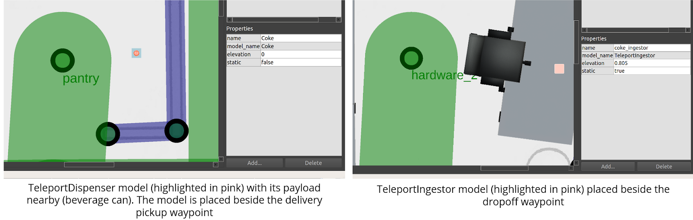
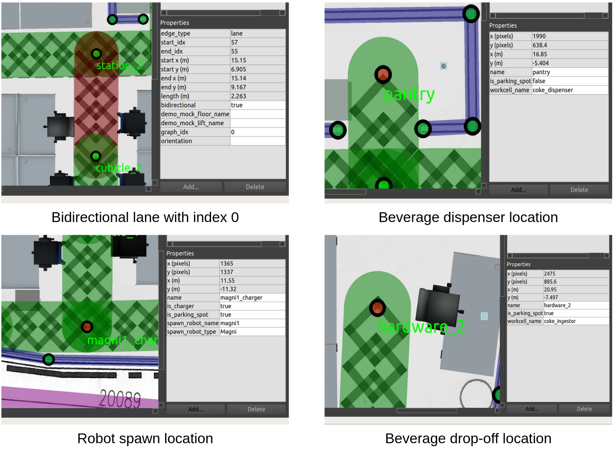
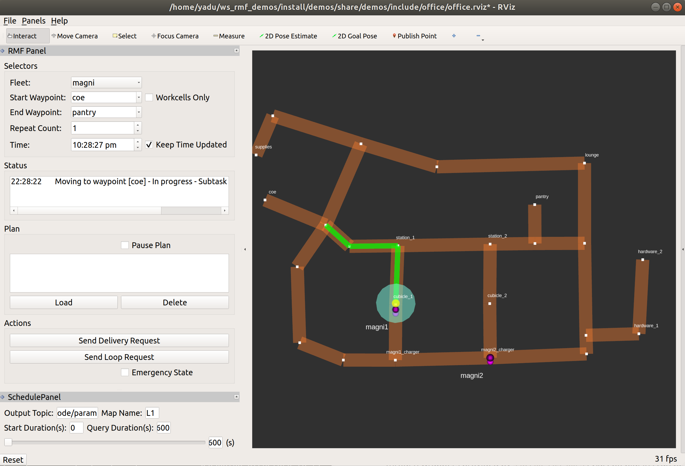

# Simulation

This chapter will describe how to generate building models from the
`traffic-editor` files and simulate fleets of robots in them.

## Motivation

Simulation environments for testing robotic solutions offer immense value across
various stages of R&D and deployment. More notably, simulations provide the
following benefits.

- **Time and resource saving:** While testing with hardware is indispensible,
  the process can slow the pace of development with additional setup time, robot
  downtime and and reset periods between trials. As the number of participants
  scale, so do costs associated with purchasing hardware and consumables for
  testing. This is especially true with solutions such as RMF which aim to
  integrate several mobile/stationary robots, and building systems such as doors
  and lifts. Simulations provide a potentially cost effective and time saving alternative
  for evaluating the behavior of robot systems at scale. More importantly
  simulations can help answer questions prior to deployment such as how many
  participants can be supported or how the existing behavior would change with
  the introduction of a new fleet, both of which can inform purchasing decisions
  for facility owners. 

- **Robust testing:** Robots in simulation neither run out of battery nor incur costs when they happen to unfortunately crash into something. Scenarios
  can be tested for hours at a stretch, at faster speeds, to fine tune
  algorithms and verify their robustness. One factor on how much scenario testing to run is a decision on how much compute power you want to avail for the simulation. With the introduction of cloud simulation, this limit is then a trade off of cost and speed as well. As scenarios in simulation are
  repeatable, fixes for undesirable bugs encountered can be readily validated.
  Reaction of the system to edge cases which are rare but have severe
  consequences can also be studied through simulation. Data logged from hardware
  trials can be used to recreate the scenario in simulation which may be further
  helpful for debugging. Lastly, long running simulations can instill confidence
  in facility owners prior to deployment.

Physics-based simulators such as `Gazebo`, carry the benefit of easily
interfacing with ROS2 nodes through wrappers provided by `gazebo_ros_pkgs`.
Gazebo plugins can be developed that accurately emulate the behavior of robots,
sensors and infrastructure systems which enhance the overall fidelity of
simulations. It is worth emphasizing here that the exact same code used to run the simulations
will also be run on the physical system as well without any changes.

However, despite these compelling benefits, simulations are sparingly employed
by developers and system integrators citing complexity over generating
environments and configuring them with appropriate plugins. In a recent publication "_A Study on the Challenges of Using Robotics Simulators for Testing_," by Afsoon Afzal, Deborah S. Katz, Claire Le Goues and Christopher S. Timperley they noted the main reasons participants gave for not using simulation for a particular project and summarized their findings as follows:

| Reason for not using simulation  | #  | %  |
|---|---|---|
| Lack of time or resources | 15 | 53.57% |
| Not realistic/accurate enough | 15 | 53.57% |
| Lack of expertise or knowledge on how to use software-based simulation | 6  | 21.43% |
| There was no simulator for the robot | 4  | 14.29% |
| Not applicable | 4  | 14.29% |
| Too much time or compute resources | 2  | 7.14%  |
| Nobody suggested it | 0  | 0.00%  |
| Other | 2  | 7.14%  |

The RMF project also
aims to address these hurdles by simplifying the process of setting up
simulation environments for multi-fleet traffic control as we will explain further throughout this section.

## Building Map Generator
The `traffic_editor` as discussed previously is a tool to annotate building
floor plans with fleet specific traffic information in a vendor neutral manner.
This includes waypoints of interest, traffic lanes and shared resources such as
doorways and lifts. It can also be used to markup the walls and floors and add
thumbnails of artifacts in the environment. The ability to auto-generate a 3D
world using this annotated map is of significant value towards simplifying the
creation and management of simulations. To this end, the `building_map_tools`
package in `traffic_editor` contains an executable `building_map_generator`. The
executable operates in two modes 1) To generate a Gazebo/Ignition compliant
`.world` file and 2) Export the fleet specific traffic information in the form
of navigation graphs which are utilized by `fleet_adapters` for planning.


To auto-generate a Gazebo simulation world, the executable takes in the command arugment "gazebo" along with others described below.

```bash
usage: building_map_generator gazebo [-h] [-o [OPTIONS [OPTIONS ...]]] [-n]
                                     [-m MODEL_PATH] [-c CACHE]
                                     INPUT OUTPUT_WORLD OUTPUT_MODEL_DIR

positional arguments:
  INPUT                 Input building.yaml file to process
  OUTPUT_WORLD          Name of the .world file to output
  OUTPUT_MODEL_DIR      Path to output the map model files

optional arguments:
  -h, --help            show this help message and exit
  -o [OPTIONS [OPTIONS ...]], --options [OPTIONS [OPTIONS ...]]
                        Generator options
  -n, --no_download     Do not download missing models from Fuel
  -m MODEL_PATH, --model_path MODEL_PATH
                        Gazebo model path to check for models
  -c CACHE, --cache CACHE
                        Path to pit_crew model cache
```

The script parses the `.building.yaml` file and generates meshes for the
flooring and walls for each level which are combined into a `model.sdf` file in
the `OUTPUT_MODEL_DIR/` directory. The `model.sdf` files for each level are
imported into the `.world` with filepath `OUTPUT_WORLD`. Model sub-elements for
various static objects annotated in the `traffic_editor` are included in the
`.world` as seen in the snippet below. Similar blocks for annotated robots are
generated. It is the responsibility of the user to append the environment
variable `$GAZEBO_MODEL_PATH` with the relevant paths to the models prior to
loading the `.world` file in Gazebo. This process can be simplified through ROS2
launch files and will be discussed in later sections.

```xml
<include>
  <name>OfficeChairBlack_6</name>
  <uri>model://OfficeChairBlack</uri>
  <pose>4.26201267190027 -7.489812761393875 0 0 0 1.1212</pose>
  <static>True</static>
</include>
```
The parser also includes Sdf elements for other dynamic assets such as doors and
lifts. Their mechanisms are discussed in the ensuing section. An `Ignition`
compatible world can be generated by using the "command" argument "ignition".

Reconfiguring simulation environments becomes as trivial as editing the
annotations on the 2D drawing and re-running the `building_map_generator`. This
is exceedingly useful to quickly evaluate traffic flow as the spatial
configuration in the facility changes.

To generate navigation graphs for fleet adapters, the `building_map_generator` is executed with `command` argument "nav". The navigation graph is generated as a `.yaml` file and is parsed during launch by the corresponding fleet adapter.
```bash
usage: building_map_generator nav [-h] INPUT OUTPUT_DIR

positional arguments:
  INPUT       Input building.yaml file to process
  OUTPUT_DIR  Path to output the nav .yaml files

```

## RMF Assets and Plugins

Assets play a pivotal role in recreating environments in simulation. Projects such as RMF, SubT and others have allowed developers to create and open source 3D models of robots, mechanical infrastructure systems and scene objects. They are available for download [here](https://app.ignitionrobotics.org/OpenRobotics/fuel/collections/).
Beyond imparting visual accuracy, assets may be dynamic and interface with rmf
core systems through the aid of plugins. 

To simulate the behavior of hardware such as robot models and infrastructure
systems, several Gazebo plugins have been architected. These plugins are derivates of the [ModelPlugin](http://osrf-distributions.s3.amazonaws.com/gazebo/api/dev/classgazebo_1_1ModelPlugin.html) class and tie in standard ROS2 and rmf_core messages to provide necessary functionality. The following sections briefly describe some of these plugins.

#### Robots
As highlighted earlier, several robot models (SESTO, MiR100, Magni, Hospi) have been
open sourced for use in simulation. For these models to emulate the behavior of
their physical counterparts which have been integrated with RMF, they need to 1)
interface with `rmf_fleet_adapters` and 2) navigate to locations in the
simulated world. These functionalities, for a "_full control_" robot type, are
achieved through the `slotcar` [plugin](https://github.com/osrf/traffic_editor/blob/master/building_gazebo_plugins/src/slotcar.cpp).
The plugin subscribes to `/robot_path_requests` and `/robot_mode_requests`
topics and responds to relevant `PathRequest` and `ModeRequest` messages
published by its `rmf_fleet_adapter`. The plugin also publishes the robot's
state to the `/robot_state` topic.

To navigate the robot through waypoints in a `PathRequest` message, a simple
"rail-like" navigation algorithm is utilized which accelerates and decelerates
the robot along a straight line from its current position to the next waypoint.
The plugin relies on these fundamental assumptions
  * The robot model is a two-wheel differential drive robot
  * The left and right wheel joints are named  `joint_tire_left` and `joint_tire_right` respectively

Other parameters, majority of which are kinematic properties of the robot are inferred from sdf parameters. 
```xml
<plugin name="slotcar" filename="libslotcar.so">
  <nominal_drive_speed>0.5</nominal_drive_speed>
  <nominal_drive_acceleration>0.25</nominal_drive_acceleration>
  <max_drive_acceleration>0.75</max_drive_acceleration>
  <nominal_turn_speed>0.6</nominal_turn_speed>
  <nominal_turn_acceleration>1.5</nominal_turn_acceleration>
  <max_turn_acceleration>2.0</max_turn_acceleration>
  <tire_radius>0.1</tire_radius>
  <base_width>0.3206</base_width>
  <stop_distance>0.75</stop_distance>
  <stop_radius>0.75</stop_radius>
</plugin>
```

During simulation, it is assumed that the robot's path is free of static
obstacles but the plugin contains logic to pause the robot's motion if an
obstacle is detected in its path. While it is possible to deploy a sensor based
navigation stack, the approach is avoided to minimize the computational load on
the system from running a navigation stack for each robot in the simulation.
Given the focus on traffic management of heterogeneous fleets and not robot
navigation, the `slotcar` plugin provides an efficiently means to simulate the
interaction between rmf core systems and robots.

The `slotcar` plugin is meant to serve as a generalized solution. Vendors are
encouraged to develop and distribute plugins that more accurately represent the
capabilities of their robot and the level of integration with RMF.
  
#### Doors
Unlike robot models whose geometries are fixed and hence can be directly
included in the generated `.world` file, doors are custom defined in
`traffic_editor` and have their own generation pipeline. As seen in the figure
below, an annotated door has several properties which include the location of
its ends, the type of door (hinged, double_hinged, sliding, double_sliding) and
its range of motion (for hinged doors).


The `building_map_generator gazebo` script parses a `.building.yaml` file for
any doors and automatically generates an sdf sub-element with links and joints
required for the door along with a configured plugin. The sdf sub-element
generated for the door in the figure above is presented below.

```xml
<model name="coe_door">
  <pose>8.077686357313898 -5.898342045416362 0.0 0 0 1.1560010438234292</pose>
  <plugin filename="libdoor.so" name="door">
    <v_max_door>0.5</v_max_door>
    <a_max_door>0.3</a_max_door>
    <a_nom_door>0.15</a_nom_door>
    <dx_min_door>0.01</dx_min_door>
    <f_max_door>500.0</f_max_door>
    <door left_joint_name="left_joint" name="coe_door" right_joint_name="empty_joint" type="SwingDoor" />
  </plugin>
  <link name="left">
    <pose>0 0 1.11 0 0 0</pose>
    <visual name="left">
      <material>
        <ambient>120 60 0 0.6</ambient>
        <diffuse>120 60 0 0.6</diffuse>
      </material>
      <geometry>
        <box>
          <size>0.8766026166317483 0.03 2.2</size>
        </box>
      </geometry>
    </visual>
    <collision name="left">
      <surface>
        <contact>
          <collide_bitmask>0x02</collide_bitmask>
        </contact>
      </surface>
      <geometry>
        <box>
          <size>0.8766026166317483 0.03 2.2</size>
        </box>
      </geometry>
    </collision>
    <inertial>
      <mass>50.0</mass>
      <inertia>
        <ixx>20.17041666666667</ixx>
        <iyy>23.36846728119012</iyy>
        <izz>3.20555061452345</izz>
      </inertia>
    </inertial>
  </link>
  <joint name="left_joint" type="revolute">
    <parent>world</parent>
    <child>left</child>
    <axis>
      <xyz>0 0 1</xyz>
      <limit>
        <lower>-1.57</lower>
        <upper>0</upper>
      </limit>
    </axis>
    <pose>0.44330130831587417 0 0 0 0 0</pose>
  </joint>
</model>
```

The door [plugin](https://github.com/osrf/traffic_editor/blob/master/building_gazebo_plugins/src/door.cpp) responds to `DoorRequest` messages with `door_name` matching its `model name` sdf tag. These messages are published over the `/door_requests` topic. The plugin is agnostic of the type of door defined and relies on the `left_joint_name` and `right_joint_name` parameters to determine which joints to actuate during open and close motions. During these motions, the joints are commanded to their appropriate limits which are specified in the parent element. The joint motions adhere to kinematic constraints specified by sdf parameters while following acceleration and deceleration profiles similar to the `slotcar`. 

To avoid situations where one robot requests a door to close on another robot, a `door_supervisor` [node](https://github.com/osrf/rmf_core/blob/master/rmf_fleet_adapter/src/door_supervisor/main.cpp) is deployed in practice. The node publishes to `/door_requests` and subscribes to `/adapter_door_requests` which the fleet adapters publish to when their robot requires access through a door. The `door_supervisor` keeps track of requests from all the fleet adapters in the system and relays the request to the door adapters while avoiding aforementioned conflicts.

#### Lifts
The ability to test lift integration is crucial as these systems are often the operational bottlenecks in facilities given their shared usage by both humans and multi robot fleets. As with annotated doors, lifts can be customized in a number of ways in the `traffic_editor` gui including the dimension & orientation of the cabin and mapping cabin doors to building levels.

TODO: update gazebo image


The `building_map_generator gazebo` script parses the `.building.yaml` file for lifts definitions and auto-generates the sdf elements for the cabin, cabin doors as well as lift shaft doors. A prismatic joint is defined at the base of the cabin which is actuated by the lift plugin to move the cabin between different levels. While the cabin doors are part of the cabin structure, the shaft doors are fixed to building. Both sets of doors open/close simultaneously at a given level and are controlled by the lift plugin itself. These doors are created using the same method as other doors in the building and include the door plugin as well. The `building_map_generator` also appends a lift [plugin](todo add link) element with required parameters to the lift's model sdf block.

```xml
<plugin filename="liblift.so" name="lift">
  <lift_name>Lift1</lift_name>
  <floor elevation="0.0" name="L1">
    <door_pair cabin_door="CabinDoor_Lift1_door1" shaft_door="ShaftDoor_Lift1_L1_door1" />
  </floor>
  <floor elevation="10.0" name="L2">
    <door_pair cabin_door="CabinDoor_Lift1_door1" shaft_door="ShaftDoor_Lift1_L2_door1" />
    <door_pair cabin_door="CabinDoor_Lift1_door2" shaft_door="ShaftDoor_Lift1_L2_door2" />
  </floor>
  <floor elevation="20.0" name="L3">
    <door_pair cabin_door="CabinDoor_Lift1_door1" shaft_door="ShaftDoor_Lift1_L3_door1" />
  </floor>
  <reference_floor>L1</reference_floor>
  <v_max_cabin>2.0</v_max_cabin>
  <a_max_cabin>1.2</a_max_cabin>
  <a_nom_cabin>1.0</a_nom_cabin>
  <dx_min_cabin>0.001</dx_min_cabin>
  <f_max_cabin>25323.0</f_max_cabin>
  <cabin_joint_name>cabin_joint</cabin_joint_name>
</plugin>
```
The plugin subscribes to `/lift_requests` topic and responds to `LiftRequest` messages with `lift_name` matching its `model name` sdf tag. The displacement between the cabin's current elevation and that of the `destination_floor` is computed and a suitable velocity is applied to the cabin joint. Prior to any motion, the cabin doors are closed and only opened at the `destination_floor` if specified in the LiftRequest message. As the cabin and shaft doors are configured with the `door` plugin, they are commanded through `DoorRequest` messages published by the `lift` plugin.
Analogous to the `door_supervisor`, a `lift_supervisor` [node](https://github.com/osrf/rmf_core/blob/master/rmf_fleet_adapter/src/lift_supervisor/main.cpp) is started in practice to manage requests from different robot fleets.


#### Workcells and Dispensers
Robots performing deliveries within facilities is a common use case and hence a `Delivery` task is configured into the `rmf_fleet_adapters`. In a delivery task, a payload is loaded onto the robot at one location and unloaded at another. The loading and unloading of the payload may be automated by a robot/workcell in a facility. To integrate these systems (generalized as "dispensers") with RMF core systems, a set of dispenser messages are [defined](https://github.com/osrf/rmf_core/tree/master/rmf_dispenser_msgs/msg). When the robot reaches the loading station, the `rmf_fleet_adapter` publishes a `DispenserRequest` message which the dispenser receives and begins processing. When the dispensing is successful, the dispenser is required to publish a `DispenserResult` message with `SUCCESS` status. The `rmf_fleet_adapter` then instructs the robot to proceed to the unloading station where a similar set of message are exchanged with the workcell unloading the payload.

To replicate this delivery behavior in simulation, the `TeleportDispenser` and `TeleportIngestor` [plugins](https://github.com/osrf/rmf_demos/tree/master/rmf_gazebo_plugins/src) are designed. These plugins are loaded into [3D models](https://github.com/osrf/rmf_demos/tree/master/rmf_demo_assets/models) the same names. 
To setup a payload loading station:
* Assign a `workcell_name` attribute to the waypoint (see figure below)
* Add a `TeleportDispenser` model beside the waypoint with `name` matching the `workcell_name`
* Add the payload model beside the `TeleportDispenser` model (Coke can in image below)

To setup a payload unloading station:
* Assign a `workcell_name` attribute to the waypoint (see figure below)
* Add a `TeleportIngestor` model beside the waypoint with `name` matching the `workcell_name`

When a `DispenserRequest` message is published with `target_guid` matching the name of the `TeleportDispenser` model, the plugin will teleport the payload onto the nearest robot model. Conversely, when the `target_guid` matches the name of the `TeleportIngestor` model, the `TeleportIngestor` plugin will teleport the payload on the robot to its location in the world. The combinations of these plugins allow for delivery requests to be simulation. In the future, this mechanism will be replaced by actual workcells or robot arms but the underlying message exchanges will remain the same.



## Creating Simulations and Running Scenarios
The section aims to provide an overview of the various components in the `rmf_demos` [repository](https://github.com/osrf/rmf_demos) which may serve as a reference for setting up other simulations and assigning tasks to robots. Here, will will focus on the `office` world.

#### Map package
The `rmf_demo_maps` package houses annotated `traffic_editor` files which will be used for the 3D world generation. Opening the `office.project.yaml` file in `traffic_editor` reveals a single level floorplan that has walls, floors, scale measurements, doors, lanes and models annotated. All the robot lanes are set to `bidirectional` with `graph_idx` equal to "0". The later signifies that all the lanes belong to the same fleet. In the `airport` world, we have two sets of graphs with indices "0" and "1" which reflect laneways occupiable by two fleets respectively. The figures below highlights special attributes assigned to certain waypoints to indicate robot spawn locations as well as disperser workcells.



To export a 3D world file along with the navigation graphs, the `building_map_generator` script is used. The `CMakeLists.txt` file of this package is configured to automatically run the generator scripts when the package is built. The outputs are installed to the `share/` directory for the package. This allows for the generated files to be easily located and used by other packages in the demo.

```cmake
foreach(path ${traffic_editor_paths})

  # Get the output world name
  string(REPLACE "." ";" list1 ${path})
  list(GET list1 0 name)
  string(REPLACE "/" ";" list2 ${name})
  list(GET list2 -1 world_name)

  set(map_path ${path})
  set(output_world_name ${world_name})
  set(output_dir ${CMAKE_CURRENT_BINARY_DIR}/maps/${output_world_name})
  set(output_world_path ${output_dir}/${output_world_name}.world)
  set(output_model_dir ${output_dir}/models)

  # first, generate the world
  add_custom_command(
    OUTPUT ${output_world_path}
    COMMAND ros2 run building_map_tools building_map_generator gazebo ${map_path} ${output_world_path} ${output_model_dir}
    DEPENDS ${map_path}
  )

  add_custom_target(generate_${output_world_name} ALL
    DEPENDS ${output_world_path}
  )

  # now, generate the nav graphs
  set(output_nav_graphs_dir ${output_dir}/nav_graphs/)
  set(output_nav_graphs_phony ${output_nav_graphs_dir}/phony)
  add_custom_command(
    OUTPUT ${output_nav_graphs_phony}
    COMMAND ros2 run building_map_tools building_map_generator nav ${map_path} ${output_nav_graphs_dir}
    DEPENDS ${map_path}
  )

  add_custom_target(generate_${output_world_name}_nav_graphs ALL
    DEPENDS ${output_nav_graphs_phony}
  )

  install(
    DIRECTORY ${output_dir}
    DESTINATION share/${PROJECT_NAME}/maps
  )

endforeach()

```

#### Launch Files
The `demos` package includes all the essential launch files required to bring up the simulation world and start various RMF services. The office simulation is launched using the `office.launch.xml` file. First, a `common.launch.xml` file is loaded which starts 
  * The `rmf_traffic_schedule` node responsible for maintaining the database of robot trajectories and monitoring traffic for conflicts. If a conflict is detected, notifications are sent to relevant fleet adapters which begin the negotiation process to find an optimal resolution.
  * The `building_map_server` which publishes a `BuildingMap` message used by UIs for visualization. The executable takes in the path to the relevant `.building.yaml` file as an argument. The `office.building.yaml` file installed by the `rmf_demo_maps` package is located using the `find-pkg-share` substitution command and is stored in the `config_file` argument.
  * The `rmf_schedule_visualizer` which is an RViz based UI to visualize the traffic lanes, actual positions of the robots, expected trajectory of robots as reflected in the `rmf_traffic_schedule` and states of building systems such as door and lifts.
  * The `door_supervisor` and `lift_supervisor` nodes to manage requests submitted by fleet adapter and UIs.

```xml
<!-- Common launch -->
<include file="$(find-pkg-share demos)/common.launch.xml">
  <arg name="use_sim_time" value="true"/>
  <arg name="viz_config_file" value ="$(find-pkg-share demos)/include/office/office.rviz"/>
  <arg name="config_file" value="$(find-pkg-share rmf_demo_maps)/office/office.building.yaml"/>
</include>
```
The next set of commands in `office.launch.xml` load the `office.world` in `Gazebo` after updating the relevant environment variables with paths to the models, plugins and resources directories.

```xml
  <group>
    <let name="world_path" value="$(find-pkg-share rmf_demo_maps)/maps/office/office.world" />
    <let name="model_path" value="$(find-pkg-share rmf_demo_maps)/maps/office/models:$(find-pkg-share rmf_demo_assets)/models:/usr/share/gazebo-9/models" />
    <let name="resource_path" value="$(find-pkg-share rmf_demo_assets):/usr/share/gazebo-9" />
    <let name="plugin_path" value="$(find-pkg-prefix rmf_gazebo_plugins)/lib:$(find-pkg-prefix building_gazebo_plugins)/lib" />

    <executable cmd="gzserver --verbose -s libgazebo_ros_factory.so -s libgazebo_ros_init.so $(var world_path)" output="both">
      <env name="GAZEBO_MODEL_PATH" value="$(var model_path)" />
      <env name="GAZEBO_RESOURCE_PATH" value="$(var resource_path)" />
      <env name="GAZEBO_PLUGIN_PATH" value="$(var plugin_path)" />
      <env name="GAZEBO_MODEL_DATABASE_URI" value="" />
    </executable>
    <executable cmd="gzclient --verbose $(var world_path)" output="both">
      <env name="GAZEBO_MODEL_PATH" value="$(var model_path)" />
      <env name="GAZEBO_RESOURCE_PATH" value="$(var resource_path)" />
      <env name="GAZEBO_PLUGIN_PATH" value="$(var plugin_path)" />
    </executable>
  </group>
```

Lastly, instances of the "full control" `rmf_fleet_adapter` are launched for each robot type annotated in the map. The navigation graphs for each fleet as generated by the `building_map_generator` script is passed via the `nav_graph_file` argument. For the office map, a single fleet of `Magni` robots is defined. Hence, a single `magni_adapter.launch.xml` file configured with the kinematic properties of this robot type along with spatial thresholds used for planning, is launched. Along with the fleet adapter, a `robot_state_aggregator` node is started. This node aggregates `RobotState` messages with `RobotState.name` containing the `robot_prefix` argument and publishes the aggregate to `/fleet_states` with `FleetState.name` specified by the `fleet_name` argument.


```xml
<group>
  <let name="fleet_name" value="magni"/>
  <include file="$(find-pkg-share demos)/include/adapters/magni_adapter.launch.xml">
    <arg name="fleet_name" value="$(var fleet_name)"/>
    <arg name="use_sim_time" value="$(var use_sim_time)"/>
    <arg name="nav_graph_file" value="$(find-pkg-share rmf_demo_maps)/maps/office/nav_graphs/0.yaml" />
  </include>
  <include file="$(find-pkg-share rmf_fleet_adapter)/robot_state_aggregator.launch.xml">
    <arg name="robot_prefix" value="magni"/>
    <arg name="fleet_name" value="$(var fleet_name)"/>
    <arg name="use_sim_time" value="true"/>
  </include>
</group>
```
When testing RMF with hardware, the same launch files can be used with noted exception of not starting `Gazebo`. More information on running demos with hardware can be found [here](hardware.md).


#### Task Requests
With the office world launched, robots may be issued tasks to carry out. At present, the rmf_fleet_adapters are designed to fulfil two classes of tasks: 1) `Loop` requests where a robot is requested to loop between two waypoints and 2) `Delivery` requests which requires a robot to pick up a payload from a dispenser and drop it off at an unloading station. The `rmf_fleet_adapters` listen for `Loop` and `Delivery` request [messages](https://github.com/osrf/rmf_core/tree/master/rmf_task_msgs/msg) published over `/loop_requests` and `delivery_requests` topics respectively and assign the task to an available robot in their fleet.

Note: the `perform_deliveries` parameter in the fleet adapter launch file must be set `true` to enable the given fleet to perform delivery requests. In the current version it is advised to have only one fleet of robots capable of fulfilling delivery requests as a "task allocator" is yet to be implemented.

 The `rmf_demo_tasks` package is created with two executables, `request_loop.py` and `request_delivery.py`, which populate and publish `Loop` and `Delivery` messages with supplied arguments. Their usages are shown below. The `ROBOT_TYPE` argument in both cases should match the `FleetState.name` of the fleet to be assigned the task. For `request_loop` the `START` and `FINISH` arguments should contain valid waypoint names from the navigation graph while `NUM` specifies the number of loops between these waypoints. For `request_delivery`, the `PICKUP` and `DROPOFF` arguments must be valid waypoint names with `workcell_name` fields specified in the `traffic_editor`. 

```bash
ros2 run rmf_demo_tasks request_loop -h
usage: request_loop [-h] [-s START] [-f FINISH] [-n NUM] [-i TASK_ID]
                    [-r ROBOT_TYPE]

ros2 run rmf_demo_tasks request_delivery -h
usage: request_delivery [-h] [-p PICKUP] [-d DROPOFF] [-i TASK_ID]
                        [-r ROBOT_TYPE]
```

As an alternative, UIs may be developed to send out these requests. More information can be found in the [UI](ui.md) chapter. The `rmf_demos` repository contains a `rmf_rviz_plugin` package which defines a custom Panel that can be used to send the above commands from RViz. A snapshot of the same is seen below.


