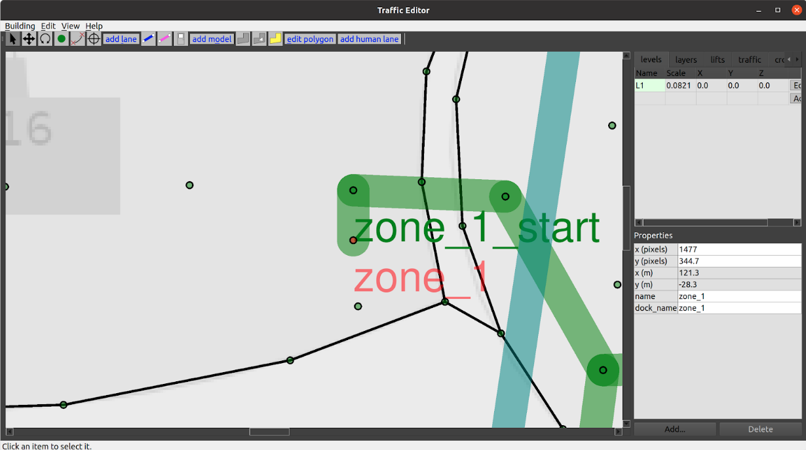

# Supported Tasks in RMF

> [RMF Task V2](https://github.com/open-rmf/rmf_task/pull/39) is in active development. This will allow user to construct custom task in a more flexble way.

## Clean Task:


Cleaning robots are becoming increasingly popular in various facilities. While there are many ways of cleaning (vacuuming, mopping, disinfecting, etc) and hence many varieties of cleaning robots, the workflow remains identical across them all. Floor space in facilities is divided into a number of “zones” or sub-regions for cleaning. Each zone has a start and finish location for the robot. In-between these locations, the robot traverses along a special path while performing the cleaning operation.

RMF fully supports the integration of various cleaning robots. Further, RMF can intelligently assign cleaning jobs to available cleaning robots based on capability and available resources, while optimizing overall productivity. Most cleaning robots have a pre-configured cleaning routine for each zone that can be run from a given starting point. RMF’s goal is to guide the robot to this starting point, trigger the execution of the cleaning routine and then guide the robot to a holding waypoint once the cleaning is complete. A `Clean` Task has been designed in RMF to orchestrate this behavior.

The rest of this section provides an overview of the steps necessary to integrate cleaning robots with RMF. The `airport_terminal` example in `rmf_demos` is a useful reference. It showcases the integration of two brands of cleaning robots: `CleanerBotA` and `CleanerBotE` which operate on navigation graphs `Graph 0` and `Graph 4` respectively.

#### Step 1: Defining waypoints for cleaning in Traffic Editor
Two waypoints need to be added to the navigation graph of the robot. The first is the waypoint where the robot should initiate its cleaning routine. In the image below, this point is labelled as `zone_1_start`. Once the robot finishes its cleaning routine, RMF will guide the robot back to this waypoint. Connected to this waypoint, is waypoint `zone_1` that has the `dock_name` property set to its name. This is the waypoint where the robot ends up after its cleaning routine is completed. In the current implementation, it is important to have the names of these waypoints as `<zone_name>_start` and `<zone_name>` respectively. When a robot enters the lane from `zone_1_start` to `zone_1`, the fleet adapter will request the robot to initiate its docking (in this case cleaning) routine. Setting the `dock_name` parameter to `zone_1` will result in the fleet adapter triggering the `RobotCommandHandle::dock()` function. Thus, the user’s implementation of this function should in-turn make an API call to the robot to begin cleaning the specified zone. Once the cleaning process is completed, the `RobotCommandHandle` should trigger the `docking_finished_callback()`.



> Note: In order to trigger the `DockPhase`, the direction of the lane is required to be from `<zone_name>_start` to `<zone_name>`.

#### Step 2: Publish DockSummary message
To estimate the resource drain from the cleaning process which is essential for optimal task allocation planning, the fleet adapters require the list of waypoints that the robot will traverse while cleaning.
This information can be summarized in a [DockSummary](https://github.com/open-rmf/rmf_internal_msgs/blob/main/rmf_fleet_msgs/msg/DockSummary.msg) message published to `/dock_summary` topic.
The [mock_docker](https://github.com/open-rmf/rmf_demos/blob/283af6d418f5c8d315cc4ca97c95885a12b15f94/rmf_demos/launch/airport_terminal.launch.xml#L97-L102) node is responsible for publishing this information. 
It accepts a `yaml` configuration file containing the lists of waypoints for each zone for each fleet whcih is used to populate the `DockSummary` message.
For the `airport_terminal` demo the file is located [here](https://github.com/open-rmf/rmf_demos/blob/main/rmf_demos_tasks/rmf_demos_tasks/airport_docker_config.yaml)

#### Step 3: Configure fleet adapter to accept clean tasks
The fleet adapter needs to be configured to accept `Clean` type of task. Else, it will not submit a bid for this task to the dispatcher node during task bidding.
If the legacy `full_control` adapter is being used, the [perform_cleaning](https://github.com/open-rmf/rmf_demos/blob/283af6d418f5c8d315cc4ca97c95885a12b15f94/rmf_demos/launch/include/adapters/cleanerBotA_adapter.launch.xml#L52) parameter needs to be set to `true` in the adapter launch file.
For newer fleet adapters, the [FleetUpdateHandle::accept_task_requests()](https://github.com/open-rmf/rmf_ros2/blob/2fe08e328f543fe6a4e0853a60607b5b52015f2a/rmf_fleet_adapter/include/rmf_fleet_adapter/agv/FleetUpdateHandle.hpp#L134) method should be called with an [AcceptTaskRequest](https://github.com/open-rmf/rmf_ros2/blob/2fe08e328f543fe6a4e0853a60607b5b52015f2a/rmf_fleet_adapter/include/rmf_fleet_adapter/agv/FleetUpdateHandle.hpp#L123-L124) callback that returns `true` if a request with TaskProfile.Description.TaskType.TYPE_CLEAN is received.

#### Step 4: Send a Clean request
If the above steps are done correctly, a request to clean a zone can be submitted to RMF via the terminal or RMF_Demo_Panel.
To send a clean request from the terminal, source the workspace with RMF and then:
```
ros2 run rmf_demos_tasks dispatch_clean -cs zone_1 -st 0 --use_sim_time
```
This will submit a request to RMF to clean `zone_1`. The `--use_sim_time` argument is only required when testing in simulation. For more information on sending a clean request:
```
ros2 run rmf_demos_tasks dispatch_clean -h
```

## Delivery Task:
Another common application for mobile robots is performing deliveries within facilities.
A delivery typically involves the robot heading to a pickup location where it gets loaded with items and then navigating to a dropoff location where the items are unloaded.
At the pickup and dropoff sites, the mobile robot may have to interface with robotic arms, conveyors or other automation systems. We term systems that load items as `dispensers` and those that unload as `ingestors`. 

To integrate these systems with RMF core systems, a set of [dispenser](https://github.com/open-rmf/rmf_internal_msgs/tree/main/rmf_dispenser_msgs/msg) and [ingestor](https://github.com/open-rmf/rmf_internal_msgs/tree/main/rmf_ingestor_msgs/msg) messages are defined.
Despite their names, these messages are sufficiently general enough to be used by any other system that perform similar actions.

A `Delivery` task is designed in RMF which guides the mobile robot to the pickup location where the dispenser is located. Once here, its `rmf_fleet_adapter` publishes a `DispenserRequest` message which the workcell receives and begins processing.
When the loading is successful, the dispenser publishes a `DispenserResult` message with `SUCCESS` status.
The `rmf_fleet_adapter` then guides the robot to the dropoff waypoint where the ingestor is located. 
Here, a similar exchange of messages ensures. The `rmf_fleet_adapter` publishes an `IngestorRequest` message which instructs the ingestor to unload its payload. Upon completion, it publishes an `IngestorResult` message with a `SUCCESS` status.

To learn how to setup a simulation with dispensers and ingestors, see [Simulation](./simulation.md)

The fleet adapter needs to be configured to accept `Delivery` type of task. Else, it will not submit a bid for this task to the dispatcher node during task bidding.
If the legacy `full_control` adapter is being used, the [perform_deliveries](https://github.com/open-rmf/rmf_demos/blob/283af6d418f5c8d315cc4ca97c95885a12b15f94/rmf_demos/launch/include/adapters/deliveryRobot_adapter.launch.xml#L45) parameter needs to be set to `true` in the adapter launch file.
For newer fleet adapters, the [FleetUpdateHandle::accept_task_requests()](https://github.com/open-rmf/rmf_ros2/blob/2fe08e328f543fe6a4e0853a60607b5b52015f2a/rmf_fleet_adapter/include/rmf_fleet_adapter/agv/FleetUpdateHandle.hpp#L134) method should be called with an [AcceptTaskRequest](https://github.com/open-rmf/rmf_ros2/blob/2fe08e328f543fe6a4e0853a60607b5b52015f2a/rmf_fleet_adapter/include/rmf_fleet_adapter/agv/FleetUpdateHandle.hpp#L123-L124) callback that returns `true` if a request with TaskProfile.Description.TaskType.TYPE_DELIVERY is received.


To submit a `Delivery` request, the `dispatch_delivery` script in `rmf_demos_tasks` can be utilized.
```
ros2 run rmf_demos_tasks dispatch_delivery -h
usage: dispatch_delivery [-h] -p PICKUP -pd PICKUP_DISPENSER -d DROPOFF -di DROPOFF_INGESTOR
                         [-st START_TIME] [-pt PRIORITY] [--use_sim_time]

optional arguments:
  -h, --help            show this help message and exit
  -p PICKUP, --pickup PICKUP
                        Start waypoint
  -pd PICKUP_DISPENSER, --pickup_dispenser PICKUP_DISPENSER
                        Pickup dispenser name
  -d DROPOFF, --dropoff DROPOFF
                        Finish waypoint
  -di DROPOFF_INGESTOR, --dropoff_ingestor DROPOFF_INGESTOR
                        Dropoff ingestor name
  -st START_TIME, --start_time START_TIME
                        Start time from now in secs, default: 0
  -pt PRIORITY, --priority PRIORITY
                        Priority value for this request
  --use_sim_time        Use sim time, default: false
```

## Loop Task:
A `Loop` task can be submitted to request a robot to navigate back and forth between two waypoints for a given number of iterations (loops).
As with `Clean` and `Delivery` tasks, the fleet adapter must be configured to accept `Loop` requests.

To submit a `Loop` request, the `dispatch_loop` script in `rmf_demos_tasks` can be utilized.

```
ros2 run tasks dispatch_loop -h
usage: dispatch_loop [-h] -s START -f FINISH [-n LOOP_NUM] [-st START_TIME] [-pt PRIORITY]
                     [--use_sim_time]

optional arguments:
  -h, --help            show this help message and exit
  -s START, --start START
                        Start waypoint
  -f FINISH, --finish FINISH
                        Finish waypoint
  -n LOOP_NUM, --loop_num LOOP_NUM
                        Number of loops to perform
  -st START_TIME, --start_time START_TIME
                        Start time from now in secs, default: 0
  -pt PRIORITY, --priority PRIORITY
                        Priority value for this request
  --use_sim_time        Use sim time, default: false
```

## ChargingTask
This is an self-generated task, self generated by RMF fleet adapter. The robot will get directed back to the charging station when charging condition is met.
User can set a valid charging station by setting `is_parking_spot` to `true` in `traffic_editor`.

User can configure the charging condition in the `fleet_adapter.launch.xml` by:
 - Recharge Threshold: `<arg name="recharge_threshold" value="0.2"/>`
 - Finishing Request: `<arg name="finishing_request" value="charge"/>`

Note that currently `finishing_request` arg also supports: `[charge, park, nothing]`. These are considered as autogenerated tasks.

## Debugging

There are a few scenarios where the dispatcher will not receive any bids from a fleet adapter when a task request is submitted:
1. The fleet adapter is not configured to accept the submitted task type as determined by [this](https://github.com/open-rmf/rmf_ros2/blob/2fe08e328f543fe6a4e0853a60607b5b52015f2a/rmf_fleet_adapter/include/rmf_fleet_adapter/agv/FleetUpdateHandle.hpp#L134) function. If you're using the `full_control` implementation, you should indicate which task types are doable using these [parameters](https://github.com/open-rmf/rmf_demos/blob/283af6d418f5c8d315cc4ca97c95885a12b15f94/rmf_demos/launch/include/adapters/tinyRobot_adapter.launch.xml#L44-L49) in your launch file. Else, the fleet adapter will simply not bid for the submitted task. A message should be published in the terminal indicating this: ```[full_control-15] [INFO] [1617245135.071996222] [tinyRobot_fleet_adapter]: Fleet [tinyRobot] is configured to not accept task [Clean0]```. If you're using a custom fleet adapter, make sure you're calling `FleetUpdateHandle::accept_task_requests()`.

2. The fleet adapter is unable to process the request due to invalid fields in the request. If for example a `loop` request is submitted with start or finish waypoints that do not exist on the robot's nav graph, a bid will not be submitted. An explanatory message will be printed in the terminal such as ```[full_control-15] [INFO] [1617245206.473805336] [tinyRobot_fleet_adapter]: Fleet [tinyRobot] does not have a named waypoint [bad_waypoint] configured in its nav graph. Rejecting BidNotice with task_id:[Loop1]```

3. The duration for which the dispatcher accepts bids is smaller than the time taken by the fleet adapters to compute and submit a bid. The duration parameter is specified [here](https://github.com/open-rmf/rmf_demos/blob/283af6d418f5c8d315cc4ca97c95885a12b15f94/rmf_demos/launch/common.launch.xml#L53). If this is the case, you should still see some printouts in the terminal highlighting that a bid was computed and submitted by the fleet adapter:
`[full_control-15] [INFO] [1617245621.881365568] [tinyRobot_fleet_adapter]: Generated Loop request for task_id:[Loop2]
[full_control-15] [INFO] [1617245621.881432804] [tinyRobot_fleet_adapter]: Planning for [2] robot(s) and [1] request(s)
[full_control-15] [INFO] [1617245621.886230967] [tinyRobot_fleet_adapter]: Submitted BidProposal to accommodate task [Loop2] by robot [tinyRobot2] with new cost [45.222308]`

[Click here](./task_new.md) to learn how to develop support for a custom task.