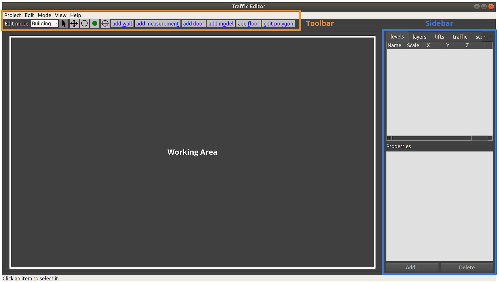
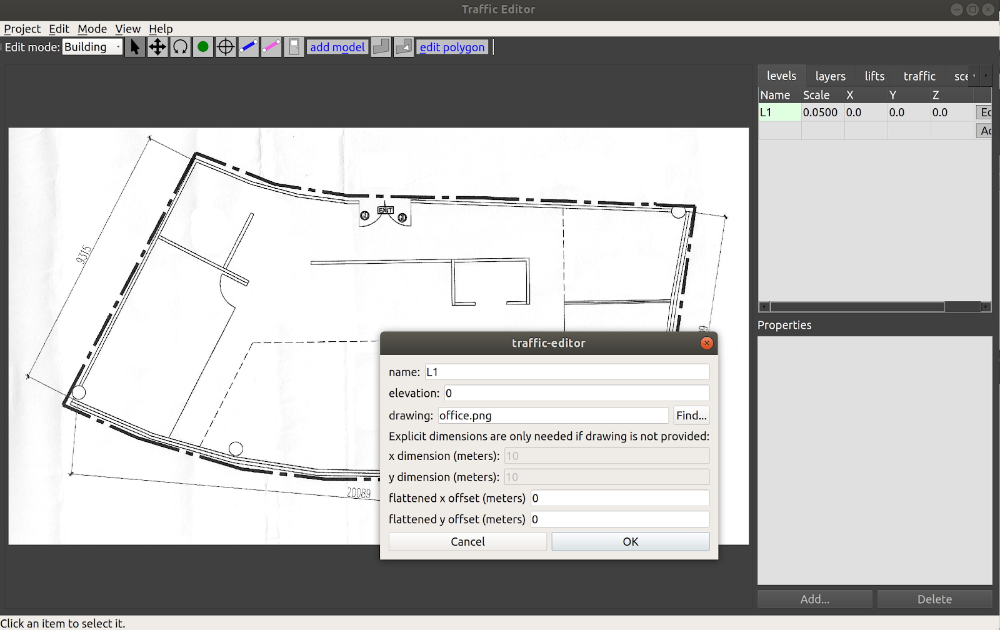
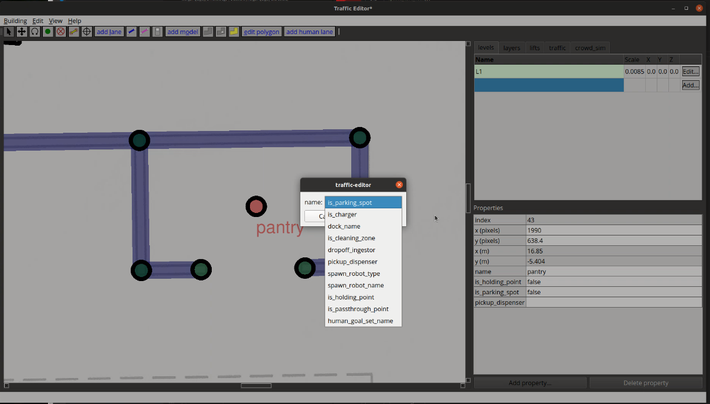
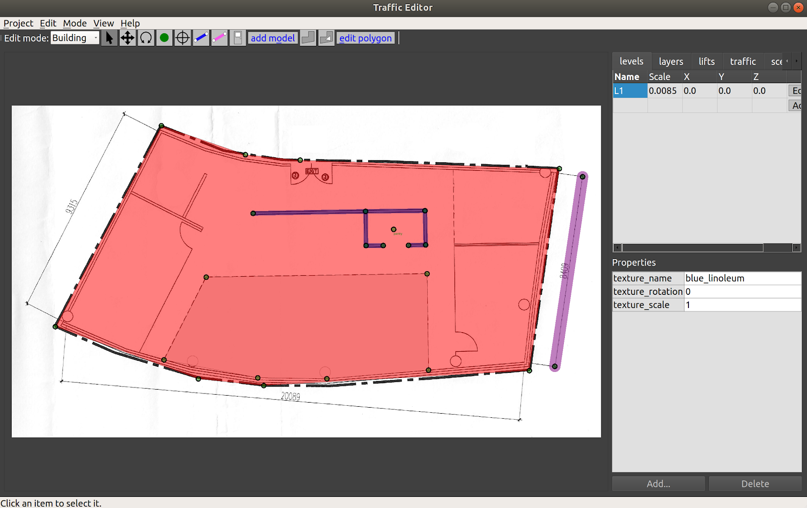
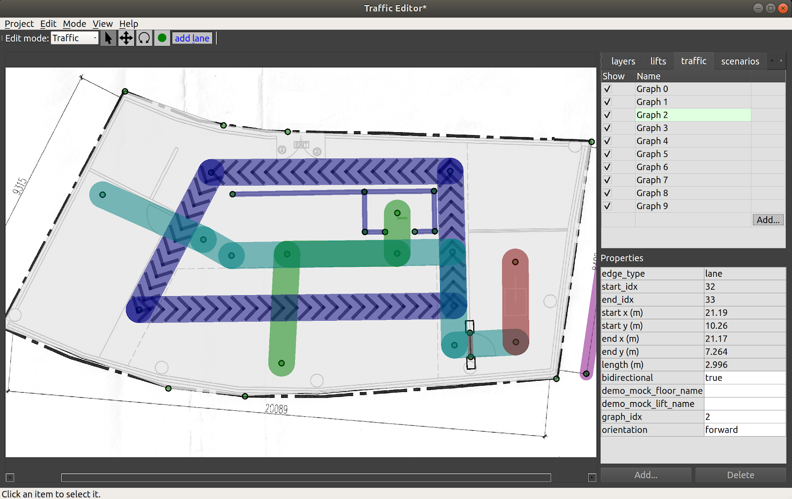
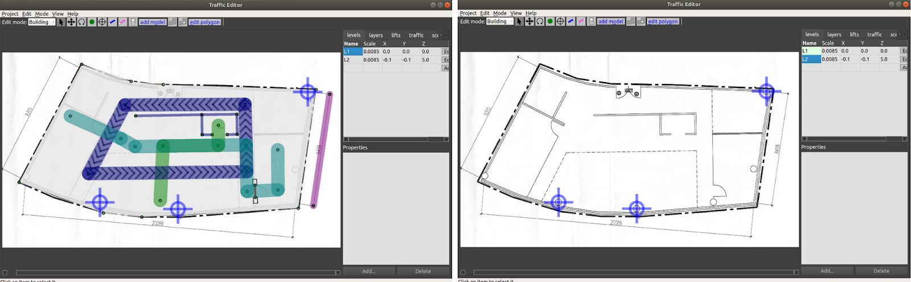
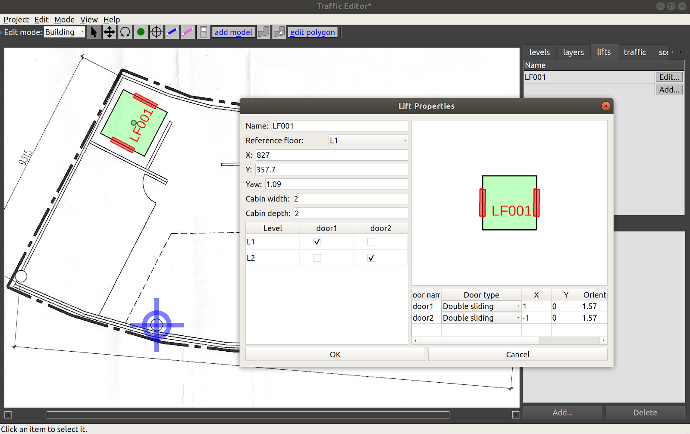
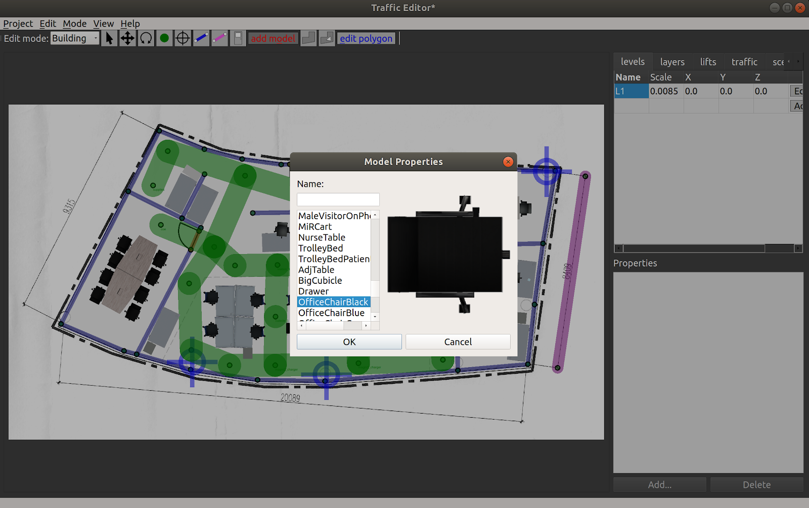

# Traffic Editor

This section describes the traffic-editor GUI and simulation tools.

## Introduction and Objectives

Traffic management of heterogeneous robot fleets is non-trivial. One of the
challenges with coordinated management arises from varying semantics in
information models used across fleets. Representations of waypoints, lanes,
charging/docking stations, restricted zones, infrastructure  systems such as
doors & lifts, among others, are subject to vendor's discretion. However,
standardized conventions that convey the capabilities and intentions of fleets
in a shared facility are quintessential for planning. Multi-agent participants
in other modes of transportation such as roadways collectively adhere to a set
of rules and conventions which minimize chaos. More importantly, they allow for
a new participant to readily integrate into the system by following the
prescribed rules. Existing agents can accommodate the new participant as its
behavior is apparent.

Traffic conventions for multi-robot systems do not exist.
The objective of the `traffic_editor` is to fill this gap by expressing the
intentions of various fleets in a standardized, vendor neutral manner through a
graphical interface. Collated traffic information from different fleets can then
be exported for planning and control. A secondary objective and benefit of the
`traffic_editor` is to facilitate generation of 3D simulation worlds which
accurately reflect physical environments.

## Overview

The `traffic_editor` [repository](https://github.com/open-rmf/rmf_traffic_editor) is home to the `traffic_editor` GUI and tools to auto-generate simulation worlds from GUI output.
The GUI is an easy-to-use interface which can create and annotate 2D floor plans with robot traffic along with building infrastructure information.
Often times, there are existing floor plans of the environment, such as architectural drawings, which simplify the task and provide a "reference" coordinate system for vendor-specific maps.
For such cases, `traffic-editor` can import these types of "backgroud images" to serve as a canvas upon which to draw the intended robot traffic maps, and to make it easy to trace the important wall segments required for simulation.

The `traffic_editor` GUI projects are stored as `yaml` files with `.building.yaml` file extensions.
Although the typical workflow uses the GUI and does not require hand-editing the `yaml` files directly, we have used a `yaml` file format to make it easy to parse using custom scripting if needed.
Each `.building.yaml` file includes several attributes for each level in the site as annotated by the user.
An empty `.building.yaml` file appears below.
The GUI tries to make it easy to add and update content to these file.

```yaml
levels:
  L1:
    doors:
      - []
    drawing:
      filename:
    fiducials:
    elevation: 0
    flattened_x_offset: 0
    flattened_y_offset: 0
    floors:
      - parameters: {}
        vertices: []
    lanes:
      - []
    layers:
      {}
    measurements:
      - []
    models:
      -{}
    vertices:
      {}
    walls:
      {}
lifts:
  {}
name: building

```

## GUI Layout

The layout of the `traffic_editor` includes a `Toolbar`, a `Working Area` and a `Sidebar` as seen in the figure below:



The toolbar contains a variety of tools to support actions such as setting the scale of the drawing, aligning levels for multi-level scenarios, adding virtual models to simulated environments, adding robot traffic lanes, simulated flooring, and so on.

As usual in a modern GUI, the top Toolbar contains a variety of tools to interact with items in the main Working Area.
This document will introduce and explain the tools as an example project is created.
However, the first three tools in the toolbar are commonly found in 2D drawing tools, and should behave as expected:

|                    Icon                           |  Name  | Shortkey |               Function               |
|:-------------------------------------------------:|:------:|:--------:|:------------------------------------:|
|  | Select |   `Esc`  | Select an entity in the `Working Area` |
|      |  Move  |    `m`   |  Move an entity in the `Working Area`  |
|  | Rotate |    `r`   | Rotate an entity in the `Working Area` |

The `Working Area` is where the levels, along with their annotations, are rendered.
The user is able to zoom via the mouse scroll wheel, and pan the view by pressing the scroll wheel and moving the mouse cursor.

The `Sidebar` on the right side of the window contains multiple tabs with various functionalities:
* **levels:** to add a new level to the building. This can be done from scratch or by importing a floor plan image file.
* **layers:** to overlap other images such as lidar maps over the level
* **lifts:** to configure and add lifts to the building
* **traffic:** to select which "navigation graph" is currently being edited, and toggle which graph(s) are being rendered.

## Annotation Guide
This section walks through the process of annotating facilities while highlighting the capabilities of the `traffic_editor` GUI.

To create a new traffic editor `Building` file, launch the traffic editor from a terminal window (first sourcing the workspace if `traffic-editor` is built from source).
Then, click `Building -> New...` and choose a location and filename for your `.building.yaml` file.

### Adding a level
A new level in the building can be added by clicking the `Add` button in the `levels` tab of the `Sidebar`.
The operation will open a dialog box where the `name`, `elevation` (in meters) and path to a 2D `drawing` file (`.png`) can be specified.
In most use cases, the floor plan for the level is used as the drawing.
If unspecified, the user may explicitly enter dimensions of the level in the fields provided.



In the figure above, a new level `L1` at `0m` elevation and a floor plan have been added as reflected in the `levels` tab.
A default scale `1px = 5cm` is applied.
The actual scale can be set by adding a measurement.
Any offsets applied to align levels will be reflected in the `X` and `Y` columns.
Saving the project will update the `tutorial.building.yaml` files as seen below:
```yaml
levels:
  L1:
    drawing:
      filename: office.png
    elevation: 0
    flattened_x_offset: 0
    flattened_y_offset: 0
    layers:
      {}
lifts:
  {}
name: building
```
### Adding a vertex
|                    Icon                    | Shortkey |
|:------------------------------------------:| :-------:|
| | `v` |

A vertex is a fundamental component of multiple annotations.
Walls, measurements, doors, floor polygons and traffic lanes are created from two or more vertices.
To create a vertex, click on the vertex icon in the `Toolbar` and then click anywhere on the canvas.
The default attributes of a vertex are its coordinates along with an empty name field.
Additional attributes may be added by first selecting the vertex (which will turn it red), and then clicking the `Add` button in the figure.
Short descriptions of these are presented below:
* **is_holding_point:** if true and if the waypoint is part of a traffic lane,
  the `rmf_fleet_adapter` will treat this as a _holding point_ during path
  planning, i.e., the robot is allowed to wait at this waypoint for an indefinite
  period of time.
* **is_parking_spot:** robot's parking spot. [Definition](https://github.com/open-rmf/rmf_traffic/blob/40023b0f9b5d79a4781f6105f0368d74c1dfc443/rmf_traffic/include/rmf_traffic/agv/Graph.hpp#L73-L76)
* **is_passthrough_point:** waypoint which the robot shouldnt stop. [Definition](https://github.com/open-rmf/rmf_traffic/blob/40023b0f9b5d79a4781f6105f0368d74c1dfc443/rmf_traffic/include/rmf_traffic/agv/Graph.hpp#L63-L68)
* **is_charger:** if true and if the waypoint is part of a traffic lane, the
  `rmf_fleet_adapter` will treat this as a charging station.
* **is_cleaning_zone** indicate if current waypoint is a cleaning zone, specifically for `Clean` Task.
* **dock_name:** if specified and if the waypoint is part of a traffic lane, the
  `rmf_fleet_adapter` will issue an `rmf_fleet_msgs::ModeRequest` message with
  `MODE_DOCKING` and `task_id` equal to the specified name to the robot as it approaches this waypoint. This is used when the robot is executing their custom docking sequence (or custom travel path).
* **spawn_robot_type:** the name of the robot model to spawn at this waypoint in
  simulation. The value must match the model's folder name in the assets
  repository. More details on the robot model and plugin required for simulation
  can be found in [Simulation](simulation.md)
* **spawn_robot_name:** a unique identifier for the robot spawned at this
  waypoint. The `rmf_fleet_msgs::RobotState` message published by this robot
  will have `name` field equal to this value.
* **pickup_dispenser** name of the dispenser workcell for `Delivery` Task, typically is the name of the model. See the [Workcell section] (https://osrf.github.io/ros2multirobotbook/simulation.html#workcells) of the Simulation Chapter for more details.
* **dropoff_ingestor** name of the ingestor workcell for `Delivery` Task, typically is the name of the model. See the [Workcell section] (https://osrf.github.io/ros2multirobotbook/simulation.html#workcells) of the Simulation Chapter for more details.
* **human_goal_set_name** The `goal_sets.set_area` name, used by crowd simulation. For more info about `crowd_sim`, please see the [Crowdsim section] (https://osrf.github.io/ros2multirobotbook/simulation.html#crowdsim) of the Simulation Chapter for more details.



Each vertex is stored in the `tutorial.building.yaml` file as a list of x-coordinate, y-coordinate, elevation, vertex_name and a set of additional parameters.

```yaml
  vertices:
    - [1364.76, 1336.717, 0, magni1_charger, {is_charger: [4, true], is_parking_spot: [4, true], spawn_robot_name: [1, magni1], spawn_robot_type: [1, Magni]}]
```
### Adding a measurement
|                    Icon                    |
|:------------------------------------------:|
| |

Adding a measurement sets the scale of the imported 2D drawing, which is essential for planning and simulation accuracy.
Scalebars or reference dimensions in the floor plan aid with the process. Often, you can draw the measurement line directly on top of a reference scale bar in a drawing.
With the editor in _Building_ mode, select the _Add Measurement_ tool and click on two points with known dimensions.
A pink line is rendered on the map with two vertices at its ends at the selected points.

Note:
A measurement line may be drawn by clicking on existing vertices.
In this scenario, no additional vertices are created at its ends.

Selecting the line populates various parameters in the Properties window of the `Sidebar`.
Setting the `distance` parameter to the physical distance between the points (in meters) will then update the `Scale` for the level.
Currently, you must save the project and restart `traffic-editor` to see the changes reflected (todo: fix this...).


The above process adds two `vertices` and a `measurement` field to the `tutorial.building.yaml` file as seen below.
For the measurement field, the first two elements represent the indices of vertices representing the ends of
the line.
The `distance` value is stored in a sub-list of parameters.

```yaml
levels:
  L1:
    drawing:
      filename: office.png
    elevation: 0
    flattened_x_offset: 0
    flattened_y_offset: 0
    layers:
      {}
    measurements:
      - [1, 0, {distance: [3, 8.409]}]
    vertices:
      - [2951.728, 368.353, 0, ""]
      - [2808.142, 1348.9, 0, ""]

lifts:
  {}
name: building
```

### Adding a wall
|                    Icon                    | Shortkey |
|:------------------------------------------:| :-------:|
| | `w` |

To annotate walls in the map, select the _Add Wall_ icon from the `Toolbar` and click on consecutive vertices that represent the corners of the wall.
The process of adding wall segments is continuous, and can be exited by pressing the `Esc` key.
Blue lines between vertices are rendered on the map which represent the drawn walls.
If the corner vertices are not present, they will automatically be created when using this tool.
Meshes of the annotated walls are automatically generated during 3D world generation using `building_map_generator`.
By default, the walls are of thickness of 10cm and height 2.5m.
The `wall_height` and `wall_thickness` attributes may be
modified [in the source code](https://github.com/open-rmf/rmf_traffic_editor/blob/main/rmf_building_map_tools/building_map/wall.py#L16-L17).

Wall texture options are available [here](https://github.com/open-rmf/rmf_traffic_editor/tree/main/rmf_building_map_tools/building_map_generator/textures) in the source code.


Walls are stored in the `tutorial.building.yaml` file as a list with indices of start and end vertices of the wall segment along with an empty parameter set.
```yaml
    walls:
      - [3, 4, {}]
      - [4, 5, {}]
      - [5, 6, {}]
      - [6, 7, {}]
      - [6, 8, {}]
      - [8, 9, {}]
```

### Adding a floor
|                    Icon                    |
|:------------------------------------------:|
| |

Flooring is essential for simulations as it provides a ground plane for the robots to travel over.
Floors are annotated using the _Add floor polygon_ tool from the `Main Toolbar` in _Building_ edit mode.
To define a floor, select consecutive vertices to create a polygon that accurately represents the flooring area as seen below.
These vertices will need to be added manually prior to this step.
Once created, save the project and reload.
Selecting the defined floor highlights its texture attributes. Similarly, [default list of available textures](https://github.com/open-rmf/rmf_traffic_editor/tree/main/rmf_building_map_tools/building_map_generator/textures) is available in the source code.



Certain scenarios may call for floors with cavities, for example, to represent elevator shafts.
The _Add hole polygon_ tool may be used for this purpose.
Additionally, the shape of a drawn polygon (floor or hole) may be modified using the _Edit polygon_ tool.
Clicking on the tool after selecting an existing polygon enables the user to modify vertices of the polygon.

Each polygon is stored in the `tutorial.building.yaml` file in the format below:
```yaml
    floors:
      - parameters: {texture_name: [1, blue_linoleum], texture_rotation: [3, 0], texture_scale: [3, 1]}
        vertices: [11, 10, 14, 15, 13, 12]
```

### Adding a door
|                    Icon                    |
|:------------------------------------------:|
| |

A door between two vertices can be added in _Building_ edit mode by selecting the _Add door_ tool from the `Main Toolbar`, and clicking on vertices representing the ends of the door.
Selecting an annotated door highlights its properties as seen in the figure below.
Presently, four door `types` are supported: "hinged", "double_hinged", "sliding" and "double_sliding".
The `motion_degrees` parameter specifies the range of motion in the case of hinged doors while the `motion_direction` dictates the direction of swing.
In order for the door to work in simulation, a `name` must be given to the door.


Doors are stored in the `tutorial.building.yaml` file as a list with indices of start and end vertices along with the set of parameters that describes the door.

```yaml
 doors:
      - [24, 25, {motion_axis: [1, start], motion_degrees: [3, 90], motion_direction: [2, 1], name: [1, D001], type: [1, double_sliding]}]
```

### Adding a traffic lane
One of the most important tools in the `traffic_editor` GUI is the _Add lane_ tool.
The allowable motions of each fleet operating in the facility is conveyed through its respective Graph which consists of waypoints and connecting lanes.
In this approach, we assume that robots travel along effectively straight-line paths between waypoints.
While this may be perceived as an oversimplification of paths taken by robots that are capable of autonomous navigation, in practice the assumption holds fairly well given that these robots mostly travel along corridors or hallways and seldom in unconstrained open spaces.
For example, even in theoretically unconstrained spaces like building lobbies or shopping-mall atriums, it is likely that the site operator would prefer for the robots to operate in a "traffic lane" on the edge of the space, in order to not impede typical human traffic flows.

The `traffic` tab in the `Sidebar` has a default of nine Graphs for nine different fleets. To annotate lanes for a graph, say Graph 0, select the Graph from the `traffic` tab and click the _Add lane_ tool.
Lanes for this graph can be drawn by clicking vertices to be connected.
If a vertex is not present, it will automatically be added. Properties may be assigned to each vertex as described in the preceding section.
To issue tasks to waypoints that require the robot to terminate at any waypoint, a name must be assigned to the waypoint.



Each Graph has a unique color for its lanes, and their visibility may be toggled using the checkbox in the `traffic` tab.
A lane that is defined between two waypoints may be configured with these additional properties:
* **bidirectional:** if `true`, the `rmf_fleet_adapter` will plan routes for its
  robot assuming the lanes can be traversed in both directions. Lanes that are
  not bidirectional have arrows indicating their directionality (indigo lanes in
  figure above). A handy shortcut is that when a lane segment is selected, you can
  press the `b` key to toggle between unidirectional and bidirectional motion along that lane.
* **graph_idx**: the Graph number a lane corresponds to
* **orientation**: constrain the lane to make the robot travel in `forward` or `backward` orientation. This can be useful for the final lane segment approaching a docking point or charger, for example.

While lifts that move between levels are now supported in the `traffic_editor`, the **demo_mock_floor_name** and **demo_mock_lift_name** properties were originally engineered to showcase shared lift access in a single floor demonstration environment with a "mock" lift that receives lift commands and transmits lift states but does not actually move between any different floors in a building.
However, as there may be interest in such functionality for testing single-floor hardware setups that seek to emulate multi-floor scenarios, these properties were retained.

* **demo_mock_floor_name**: name of the floor that the robot is on while
  traversing the lane
* **demo_mock_lift_name**: name of the lift that is being entered or exited
  while the robot traverses the lane

To further explain these properties, consider this representation of a
navigation graph where numbers are waypoints and letters are lanes:
```
1 <---a---> 2 <---b---> 3

Waypoint 1 is on floor L1
Waypoint 2 is inside the "lift" named LIFT001
Waypoint 3 is on floor L3
The properties of edge "a" are:
    bidirectional: true
    demo_mock_floor_name: L1
    demo_mock_lift_name: LIFT001
The properties of edge "b" are:
    bidirectional: true
    demo_mock_floor_name: L3
    demo_mock_lift_name: LIFT001
```

If the robot is to travel from waypoint 1 to waypoint 3, the `rmf_fleet_adapter` will request for the "mock lift" to arrive at L1 when the robot approaches waypoint 1.
With confirmation of the "lift" at L1 and its doors in "open" state, the robot will be instructed to move into the "lift" to waypoint 2.
Once the "lift" indicates that it has reached L3, the robot will exit along lane b toward waypoint 3.

Note: when annotating graphs, it is highly recommended to follow an ascending sequence of graph indices without skipping intermediate numbers. Drawn lanes can only be interacted with if their associated Graph is first selected in the `traffic` tab.

The annotated Graphs are eventually exported as `navigation graphs` using the `building_map_generator` which are then used by respective `rmf_fleet_adapters` for path planning.

Lanes are stored in the following format in `tutorial.building.yaml`.
The data structure is a list with the first two elements representing the indices of the two vertices of the lane and a set of parameters with configured properties.
```yaml
    lanes:
      - [32, 33, {bidirectional: [4, true], demo_mock_floor_name: [1, ""], demo_mock_lift_name: [1, ""], graph_idx: [2, 2], orientation: [1, forward]}]
```

### Deriving coordinate-space transforms

Coordinate spaces are confusing!
For historical reasons, the GUI internally creates traffic maps by annotating images, so the "raw" annotations are actually encoded in pixel coordinates of the "base" floorplan image, in pixel coordinates, with +X=right and +Y=down, with the origin in the upper-left of the base floorplan image.
However, during the building map generation step, the vertical axis is flipped to end up in a Cartesian plane, so the vast majority of RMF (that is, everything downstream of traffic-editor and the building map generators) uses a "normal" Cartesian coordinate system. (As an aside -- the next version of traffic-editor is intended to be more flexible in this respect, and will default to a normal Cartesian coordinate system (not an image-based coordinate system), or even global coordinates (lat/lon). Although preliminary work is underway, there is not a hard schedule for this next-gen editor at time of writing, so the rest of this chapter will describe the existing `traffic-editor`.)

Although `traffic-editor` currently uses the upper-left corner of the base floorplan image as the reference frame, maps generated by robots likely will have their origin elsewhere, and will likely be oriented and scaled differently.
It is critical to derive the correct transform between coordinate frames in `traffic_editor` maps and robot maps as
`rmf_fleet_adapters` expect all robots to publish their locations in the RMF coordinate system while the `rmf_fleet_adapters` also issue path requests in the same frame.

To derive such transforms, the `traffic_editor` GUI allows users to overlay robot maps on a floor plan and apply scale, translation and rotation transformations such that the two maps align correctly.
The user can then apply the same transformations to convert between robot map and RMF coordinates when programming interfaces for their robot.

The robot map can be imported by clicking the `Add` button from the `layers` tab in the `Sidebar`.
A dialog box will then prompt the user to upload the robot map image.
The same box contains fields for setting the scale for the image along with applying translations and rotation.
Through visual feedback, the user can determine appropriate values for these fields.
As seen in the image below, importing the robot-generated map into the GUI has it located and oriented
differently than the floor plan.
With the right transformation values, the two maps can be made to overlap.


### Adding fiducials
|                    Icon                    |
|:------------------------------------------:|
| |

For maps with multiple levels, fiducials provide a means to scale and align different levels with respect to a reference level.
This is crucial for ensuring dimensional accuracy of annotations across different levels and aligning the
same for simulation.
Fiducials are reference markers placed at locations which are expected to be vertically aligned between two or more levels.
For example, structural columns may run through multiple floors and their locations are often indicated on floor plans.
With two or more pairs of corresponding markers between a level and a reference level, a geometric transformation (translation, rotation and scale) may be derived between the two levels.
This transformation can then be applied to all the vertices and models in the newly defined level.

To begin, add two or more non-collinear fiducials to the reference level with unique `name` attributes using the _Add fiducial_ tool (left image in figure below).
In the newly created level, add the same number of fiducials at locations that are expected to be vertically aligned with matching names as the reference level (right image in figure below).
Saving and reloading the project computes the transformation between the levels which is evident from the Scale
and X-Y offsets for the new level as seen in the `levels` tab.
This level is now ready to be annotated.



For each level, fiducials are stored in a list of their X & Y coordinates along with their name.
```yaml
    fiducials:
      - [936.809, 1323.141, F1]
      - [1622.999, 1379.32, F2]
      - [2762.637, 346.69, F3]
```

### Adding a lift
Lifts are integral resources that are shared between humans and robot fleets in multi-level facilities.
To add a lift to a building, click the `Add` button in the `lifts` tab in the `Sidebar`.
A dialog box with various configurable properties will load.
It is essential to specify the Name, Reference level and the X&Y coordinates (pixel units) of its cabin center.
A yaw (radians) may further be added to orient the lift as desired.
The width and depth of the cabin (meters) can also be customized.
Lifts can be designed to have multiple cabin doors which may open at more than one level.
To add a cabin door, click the `Add` button in the box below the cabin image.
Each cabin door requires a name along with positional and orientational information.
Here, the X&Y coordinates are relative to the cabin center.



The configured lift is stored in the `tutorial.building.yaml` file as described below:
```yaml
lifts:
  LF001:
    depth: 2
    doors:
      door1:
        door_type: 2
        motion_axis_orientation: 1.57
        width: 1
        x: 1
        y: 0
      door2:
        door_type: 2
        motion_axis_orientation: 1.57
        width: 1
        x: -1
        y: 0
    level_doors:
      L1: [door1]
      L2: [door2]
    reference_floor_name: L1
    width: 2
    x: 827
    y: 357.7
    yaw: 1.09
```

After adding the lift, we would also wish to let our robots to transverse through the lift.
To achieve that, the user needs to create vertices/waypoints which are located within the lift cabin on each floor.
Once done, connect the waypoint within the lift cabin to other vertices via __add_lane__.

### Adding environment assets
Levels may be annotated with thumbnails of models available for simulation using the __Add model__ tool in __Building__ edit mode.
Selecting this tool opens a dialog box with a list of model names and matching thumbnails which can be imported to the map.
Once on the map, their positions and orientations can be adjusted using the _Move_ and _Rotate_ tools. Sample models are provided [here](https://github.com/open-rmf/rmf_traffic_editor/tree/main/rmf_traffic_editor_assets/assets/thumbnails/images/cropped/OpenRobotics)

The [thumbnail_generator documentation](https://github.com/open-rmf/rmf_traffic_editor/tree/main/rmf_traffic_editor#generating-custom-thumbnails) contains instructions on expanding the list of thumbnails for other models.

> Note: If no models are shown on the __add models__ window, Go to "Edit -> Preference", then indicate the thumbnail path. (`e.g. $HOME/rmf_ws/src/rmf/rmf_traffic_editor/rmf_traffic_editor_assets/assets/thumbnails`)



## Conclusion
This chapter covered various capabilities of the `traffic_editor` which are useful for annotating maps of facilities while adhering to a standardized set of semantics.
Examples of other traffic editor projects can be found in the [rmf_demos](https://github.com/open-rmf/rmf_demos) repository.
Running physics based simulations with RMF in the annotated sites is described in the [Simulation](simulation.md) chapter.
