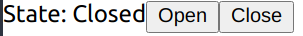

# UI

## Introduction

We have looked at how we can integrate new hardware into RoMi, now we will look at how we can write end user applications that integrates into RoMi. We will briefly go through the requirements of a RoMi UI application and proceed with a tutorial of how we can write a React Webapp that interfaces with RoMi.

## Overview

The most common way to write a UI application is to make use of a UI framework, there are many UI frameworks out there, here are some of the popular frameworks out there

  * Multi-Paradigm
    * Qt
    * React native
    * Xamarin
    * Flutter
  * Web
    * React
    * Angular
    * Vue
  * Desktop
    * wxWidgets
    * Gtk
    * WPF (Windows only)

Each of these frameworks has its own pros and cons, there isn't a "best" framework for all use cases. That being said, some frameworks are more suitable to integrate with RoMi due to the technologies they are built upon, to understand why, let's take a brief overview at how a RoMi UI application would work.

## How does a RoMi UI Application Work?

Imagine a simple UI application with a label that shows the current status of a door and a button that opens/closes the door. Recall that in the door adapter, we publishes door states and subscribes to door requests, here we are doing the reverse, subscribing to door states and publishing door requests. We will be listening to door states coming in from RoMi and updating our display to match, and sending door requests when the user clicks the open or close button.

We need to use a libray to help us do that, in the hardware adapter examples, we are using the `rclcpp` library, but `rclcpp` isn't the only way to use ROS2, here are some libraries that also works well

  * Direct
    * rcl (C)
    * rclcpp (C++)
    * rclpy (python)
    * rclnodejs (nodejs)
  * Indirect
    * soss (websocket)
    * rosbridge (websocket)

A "direct" library is able to send and receive ROS2 messages directly from the application, in contrast, an indirect library uses a middleman service to forward ROS2 messages. In general, the "direct" approach is more preferable but sometimes it is not possible on the target platform. In these cases, the indirect approach can be used.

<div style="border: 1px; border-style: solid; padding: 1em">
<b>Note</b>: This is not an exhaustive list, you can find many third party projects that aims to bring the ROS2 ecosystem to more platforms, the <code>ros2-dotnet</code> project for example, provides C# bindings for ROS2. You can also write your own bindings and middlewares!
</div>

At the end of the day, writing a RoMi UI application isn't much different from writing any other UI application, the only difference being that we will be sending/receiving ROS2 in response to user input and updating the state.

# Tutorial: React WebApp

In this section, we will go through an example of creating a React based webapp to monitor door states and send door open/close requests. The tutorial will focus on the aspects of communicating with RoMi, basic knowledge of React and typescript is needed.

Note that this isn't the only way to create a RoMi UI application, as mentioned before, you can use any UI toolkit, the only requirement is to be able to send/receive ROS2 messages.

The code for this tutorial is available at <https://github.com/osrf/ros2multirobotbook/tree/master/src/react-app-tutorial>.

## Requirements

  * nodejs >= 10
  * soss (<https://github.com/osrf/soss>)
  * romi-soss-ros2 (<https://github.com/osrf/romi-soss-ros2>)
  * rmf_demos (<https://github.com/osrf/rmf_demos>)

We will not go through the process of setting up the dependencies, instructions to set them up can be easily found on the web or from their project homepages.

## Setting Up

We will be using an example from rmf_demo as the RoMi deployment that we will be interacting with. This is a good time to test if your installation of `rmf_demo` is working properly, start the demo with the following command

```
ros2 launch demos office.launch.xml
```

Next let's test if soss is working. In order to run soss, you need to provide it with a configuration file, you can use [this](ui-resources/soss.yaml) template as a start. You would need a certificate for soss, refer to various tutorials online to generate one, if you are using a self-signed cert, also make sure your browser is set to accept it for websocket connections. Add the path of your cert and key to the soss config and try starting soss with

```
soss <path_to_config>
```

Once the environment is set up, we can finally proceed to setting up our actual app. First, create a React workspace with

```
npx create-react-app react-app-tutorial --template typescript
```

Go inside the newly created `react-app-tutorial` directory and run the follow command to install all the javascript dependencies we will be using

```
npm install @osrf/romi-js-core-interfaces @osrf/romi-js-soss-transport jsonwebtoken @types/jsonwebtoken
```

These libraries are not strictly required but they contain helpful functions to use soss and to communicate with RoMi. If you are building a javascript based RoMi app, it is recommended to make use of them, we will see later how they simplify the communicaton to RoMi.

<div style="border: 1px; border-style: solid; padding: 1em">
<b>Note</b>: Other than <code>@osrf/romi-js-soss-transport</code>, there is also <code>@osrf/romi-js-rclnodejs-transport</code> which is able to send ROS2 messages directly, however it does not work on the browser. It is preferred if you are writing a nodejs based desktop application using something like electron, or you are writing a server based application like a REST API provider.
</div>

## Door Component

First of all, let's create a simple component to show a door's state along with open and close buttons. Create a new file called `Door.tsx` in `react-app-tutorial/src` directory and copy the below snippet into it.

Door.tsx:
```js
import * as RomiCore from '@osrf/romi-js-core-interfaces';
import React from 'react';

export interface DoorProps {
  door: RomiCore.Door;
  doorState?: RomiCore.DoorState;
  onOpenClick?(e: React.MouseEvent): void;
  onCloseClick?(e: React.MouseEvent): void;
}

export const Door = (props: DoorProps) => {
  const { door, doorState, onOpenClick, onCloseClick } = props;
  const modeString = doorState ? doorModeString(doorState.current_mode) : 'Unknown';
  return (
    <div>
      Door: {door.name}
      <br />
      State: {modeString}
      <br />
      <button onClick={(e) => onOpenClick && onOpenClick(e)}>Open</button>
      <button onClick={(e) => onCloseClick && onCloseClick(e)}>Close</button>
      <br />
      <br />
    </div>
  );
};

function doorModeString(doorMode: RomiCore.DoorMode): string {
  switch (doorMode.value) {
    case RomiCore.DoorMode.MODE_OPEN:
      return 'Open';
    case RomiCore.DoorMode.MODE_CLOSED:
      return 'Closed';
    case RomiCore.DoorMode.MODE_MOVING:
      return 'Moving';
    default:
      return 'Unknown';
  }
}

export default Door;
```

Note here that we are using `@osrf/romi-js-core-interfaces`, this package provides typings information for core messages used by RoMi, if you are using an IDE with typescript autocomplete support, you can easily see the various fields and constants used by the `Door` and `DoorState` messages.

Take the `doorModeString` function for example, using `@osrf/romi-js-core-interfaces` allows us to switch based on the door mode constant (MODE_OPEN, MODE_CLOSED, MODE_MOVING). Normally you would have to refer to the RoMi manual or the ros2 message definition and map the constants manually like this:

```js
function doorModeString(doorMode: RomiCore.DoorMode): string {
  switch (doorMode.value) {
    // values based on ros2 message definitions
    case 2:
      return 'Open';
    case 0:
      return 'Closed';
    case 1:
      return 'Moving';
    default:
      return 'Unknown';
  }
}
```

Let's try running this and see if it works, change `App.tsx` to this

App.tsx:
```js
import * as RomiCore from '@osrf/romi-js-core-interfaces';
import React from 'react';
import Door from './Door';

function App() {
  const exampleDoor: RomiCore.Door = {
    name: 'example_door',
    door_type: RomiCore.Door.DOOR_TYPE_DOUBLE_SLIDING,
    motion_direction: 1,
    motion_range: 1,
    v1_x: 0,
    v1_y: 0,
    v2_x: 0,
    v2_y: 0,
  };
  const exampleDoorState: RomiCore.DoorState = {
    door_name: 'example_door',
    door_time: RomiCore.toRosTime(new Date()),
    current_mode: {
      value: RomiCore.DoorMode.MODE_CLOSED,
    },
  };

  return <Door door={exampleDoor} doorState={exampleDoorState} />;
}

export default App;
```



For now we are hardcoding a fake door, later on we will look at how to we can obtain a list of doors from RoMi.

## Obtaing List of Doors

Previously we made a simple door component and tested rendering it with a fake door, here we will look at how we can obtain the list of actual doors from RoMi. Replace your `App.tsx` with the snippet

App.tsx:
```js
import * as RomiCore from '@osrf/romi-js-core-interfaces';
import { SossTransport } from '@osrf/romi-js-soss-transport';
import * as jwt from 'jsonwebtoken';
import React from 'react';
import Door from './Door';

function App() {
  const [doors, setDoors] = React.useState<RomiCore.Door[]>([]);

  React.useEffect(() => {
    (async () => {
      const token = jwt.sign({ user: 'example-user' }, 'rmf', { algorithm: 'HS256' });
      const transport = await SossTransport.connect('example', 'wss://localhost:50001', token);
      const buildingMap = (await transport.call(RomiCore.getBuildingMap, {})).building_map;
      setDoors(buildingMap.levels.flatMap((level) => level.doors));
    })();
  }, []);

  return (
    <React.Fragment>
      {doors.map((door) => (
        <Door door={door} />
      ))}
    </React.Fragment>
  );
}

export default App;
```

Here we are making use of soss and the `getBuildingMap` service from RoMi to obtain the list of doors available, let's take a deeper look at what is happening.

```js
const token = jwt.sign({ user: 'example-user' }, 'rmf', { algorithm: 'HS256' });
const transport = await SossTransport.connect('example', 'wss://localhost:50001', token);
```

These 2 lines performs a connection to the soss server, the server uses a JWT token signed with a secret specified in the soss config. The example config is using `rmf`, if you changed the secret, be sure to change it here as well.

<div style="border: 1px; border-style: solid; padding: 1em">
<b>Note</b>: This example is only for convenience, you should never reveal the secret to the client. Usually the client would connect to an authentication server which will verify that its a valid request and return a signed token.
</div>

<br />

<div style="border: 1px; border-style: solid; padding: 1em">
<b>Note</b>: soss requires the token to be embedded in a <code>Sec-WebSocket-Protocol</code> header sent as part of the initiating connection. This is taken care of by <code>SossTransport</code> so you don't have to worry about anything here, but if you are using your own soss client, you will have to embed the token yourself.
</div>

The next 2 lines

```js
const buildingMap = (await transport.call(RomiCore.getBuildingMap, {})).building_map;
setDoors(buildingMap.levels.flatMap((level) => level.doors));
```

download and parses the building map from RoMi. `romi-js` simplifies a ROS2 service call with the async `call` method. If you are familiar with `rclnodejs`, this is roughly equivalent to

```js
const client = node.createClient(
  'building_map_msgs/srv/GetBuildingMap',
  'get_building_map'
);
client.sendRequest({}, response => {
  const buildingMap = response.building_map;
  setDoors(buildingMap.levels.flatMap((level) => level.doors));
});
```

Instead of specifying the service name and type, `romi-js` allows us to specify a known service `getBuildingMap`. It is not obvious here but `romi-js` also provides type information for the request and reponses. Altogether, they make it easier to prepare the messages without constantly referring to the ROS2 definitions.

If everything goes well, you should see 3 doors that are in the building


## Listening for Door States

First thing you will notice is that all the doors have unknown state, that is because we are not listening for any door states from RoMi. We will now fix it here, add a new react state for door states

```js
const [doorStates, setDoorStates] = React.useState<Record<string, RomiCore.DoorState>>({});
```

and update your effect to add this

```js
transport.subscribe(RomiCore.doorStates, (doorState) =>
  setDoorStates((prev) => ({ ...prev, [doorState.door_name]: doorState })),
);
```

This performs a ROS2 subscription to the `RomiCore.doorStates` topic, similar to the service call we did earlier, `romi-js` abstracts away the ROS2 topic name and provide type information. The callback will be fired each time a new door state message comes in, in the callback, we simply update the `doorStates` state.

now just pass the door state to the door component

```js
<Door door={door} doorState={doorStates[door.name]} />
```

the end result of your `App.tsx` should look like this

```js
import * as RomiCore from '@osrf/romi-js-core-interfaces';
import { SossTransport } from '@osrf/romi-js-soss-transport';
import * as jwt from 'jsonwebtoken';
import React from 'react';
import Door from './Door';

function App() {
  const [doors, setDoors] = React.useState<RomiCore.Door[]>([]);
  const [doorStates, setDoorStates] = React.useState<Record<string, RomiCore.DoorState>>({});

  React.useEffect(() => {
    (async () => {
      const token = jwt.sign({ user: 'example-user' }, 'rmf', { algorithm: 'HS256' });
      const transport = await SossTransport.connect('example', 'wss://localhost:50001', token);
      const buildingMap = (await transport.call(RomiCore.getBuildingMap, {})).building_map;
      setDoors(buildingMap.levels.flatMap((level) => level.doors));

      transport.subscribe(RomiCore.doorStates, (doorState) =>
        setDoorStates((prev) => ({ ...prev, [doorState.door_name]: doorState })),
      );
    })();
  }, []);

  return (
    <React.Fragment>
      {doors.map((door) => (
        <Door door={door} doorState={doorStates[door.name]} />
      ))}
    </React.Fragment>
  );
}

export default App;
```

And just like that we now have the door states!


## Sending Door Requests

As you have expected by now, all we have to do here is to send door requests to RoMi.

First, create a publisher, add this to the start of the render function.

```js
const doorRequestPub = React.useRef<RomiCore.Publisher<RomiCore.DoorRequest> | null>(null);
```

Then add this helper function

```js
const requestDoor = (door: RomiCore.Door, mode: number) => {
  if (doorRequestPub.current) {
    const request: RomiCore.DoorRequest = {
      door_name: door.name,
      request_time: RomiCore.toRosTime(new Date()),
      requested_mode: { value: mode },
      requester_id: 'example-request',
    };
    doorRequestPub.current.publish(request);
  }
};
```

it takes in a `RomiCore.Door` and a number, representing the desired mode and simply craft a `RomiCore.DoorRequest` message and sends it using the publisher. The typing information from `romi-js` makes it easy to find all the required fields, we are also using a helper function from `romi-js`, `RomiCore.toRosTime` converts a `Date` object to a ROS2 `builtin_interfaces/Time` object that we can put into the `request_time` field.

and finally add this to the props passed to the door component

```js
onOpenClick={() => requestDoor(door, RomiCore.DoorMode.MODE_OPEN)}
onCloseClick={() => requestDoor(door, RomiCore.DoorMode.MODE_CLOSED)}
```

Your final `App.tsx` should look like this

```js
import * as RomiCore from '@osrf/romi-js-core-interfaces';
import { SossTransport } from '@osrf/romi-js-soss-transport';
import * as jwt from 'jsonwebtoken';
import React from 'react';
import Door from './Door';

function App() {
  const [doors, setDoors] = React.useState<RomiCore.Door[]>([]);
  const [doorStates, setDoorStates] = React.useState<Record<string, RomiCore.DoorState>>({});
  const doorRequestPub = React.useRef<RomiCore.Publisher<RomiCore.DoorRequest> | null>(null);

  React.useEffect(() => {
    (async () => {
      const token = jwt.sign({ user: 'example-user' }, 'rmf', { algorithm: 'HS256' });
      const transport = await SossTransport.connect('example', 'wss://localhost:50001', token);
      const buildingMap = (await transport.call(RomiCore.getBuildingMap, {})).building_map;
      setDoors(buildingMap.levels.flatMap((level) => level.doors));

      transport.subscribe(RomiCore.doorStates, (doorState) =>
        setDoorStates((prev) => ({ ...prev, [doorState.door_name]: doorState })),
      );

      doorRequestPub.current = transport.createPublisher(RomiCore.adapterDoorRequests);
    })();
  }, []);

  const requestDoor = (door: RomiCore.Door, mode: number) => {
    if (doorRequestPub.current) {
      const request: RomiCore.DoorRequest = {
        door_name: door.name,
        request_time: RomiCore.toRosTime(new Date()),
        requested_mode: { value: mode },
        requester_id: 'example-request',
      };
      doorRequestPub.current.publish(request);
    }
  };

  return (
    <React.Fragment>
      {doors.map((door) => (
        <Door
          door={door}
          doorState={doorStates[door.name]}
          onOpenClick={() => requestDoor(door, RomiCore.DoorMode.MODE_OPEN)}
          onCloseClick={() => requestDoor(door, RomiCore.DoorMode.MODE_CLOSED)}
        />
      ))}
    </React.Fragment>
  );
}

export default App;
```

Try clicking on the open and close buttons now, you should see the door state being updated, you can also see the door opening/closing in gazebo.

## Conclusion

We have just created a minimal RoMi UI application that reports the door state and control them. There isn't much feature but hopefully this tutorial provides the basic knowledge of how to create a RoMi UI application not just in React but also in any frameworks that you like.

If you would like more examples of a React RoMi application, you can take a look at the official [RoMi dashboard](https://github.com/osrf/romi-dashboard).

## Extra: Extending romi-js

Throughout the tutorial, we are using `romi-js` to simplify the communication to RoMi. As you might have noticed `romi-js` is actually a collection of packages, this design makes it possible to easily extend it with new topic, services and even transports.

### Adding Topics and Services

Adding topics and services are very simple, a topic and service is defined by the interfaces

```js
export interface RomiTopic<Message> {
  readonly validate: (msg: any) => Message;
  readonly type: string;
  readonly topic: string;
  readonly options?: Options;
}

export interface RomiService<Request, Response> {
  readonly validateRequest: (msg: any) => Request;
  readonly validateResponse: (msg: any) => Response;
  readonly type: string;
  readonly service: string;
  readonly options?: Options;
}
```

If you are familiar with ROS2, the `type` field specify the message type that the topic or service expects, `topic`/`service` are the topic and service names respectively. Sometimes a topic or service is expected to use a different QoS option, for example a topic that does not only publish when the state changes and expects late subscriptions to make use of transient local QoS to receive the latest state. The `options` specify the "default" QoS options that should be used, in this way, users do not have to refer to the usage instructions to correctly publish and subscribe to the topic.

The `validate*` methods are used by the transport to convert an abitary object to the expected type of the topic or service. It should check if the object has the correct fields and that the fields are of the correct types. To ensure compatibility with different transports, these methods should be able to convert number arrays to typed arrays and vice versa.

We can create custom topics or services by implementing these interfaces, they can then be passed to the transport's various methods.

```js
export const myTopic: RomiTopic<MyMessage> = {
  validate: validateMyMessage(msg), // some function that valides MyMessage
  type: 'my_messages/msg/MyMessage',
  topic: 'my_topic',
};
```

### Adding Transport

A `Transport` in `romi-js` is a class with the interface

```js
export interface Subscription {
  unsubscribe(): void;
}

export interface Publisher<Message> {
  publish(msg: Message): void;
}

export interface Service<Request, Response> {
  start(handler: (req: Request) => Promise<Response> | Response): void;
  stop(): void;
}

export interface Transport extends TransportEvents {
  readonly name: string;

  createPublisher<Message extends unknown>(
    topic: RomiTopic<Message>,
    options?: Options,
  ): Publisher<Message>;

  subscribe<Message extends unknown>(
    topic: RomiTopic<Message>,
    cb: SubscriptionCb<Message>,
    options?: Options,
  ): Subscription;

  call<Request extends unknown, Response extends unknown>(
    service: RomiService<Request, Response>,
    req: Request,
  ): Promise<Response>;

  createService<Request extends unknown, Response extends unknown>(
    service: RomiService<Request, Response>,
  ): Service<Request, Response>;

  destroy(): void;
}
```

There isn't a general guide on how the interface should be implemented, the details would be different for each transport. One thing to note is that it might tempting to return a type derived from `any` (e.g. `Publisher<any>`) to pass the typescript checks but doing so is not recommended. You should call the `validate*` methods in the topic or service to convert something into a type of `Message`.

To ensure compatibilities with different topics and services, transports must deserialize the data to a plain old data object. It can use either number arrays or typed arrays, the `validate*` methods should support converting them to the expected types.